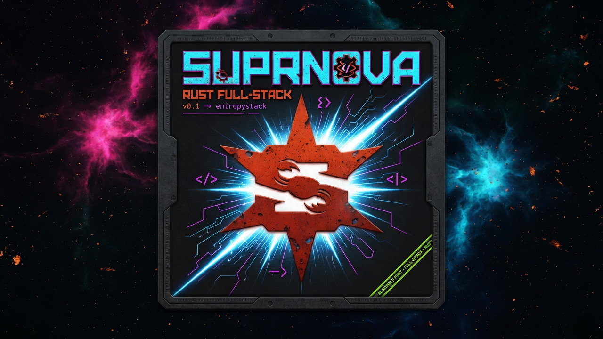

# Suprnova

**A Laravel-inspired web framework for Rust.**

[](https://opensource.org/licenses/MIT)
[](./CHANGELOG.md)



Suprnova is a full-stack Rust web framework with Laravel's developer
experience on Tokio's runtime. The API reads like Laravel - `Auth::login`,
`Cache::remember`, `Mail::to`, `EventFacade::dispatch`, Eloquent-style
models, `#[handler]`, `#[command]`, `routes!` - on top of hyper, SeaORM and
Tokio, so one long-lived process serves requests, runs queue workers and
the scheduler, and holds WebSocket connections.

Current `main` requires Rust 1.94.0 or newer. The tagged v3.2.0 release has
the same Rust 1.94.0 floor.

```bash
cargo install --git https://github.com/eas4ai/suprnova.git --tag v3.2.0 suprnova-cli
suprnova new myapp --frontend svelte
cd myapp
suprnova serve
```

`suprnova serve` starts your app at `http://localhost:8765` and the Vite dev
server for the frontend beside it, and rebuilds when your Rust changes. The
frontend can be Svelte 5, React 19 or Vue 3.5 (`--frontend svelte`,
`react` or `vue`).

## Quick taste

If you've used Laravel, this should feel familiar - only typed. A model, its
routes and three handlers:

```rust
use std::time::Duration;

use suprnova::{
    attrs, get, handler, inertia_response, json_response, model, post, request, routes, Cache,
    Collection, InertiaProps, Model, Redirect, Request, Response, RouteParam,
};

#[model(table = "posts", fillable = ["title", "body"])]
pub struct Post {
    pub id: i64,
    pub title: String,
    pub body: String,
    pub views: i64,
}

routes! {
    get!("/", home),
    get!("/posts/{post}", show),
    post!("/posts", store),
}

#[derive(InertiaProps)]
pub struct HomeProps {
    pub posts: Collection<Post>,
}

#[handler]
pub async fn home(req: Request) -> Response {
    let posts = Cache::remember("posts.popular", Some(Duration::from_secs(60)), || async {
        Post::query().filter_op("views", ">", 1000).get().await
    })
    .await?;
    inertia_response!(&req, "Home", HomeProps { posts })
}

#[handler]
pub async fn show(RouteParam(post): RouteParam<Post>) -> Response {
    json_response!({ "post": post })
}

#[request]
pub struct StorePostRequest {
    #[validate(length(min = 1, max = 200))]
    pub title: String,
    pub body: String,
}

#[handler]
pub async fn store(form: StorePostRequest) -> Response {
    let post = Post::create(attrs! { title: form.title, body: form.body }).await?;
    Redirect::to(format!("/posts/{}", post.id)).into()
}
```

`#[model]` generates the SeaORM entity and the Eloquent-style API on the
struct itself. `RouteParam<Post>` loads the model named in the URI, applying
its global scopes, and answers 404 when there is none. `#[request]` makes a
validated form request: the handler only runs when the body passes its
rules. `inertia_response!` checks at compile time that the page component
exists in `frontend/src/pages/`.

## What's in the box

| Area | What ships |
|---|---|
| **HTTP and routing** | `Router`, `routes!`, `group!`, named routes, resource controllers, route model binding with `RouteParam`, signed URLs (`sign_route`, `verify_signature`), `Redirect`, file and download responses (`HttpResponse::download`), `#[handler]`, `#[authorize]` |
| **Middleware** | `CsrfMiddleware`, `CorsMiddleware`, `SessionMiddleware`, `TimeoutMiddleware`, `RequestIdMiddleware`, `ThrottleRequestsMiddleware`, `AuthMiddleware`, `GuestMiddleware`, `EnsureEmailVerifiedMiddleware`, `MaintenanceMiddleware`, `LocaleMiddleware`, and your own global, group or per-route middleware |
| **Inertia 3** | `#[derive(InertiaProps)]` with TypeScript generation, partial reloads, deferred and once props, merge strategies, SSR, three starters: Svelte 5, React 19 and Vue 3.5 |
| **Eloquent models** | `#[model]`, relations from `HasMany` to `MorphedByMany`, eager loading, soft deletes, observers, global and local scopes, casts (`AsJson`, `AsNativeDateTime` and more), model events, factories and seeders, `Collection`, paginators, chunked and lazy iteration, joins |
| **Database** | SQLite, Postgres, MySQL and MariaDB; SeaORM migrations with a Laravel-style `Schema` builder; `DB::transaction` with savepoints and `DB::after_commit`; read and write connections; `suprnova schema:dump` |
| **Cache** | `Cache::remember`, `Cache::lock`, tags; `InMemoryCache` and `RedisCache` stores |
| **Queues and jobs** | `Queue`, `Job`, batches, chains, job middleware, failed-job store, unique jobs; `MemoryQueueDriver`, `SyncQueueDriver`, `DatabaseQueueDriver`, `RedisQueueDriver`, `SqsQueueDriver`, `NullQueueDriver` and `FailoverQueueDriver` |
| **Events and bus** | `EventFacade::dispatch`, `Listener`, `QueuedListener`, `Subscriber`, the command `Bus` |
| **Notifications** | `Notify` with `MailChannel`, `DatabaseChannel`, `BroadcastChannel` and `WebPushChannel`, anonymous notifiables |
| **Mail** | `Mail::to`, `Mailable`, queued mail; SMTP, Mailgun, Postmark, SendGrid, Resend and SES transports, plus log, file and in-memory ones for development |
| **Broadcasting and WebSockets** | Public, private and presence channels, `BroadcastHub`, `InMemoryBroadcastHub`, `PusherBroadcastHub` for Pusher, Soketi and Reverb, `SeaStreamerBroadcastHub` behind the `broadcasting-fanout` feature |
| **Filesystem** | `Storage` over OpenDAL: local, memory, S3 and S3-compatible stores (R2, B2, RustFS, MinIO), Azure and GCS behind features; a default disk from `FILESYSTEM_DISK` |
| **HTTP client** | `Http` with retries and `Http::fake` |
| **Vector search** | `Vector` with `MemoryVectorDriver`, `QdrantVectorDriver`, `MariaDbVectorDriver` and `PineconeVectorDriver` |
| **Payments** | `Checkout`, `Subscription`, `CustomerStore` and `WebhookHandler` traits, with adapter crates for Stripe, Paddle and NOWPayments |
| **Validation and data** | `#[request]` form requests, rules such as `Unique`, `Exists`, `Confirmed`, `RequiredIf` and `DateFormat`, `#[derive(Data)]` data objects, JSON:API resources |
| **Auth** | `Auth::login`, `Auth::user`, named guards, remember-me, email verification, password reset, two-factor with recovery codes, brute-force lockout, gates and `#[policy]`; passwords, OAuth (Apple, Facebook, Google, TikTok, X), passkeys and magic links through `Auth::password`, `Auth::oauth`, `Auth::passkey` and `Auth::magic_link` |
| **Scheduling** | `Schedule::call`, `Schedule::command`, cron expressions, time zones, `suprnova schedule:work` |
| **Workflows** | Durable steps with `#[workflow_step]` and `#[workflow]`, `suprnova workflow:work` |
| **Console** | Your app's `console` binary, `#[command]` and `#[derive(Command)]`, `make:*` generators, `db:seed` |
| **Processes** | `Process::command` and `Process::shell` with timeouts, pools and pipes, and `Process::fake` |
| **Redis** | `Redis::connection` with commands, pipelines, transactions and pub/sub |
| **Logging and observability** | `Log` channels (`LOG_CHANNEL`: stdout, single, daily, syslog, stack and more), request IDs, `tracing` throughout, OpenTelemetry behind the `otel` feature, `Metrics` |
| **Errors** | In debug mode, a failing route shows the development error page in the browser; in tests, a failing response carries an `ErrorReport` |
| **Localization and strings** | `Lang` with Fluent catalogs and locale-aware formatting, `Str::slug`, `Str::plural` and friends |
| **Images** | `Image` transformations through the OxideAV or ImageMagick driver |
| **Feature flags** | `Feature`, database-backed and cached evaluators |
| **Testing** | `#[suprnova_test]`, `TestDatabase`, in-process requests with `handle_request`, `expect!`, and fakes: `Mail::fake`, `Queue::fake`, `EventFacade::fake`, `Notify::fake`, `Bus::fake`, `Storage::fake`, `Http::fake`, `Process::fake` |
| **Heap profiling** | The `heap-profiling` feature writes a dhat heap profile when the process ends, to the file `SUPRNOVA_HEAP_PROFILE` names |

Every subsystem with more than one plausible backend is a trait with
drivers, chosen by configuration. A new backend is a new driver, not a fork.

## Suprnova Live

Live components are server-rendered and interactive without a frontend
framework. A component is a Rust struct with `#[derive(LiveComponent)]`, an
Askama view and `#[action]` methods the browser calls. State travels in a
signed snapshot, uploads and async updates (over SSE or WebSockets, with a
polling fallback) are built in. Separately, `RenderCache` can serve a GET or HEAD
route you opt in from a stored copy of its response, without running the
handler, when it can prove the copy is safe to share.

The shipped library has 58 components - forms, overlays, feedback,
navigation and data display. Each one installs into your app with
`suprnova live:add <name>`, so you own and can edit its view, styles and
script. `suprnova live:check` checks your views' markup, accessibility and
live directives. See the [Live chapter](./manual/live.md).

## End-to-end type safety

Define props in Rust once and use them in TypeScript with autocomplete:

```rust
use suprnova::{handler, inertia_response, InertiaProps, Request, Response};

#[derive(InertiaProps)]
pub struct DashboardProps {
    pub title: String,
    pub user: UserDto,
}

#[derive(InertiaProps)]
pub struct UserDto {
    pub name: String,
    pub email: String,
}

#[handler]
pub async fn dashboard(req: Request) -> Response {
    inertia_response!(
        &req,
        "Dashboard",
        DashboardProps {
            title: "Welcome!".into(),
            user: UserDto {
                name: "Ada".into(),
                email: "ada@example.com".into(),
            },
        }
    )
}
```

Run `suprnova generate-types` and `frontend/src/types/inertia-props.ts`
mirrors the Rust shape. `suprnova serve` regenerates it as you edit. Change a
field and the TypeScript compiler points at every component that uses it.

## Durable workflows

Workflow steps record their results, so a workflow resumes where it stopped
after a restart, and a failed step is retried. The worker runs on Postgres:

```rust
use suprnova::{start_workflow, workflow, workflow_step, FrameworkError, WorkflowHandle};

#[workflow_step]
async fn fetch_user(user_id: i64) -> Result<String, FrameworkError> {
    Ok(format!("user-{user_id}"))
}

#[workflow_step]
async fn send_welcome_email(user: String) -> Result<(), FrameworkError> {
    let _ = user;
    Ok(())
}

#[workflow]
async fn welcome_flow(user_id: i64) -> Result<(), FrameworkError> {
    let user = fetch_user(user_id).await?;
    send_welcome_email(user).await?;
    Ok(())
}

pub async fn on_signup(user_id: i64) -> Result<WorkflowHandle, FrameworkError> {
    start_workflow!(welcome_flow, user_id).await
}
```

```bash
suprnova workflow:work
```

## Starter kits

Don't start from an empty scaffold unless you want to - fork a kit:

- **[Nebula](https://github.com/eas4ai/Nebula)** - authentication
  (Breeze-tier): register, email verification, login with remember-me, password
  reset, and profile management, on Inertia 3 + Svelte 5.
- **[Pulsar](https://github.com/eas4ai/Pulsar)** - a full product site
  and community on Vue 3.5 + Vuetify: everything in Nebula plus a marketing
  landing, dashboard, a Markdown docs pipeline, a blog with RSS, member
  profiles, taxonomy, role-based access control, and admin/moderation surfaces.
- **[Directory starter](https://github.com/eas4ai/suprnova-directory-starter)** -
  listings, moderation, and paid publication on Vue 3.5: owners submit
  listings, moderators review them, visitors search them, and publication
  is free or paid through Stripe and Paddle.

See **[Starter Kits](./manual/starter-kits.md)** for the full rundown, or run
`suprnova new` for the plain scaffold on any of the three frontends.

## Documentation

- **[Manual](./manual/README.md)** - every public subsystem. Pick a reading
  path: [From Laravel](./manual/from-laravel.md) (if you know
  `Auth::user()`, Eloquent and Blade) or
  [From Rust Web](./manual/from-rust-web.md) (if you know Axum, Actix or Rocket).
- **[Quickstart](./manual/quickstart.md)** - a small app end to end.
- **[Laravel parity](./manual/parity.md)** - where Suprnova matches Laravel
  13, and where it diverges on purpose.
- **[CHANGELOG.md](./CHANGELOG.md)** - what changed in each version.
- **[Introduction](./manual/introduction.md)** - the design principles,
  including why every backend-bearing subsystem is a trait with drivers.
- **[Contributing](./manual/contributions.md)** - the working agreement:
  **full implementations only, well tested, production-ready.**

## Distribution model

Suprnova is distributed through git tags, not crates.io. A generated app
depends on
`suprnova = { git = "https://github.com/eas4ai/suprnova.git", tag = "v3.2.0" }`,
and the CLI installs with `cargo install --git`. The adapter crates
(`suprnova-payments-stripe`, `suprnova-payments-paddle`,
`suprnova-payments-nowpayments` and `suprnova-web-push`) follow the same
model. The tag *is* the release: an app moves versions by editing one
`tag =` line, and each version's [CHANGELOG](./CHANGELOG.md) section is its
release record, with what to check when you upgrade.

## License

MIT, © 2026 Shawn McAllister & Dayem Siddiqui - see [LICENSE](./LICENSE).
Suprnova began as a fork of [Kit](https://github.com/dayemsiddiqui/kit)
(MIT, © Dayem Siddiqui) and has since been taken in its own direction.
