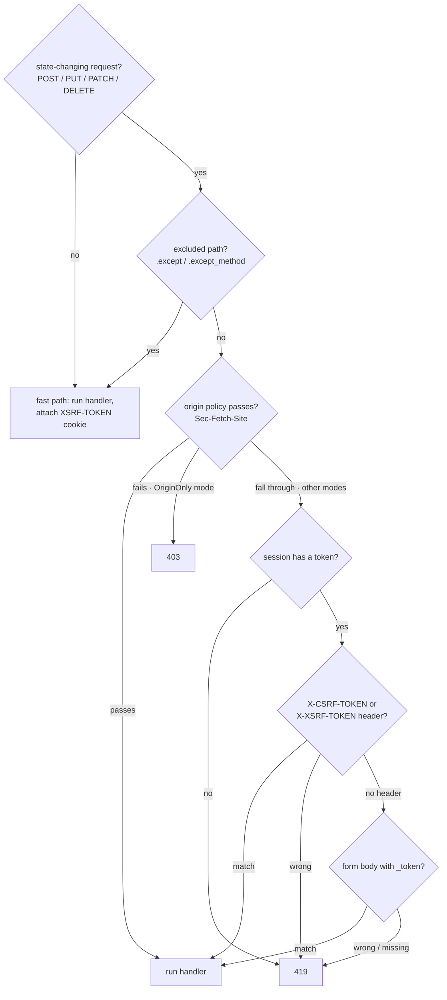

# CSRF

`CsrfMiddleware` validates a per-session token on every state-changing
request (POST / PUT / PATCH / DELETE). It mirrors Laravel 13's
`PreventRequestForgery` - same token sources, same `XSRF-TOKEN` cookie
convention, same `Sec-Fetch-Site` origin verification, same 419 token
mismatch / 403 origin mismatch split - implemented on top of Suprnova's
session middleware.

## Install it globally

CSRF runs after the session middleware (it needs the session's CSRF
token to compare against). In `bootstrap.rs`:

```rust
use suprnova::{global_middleware, CsrfMiddleware, SessionConfig, SessionMiddleware};

pub async fn register() {
    let session_config = SessionConfig::from_env();
    global_middleware!(SessionMiddleware::new(session_config));
    global_middleware!(CsrfMiddleware::new());
}
```

`SessionMiddleware::new(SessionConfig)` takes the config; the default
constructor wires up the database-backed `DatabaseSessionDriver`
internally. Use `SessionMiddleware::with_store(config, store)` to plug
in a custom `SessionStore`.

`CsrfMiddleware` must come **after** `SessionMiddleware` in registration
order - global middleware runs outside-in, so the session is loaded
before CSRF reads its token.

## How a request flows



GET, HEAD, and OPTIONS are never token-checked, but they still hit the
bottom of the middleware so the `XSRF-TOKEN` cookie attaches to the
response. That's how SPA clients first acquire the cookie.

## Token sources, in priority order

The middleware reads the token from one of three places, in this order
(matching Laravel):

1. **`X-CSRF-TOKEN` header** - what Inertia and the scaffolded SPA
   templates send.
2. **`X-XSRF-TOKEN` header** - Laravel / Axios / Angular convention:
   JavaScript reads the `XSRF-TOKEN` cookie and echoes its value here.
3. **`_token` form field** - for `application/x-www-form-urlencoded`
   posts from a traditional HTML form.

If a header is present but wrong, the middleware rejects immediately
without parsing the body. A correct client picks one location for the
token; combining sources would be a token-splitting footgun.

For form-body validation, the middleware buffers the request body up to
64 KiB before reading `_token`. The downstream handler still sees the
full form bag - the buffering is transparent, so `_token` stays in the
parsed form for any handler that wants to look at it.

## The frontend side

The scaffolded `main.ts` / `main.tsx` (Svelte / React / Vue) already
configures Axios:

```ts
import axios from 'axios';

axios.defaults.headers.common['X-Requested-With'] = 'XMLHttpRequest';

const csrfToken = document
  .querySelector('meta[name="csrf-token"]')
  ?.getAttribute('content');
if (csrfToken) {
  axios.defaults.headers.common['X-CSRF-TOKEN'] = csrfToken;
}
```

The `<meta name="csrf-token">` tag is injected into the Inertia base
view automatically by `framework/src/inertia/response.rs` - you don't
need to add it yourself in a generated project. Every Inertia response
carries the current session's token in the page shell.

Inertia's `useForm` posts go through Axios, so they inherit the header
without any extra wiring:

```tsx
import { useForm } from '@inertiajs/react';

const form = useForm({ title: '', content: '' });
form.post('/posts');  // X-CSRF-TOKEN comes from Axios defaults
```

For a raw `fetch` call, read the token off the meta tag the same way:

```ts
const token = document
  .querySelector('meta[name="csrf-token"]')
  ?.getAttribute('content') ?? '';

await fetch('/api/data', {
  method: 'POST',
  headers: {
    'Content-Type': 'application/json',
    'X-CSRF-TOKEN': token,
  },
  body: JSON.stringify({ /* ... */ }),
});
```

## The `XSRF-TOKEN` cookie

On every response - read or write - `CsrfMiddleware` attaches an
`XSRF-TOKEN` cookie containing the current session's token. This is
the Laravel-Axios convention: the SPA library reads the cookie via
JavaScript and echoes it as `X-XSRF-TOKEN` on the next state-changing
request, completing the round-trip without ever touching a meta tag.

The cookie is **not** `HttpOnly` - it has to be readable from JS. The
value is therefore stored as plaintext (no encryption round-trip),
because the JS-side value must match what the middleware compares
server-side. Laravel encrypts the cookie via `EncryptCookies` running
in front of `PreventRequestForgery`; Suprnova ships it plaintext and
documents the divergence - same wire behaviour from the client's
perspective.

### Cookie attributes

Defaults match `SessionConfig::default()`: `Path=/`, `Secure`,
`SameSite=Lax`, `Max-Age=7200` (2 hours), no `Domain`. Override per
builder:

```rust
use std::time::Duration;
use suprnova::{CsrfMiddleware, http::SameSite};

CsrfMiddleware::new()
    .xsrf_cookie_path("/app")
    .xsrf_cookie_domain(".example.com")
    .xsrf_cookie_secure(false)             // for local HTTP dev
    .xsrf_cookie_same_site(SameSite::Strict)
    .xsrf_cookie_lifetime(Duration::from_secs(15 * 60));
```

### Sync from `SessionConfig`

If you override `SESSION_PATH` / `SESSION_DOMAIN` / `SESSION_SECURE` /
`SESSION_SAME_SITE` / `SESSION_LIFETIME` in `.env`, the session cookie
respects those overrides - but the XSRF cookie's defaults wouldn't,
which silently desynchronises the two. The fix is a one-call alignment:

```rust
let session_config = SessionConfig::from_env();
let csrf = CsrfMiddleware::new().with_session_config(&session_config);
global_middleware!(SessionMiddleware::new(session_config));
global_middleware!(csrf);
```

`with_session_config` copies `cookie_path`, `cookie_domain`,
`cookie_secure`, `lifetime`, and parses `cookie_same_site` with the
same case-insensitive matrix the session middleware uses (`"strict"` →
`Strict`, `"none"` → `None`, anything else → `Lax`).

### Disable it

For a pure server-rendered app where you only ever issue the token via
`{{ csrf_meta_tag() }}` (no SPA round-tripping), drop the cookie:

```rust
global_middleware!(CsrfMiddleware::new().without_xsrf_cookie());
```

## Excluding routes

Webhook endpoints, OAuth callbacks, and other external integrations
can't carry a CSRF token. Exempt them with `.except(...)`:

```rust
global_middleware!(
    CsrfMiddleware::new()
        .except(vec!["/webhooks/*", "/api/external/*"])
);
```

Each entry is a Laravel-style glob (`Str::is` semantics): `*` matches
any run of characters, including `/`.

| Pattern | Matches |
|---|---|
| `"/login"` | only `/login` |
| `"/webhooks/*"` | `/webhooks/stripe`, `/webhooks/github/events`, … |
| `"/api/*/internal"` | `/api/v1/internal`, `/api/v2/internal` |
| `"*/healthz"` | any path with `/healthz` somewhere |

Leading slashes normalise - `"webhooks/*"` and `"/webhooks/*"` behave
identically. Bare `/healthz` (no prefix segment) does **not** match
`"*/healthz"`, matching Laravel's `Str::is` exactly.

### Per-method exemptions

Sometimes a webhook prefix legitimately handles both unauthenticated
`POST` callbacks (which can't carry a token) and authenticated `DELETE`
admin requests (which can and should). Use `.except_method`:

```rust
global_middleware!(
    CsrfMiddleware::new()
        // Stripe POST callbacks bypass CSRF…
        .except_method("POST", "/webhooks/stripe/*")
        // …but DELETEs against the same prefix still require a token.
);
```

The method comparison is case-insensitive. `.except(...)` rules apply
to every method; `.except_method(...)` rules only fire for the verb
they name.

## Origin verification

Modern browsers set `Sec-Fetch-Site` on every fetch over HTTPS. A
matching value tells you the request came from the same origin
(or the same registrable domain) without any token round-trip.
`CsrfMiddleware` can consult this header in addition to - or instead of -
the token check.

`OriginPolicy` is the value type that picks which mode runs:

| Variant | Behaviour |
|---|---|
| `Disabled` (default) | Ignore `Sec-Fetch-Site`. Only token validation runs. |
| `SameOriginOnly` | `same-origin` passes; anything else falls through to token validation. |
| `AllowSameSite` | `same-origin` and `same-site` pass; anything else falls through. |
| `OriginOnly` | `Sec-Fetch-Site` is the **only** gate. Token check is skipped. A miss is a **403** (not 419). |

Two convenience builders cover the common cases:

```rust
CsrfMiddleware::new().allow_same_site();   // OriginPolicy::AllowSameSite
CsrfMiddleware::new().origin_only();       // OriginPolicy::OriginOnly
```

Use `.with_origin_policy(OriginPolicy::SameOriginOnly)` for the
no-`allow-same-site` middle option.

**HTTPS caveat:** browsers only emit `Sec-Fetch-Site` over HTTPS. An
app running plain HTTP can't use `origin_only()` - every state-changing
request will 403 because the header is missing.

`origin_only()` also disables the `XSRF-TOKEN` cookie automatically -
there's no token round-trip to feed, so shipping the cookie is dead
weight.

### 419 vs 403

| Status | What failed |
|---|---|
| **419** | Token check (Laravel's `TokenMismatchException`) - missing session token, missing request token, or wrong request token |
| **403** | Origin check under `OriginOnly` mode (Laravel's `OriginMismatchException`) |

Clients can tell the two failure modes apart by status alone. A 419
generally means "reload the page and retry"; a 403 from origin
verification means the request didn't come from a trusted origin and
retrying won't help.

## Helper functions

Three free functions read or render the current session's token. They
return empty / `None` when no session is active (the middleware will
reject the request before a handler runs in that case, so a missing
token outside a request scope is benign).

```rust
use suprnova::csrf::{csrf_token, csrf_meta_tag, csrf_field};

let token: Option<String> = csrf_token();
let meta: String = csrf_meta_tag();
// → <meta name="csrf-token" content="...">
let field: String = csrf_field();
// → <input type="hidden" name="_token" value="...">
```

The Inertia base view already calls `csrf_meta_tag()` for you - use
`csrf_field()` when rendering a traditional HTML form from a Tera /
Askama / minijinja template, and `csrf_token()` when you need the raw
value for something custom.

## Constant-time comparison

Token comparison goes through `subtle::ConstantTimeEq`, a reviewed
constant-time equality primitive, rather than a hand-rolled XOR loop.
Suprnova tokens are fixed-length (40 lowercase alphanumeric
characters), so an unequal-length comparison short-circuits as a
structural reject - a length mismatch can only come from a malformed
or wrong-class token, not from an attacker probing for a same-length
timing oracle.

## Token regeneration

The session middleware regenerates the CSRF token on login and logout
to prevent session fixation. If you need to force a new token outside
those flows (e.g. after a sensitive privilege change), call
`regenerate_csrf_token()`:

```rust
use suprnova::regenerate_csrf_token;

if let Some(new_token) = regenerate_csrf_token() {
    // Token rotated; the SPA's next request must echo this value.
}
```

Returns `None` if no session is active.

## Handling 419 on the client

When a session expires mid-session and the next state-changing request
fires, the server returns 419. The standard pattern is to reload the
page so the SPA picks up a fresh meta tag and cookie:

```ts
axios.interceptors.response.use(
  response => response,
  error => {
    if (error.response?.status === 419) {
      window.location.reload();
    }
    return Promise.reject(error);
  },
);
```

Inertia visits already follow redirects, so a controller that
`redirect`s after a session refresh (e.g. through a login flow) lands
the user back on the page with a working token.

## Testing

Tests drive the same `handle_request` pipeline production uses - see
[HTTP Tests](http-tests.md) for the full setup. The cleanest pattern
for a CSRF-guarded endpoint is to run the request through the same
two-hop dance a real SPA performs:

1. **`GET` something first** under the same TCP loopback listener.
   The session middleware mints a session cookie; `CsrfMiddleware`
   attaches the `XSRF-TOKEN` cookie on the way out.
2. **`POST` the actual route**, sending the session cookie back so
   the same session loads, and echoing the captured `XSRF-TOKEN`
   value in `X-XSRF-TOKEN`.

That's the production round-trip with no special test surface - the
middleware can't tell the test client apart from a browser. The
framework's own CSRF middleware tests exercise this end-to-end via
hyper loopback; the harness lives in
`framework/src/csrf/middleware.rs`'s `tests` module and is the
reference shape for higher-level integration tests.

## Security guarantees

- **Per-session tokens.** Each session has its own 40-character random
  token; logout rotates it.
- **CSPRNG-backed.** Tokens come from the same generator as session IDs
  (`rand::Rng::random_range` over an alphanumeric charset, seeded by
  the OS's CSPRNG).
- **Constant-time comparison.** `subtle::ConstantTimeEq` for the body
  of the comparison; structural length-mismatch shortcut for the
  unequal-length case.
- **Login / logout rotation.** Session regeneration generates a new
  token, defeating session fixation.
- **SameSite cookies.** Combined with the `XSRF-TOKEN` cookie's
  `SameSite=Lax` default for defence in depth.
- **419 not 500 on missing session.** A missing session is a
  client-side condition (no cookie / expired session), not a server
  misconfiguration - Laravel returns 419 in the same case, and so do we.

## Laravel parity matrix

| Laravel | Suprnova |
|---|---|
| `VerifyCsrfToken` / `PreventRequestForgery` middleware | `CsrfMiddleware` |
| `csrf_token()` helper | `suprnova::csrf::csrf_token()` |
| `csrf_field()` Blade helper | `suprnova::csrf::csrf_field()` |
| `<meta name="csrf-token">` (Blade `@csrf` for forms) | `suprnova::csrf::csrf_meta_tag()` + auto-injected by Inertia base view |
| `$except = ['stripe/*']` | `.except(["stripe/*"])` |
| Glob `*` (mid / leading / trailing) | Same - full `Str::is` semantics |
| `XSRF-TOKEN` cookie + `X-XSRF-TOKEN` header round-trip | Same convention |
| `$addHttpCookie = false` | `.without_xsrf_cookie()` |
| `PreventRequestForgery::allowSameSite(true)` | `.allow_same_site()` |
| `PreventRequestForgery::useOriginOnly(true)` | `.origin_only()` |
| `TokenMismatchException` (419) | 419 `{"message": "CSRF token mismatch."}` |
| `OriginMismatchException` (403) | 403 `{"message": "Origin mismatch."}` |
| `EncryptCookies` encrypts `XSRF-TOKEN` | **Diverged:** plaintext (JS-readable; same wire shape for clients) |
| `config('session.*')` drives cookie attrs | `.with_session_config(&SessionConfig)` |

## Next

- [Sessions](session.md) - how `SessionMiddleware` populates the token
  the CSRF middleware compares
- [CORS](cors.md) - the other global middleware most apps install
  alongside CSRF
- [Middleware](middleware.md) - registration order, the global stack,
  writing your own
- [HTTP Tests](http-tests.md) - driving `handle_request` end-to-end,
  including CSRF-guarded routes
- [Authentication](authentication.md) - login / logout flows that
  rotate the session and its CSRF token
