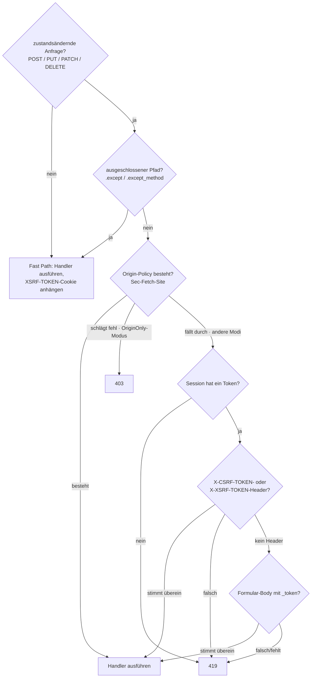

# CSRF

`CsrfMiddleware` validiert ein Pro-Session-Token bei jeder
zustandsändernden Anfrage (POST / PUT / PATCH / DELETE). Es spiegelt
Laravel 13s `PreventRequestForgery` - dieselben Token-Quellen, dieselbe
`XSRF-TOKEN`-Cookie-Konvention, dieselbe
`Sec-Fetch-Site`-Origin-Verifizierung, dieselbe Aufteilung in
419-Token-Mismatch / 403-Origin-Mismatch - implementiert auf Basis von
Suprnovas Session-Middleware.

## Global installieren

CSRF läuft nach der Session-Middleware (sie braucht das CSRF-Token der
Session, um damit zu vergleichen). In `bootstrap.rs`:

```rust
use suprnova::{global_middleware, CsrfMiddleware, SessionConfig, SessionMiddleware};

pub async fn register() {
    let session_config = SessionConfig::from_env();
    global_middleware!(SessionMiddleware::new(session_config));
    global_middleware!(CsrfMiddleware::new());
}
```

`SessionMiddleware::new(SessionConfig)` nimmt die Config entgegen; der
Standard-Konstruktor verdrahtet intern den datenbankgestützten
`DatabaseSessionDriver`. Verwenden Sie
`SessionMiddleware::with_store(config, store)`, um einen eigenen
`SessionStore` einzubinden.

`CsrfMiddleware` muss in der Registrierungsreihenfolge **nach**
`SessionMiddleware` kommen - globale Middleware läuft von außen nach
innen, sodass die Session geladen wird, bevor CSRF ihr Token liest.

## Wie eine Anfrage abläuft



GET, HEAD und OPTIONS werden nie auf das Token geprüft, durchlaufen
aber trotzdem die Middleware bis zum Ende, damit das
`XSRF-TOKEN`-Cookie an die Response angehängt wird. So bekommen
SPA-Clients das Cookie zum ersten Mal.

## Token-Quellen, in Prioritätsreihenfolge

Die Middleware liest das Token aus einer von drei Stellen, in dieser
Reihenfolge (passend zu Laravel):

1. **`X-CSRF-TOKEN`-Header** - was Inertia und die per Scaffold
   erzeugten SPA-Templates senden.
2. **`X-XSRF-TOKEN`-Header** - Laravel-/Axios-/Angular-Konvention:
   JavaScript liest das `XSRF-TOKEN`-Cookie und spiegelt dessen Wert
   hierher zurück.
3. **`_token`-Formularfeld** - für
   `application/x-www-form-urlencoded`-Posts von einem traditionellen
   HTML-Formular.

Ist ein Header vorhanden, aber falsch, weist die Middleware sofort
zurück, ohne den Body zu parsen. Ein korrekter Client wählt einen Ort
für das Token; das Kombinieren von Quellen wäre eine
Token-Splitting-Falle.

Für die Formular-Body-Validierung puffert die Middleware den
Anfrage-Body bis zu 64 KiB, bevor sie `_token` liest. Der nachgelagerte
Handler sieht weiterhin die vollständige Form-Bag - das Puffern ist
transparent, sodass `_token` im geparsten Formular bleibt, für jeden
Handler, der es sich ansehen möchte.

## Die Frontend-Seite

Die per Scaffold erzeugten Svelte-, React- und Vue-Einstiegspunkte verwenden
Inertia 3s native Visit-Pipeline, nicht Axios. Jeder Einstiegspunkt importiert
`router` aus seinem Inertia-Adapter, liest das Meta-Token und hängt es in einem
Router-Hook an:

```ts
const csrfToken = document
  .querySelector('meta[name="csrf-token"]')
  ?.getAttribute('content');
if (csrfToken) {
  router.on('before', (event) => {
    event.detail.visit.headers['X-CSRF-TOKEN'] = csrfToken;
  });
}
```

Der `<meta name="csrf-token">`-Tag wird automatisch von
`framework/src/inertia/response.rs` in die Inertia-Basisansicht
injiziert - Sie müssen ihn in einem generierten Projekt nicht selbst
hinzufügen. Jede Inertia-Response trägt das Token der aktuellen Session
in der Seiten-Shell.

Inertias `useForm` verwendet dieselbe Visit-Pipeline und erhält den Header
daher über diesen Hook:

```tsx
import { useForm } from '@inertiajs/react';

const form = useForm({ title: '', content: '' });
form.post('/posts');  // X-CSRF-TOKEN kommt vom Router-Hook
```

Für einen rohen `fetch`-Aufruf lesen Sie das Token auf dieselbe Weise
vom Meta-Tag:

```ts
const token = document
  .querySelector('meta[name="csrf-token"]')
  ?.getAttribute('content') ?? '';

await fetch('/api/data', {
  method: 'POST',
  headers: {
    'Content-Type': 'application/json',
    'X-CSRF-TOKEN': token,
  },
  body: JSON.stringify({ /* ... */ }),
});
```

## Das `XSRF-TOKEN`-Cookie

Bei jeder Response - Lesen oder Schreiben - hängt `CsrfMiddleware` ein
`XSRF-TOKEN`-Cookie an, das das Token der aktuellen Session enthält.
Das ist die Laravel-Axios-Konvention: Die SPA-Bibliothek liest das
Cookie per JavaScript und spiegelt es bei der nächsten
zustandsändernden Anfrage als `X-XSRF-TOKEN` zurück, wodurch der
Round-Trip abgeschlossen wird, ohne je einen Meta-Tag zu berühren.

Das Cookie ist **nicht** `HttpOnly` - es muss von JS lesbar sein. Der
Wert wird deshalb als Klartext gespeichert (kein
Verschlüsselungs-Roundtrip), weil der JS-seitige Wert mit dem
übereinstimmen muss, was die Middleware serverseitig vergleicht.
Laravel verschlüsselt das Cookie über `EncryptCookies`, das vor
`PreventRequestForgery` läuft; Suprnova liefert es als Klartext aus und
dokumentiert die Abweichung - aus Sicht des Clients dasselbe
Wire-Verhalten.

### Cookie-Attribute

Die Standardwerte entsprechen `SessionConfig::default()`: `Path=/`,
`Secure`, `SameSite=Lax`, `Max-Age=7200` (2 Stunden), kein `Domain`.
Überschreiben Sie sie per Builder:

```rust
use std::time::Duration;
use suprnova::{CsrfMiddleware, http::SameSite};

CsrfMiddleware::new()
    .xsrf_cookie_path("/app")
    .xsrf_cookie_domain(".example.com")
    .xsrf_cookie_secure(false)             // für lokale HTTP-Entwicklung
    .xsrf_cookie_same_site(SameSite::Strict)
    .xsrf_cookie_lifetime(Duration::from_secs(15 * 60));
```

### Abgleich mit `SessionConfig`

Wenn Sie `SESSION_PATH` / `SESSION_DOMAIN` / `SESSION_SECURE` /
`SESSION_SAME_SITE` / `SESSION_LIFETIME` in `.env` überschreiben,
respektiert das Session-Cookie diese Overrides - die Standardwerte des
XSRF-Cookies aber nicht, was die beiden still auseinanderlaufen lässt.
Die Lösung ist ein Abgleich mit einem einzigen Aufruf:

```rust
let session_config = SessionConfig::from_env();
let csrf = CsrfMiddleware::new().with_session_config(&session_config);
global_middleware!(SessionMiddleware::new(session_config));
global_middleware!(csrf);
```

`with_session_config` kopiert `cookie_path`, `cookie_domain`,
`cookie_secure`, `lifetime`, und parst `cookie_same_site` mit derselben
Matrix ohne Unterscheidung von Groß- und Kleinschreibung, die die
Session-Middleware verwendet (`"strict"` → `Strict`, `"none"` → `None`,
alles andere → `Lax`).

`with_session_config` kopiert absichtlich nicht
`SessionConfig::cookie_prefix`. Session- und Remember-me-Cookies verwenden
das Wire-Präfix; Axios und ähnliche Clients suchen jedoch üblicherweise nach
dem wörtlichen Namen `XSRF-TOKEN` (`xsrfCookieName` in Axios). Eine
Nebenwirkungs-Präfixierung würde dazu führen, dass Browser und Client nicht
mehr übereinstimmen, wo das Token liegt.

Wenn der Client für ein präfixiertes XSRF-Cookie konfiguriert ist, wählen Sie
diesen Namen ausdrücklich:

```rust
let csrf = CsrfMiddleware::new().xsrf_cookie_name("__Host-XSRF-TOKEN");
```

Der Cookie-Renderer liefert für den Namen `__Host-` `Secure`, `Path=/` und
keine `Domain`. Das Session-Präfix bleibt eine unabhängige Einstellung; beide
Cookies werden absichtlich separat konfiguriert, wenn beide an den Host
gebunden sein müssen.

### Deaktivieren

Für eine rein serverseitig gerenderte App, bei der Sie das Token immer
nur über `{{ csrf_meta_tag() }}` ausgeben (kein SPA-Round-Trip), lassen
Sie das Cookie weg:

```rust
global_middleware!(CsrfMiddleware::new().without_xsrf_cookie());
```

## Routen ausschließen

Webhook-Endpunkte, OAuth-Callbacks und andere externe Integrationen
können kein CSRF-Token mitführen. Nehmen Sie sie mit `.except(...)`
aus:

```rust
global_middleware!(
    CsrfMiddleware::new()
        .except(vec!["/webhooks/*", "/api/external/*"])
);
```

Jeder Eintrag ist ein Glob im Laravel-Stil (`Str::is`-Semantik): `*`
matcht jede Folge von Zeichen, einschließlich `/`.

| Pattern | Matcht |
|---|---|
| `"/login"` | nur `/login` |
| `"/webhooks/*"` | `/webhooks/stripe`, `/webhooks/github/events`, … |
| `"/api/*/internal"` | `/api/v1/internal`, `/api/v2/internal` |
| `"*/healthz"` | jeder Pfad mit `/healthz` irgendwo |

Führende Schrägstriche werden normalisiert - `"webhooks/*"` und
`"/webhooks/*"` verhalten sich identisch. Bloßes `/healthz` (ohne
Präfixsegment) matcht `"*/healthz"` **nicht**, exakt passend zu
Laravels `Str::is`.

### Ausnahmen pro Methode

Manchmal behandelt ein Webhook-Präfix legitim sowohl unauthentifizierte
`POST`-Callbacks (die kein Token mitführen können) als auch
authentifizierte `DELETE`-Admin-Anfragen (die eines mitführen können
und sollten). Verwenden Sie `.except_method`:

```rust
global_middleware!(
    CsrfMiddleware::new()
        // Stripe-POST-Callbacks umgehen CSRF…
        .except_method("POST", "/webhooks/stripe/*")
        // …aber DELETEs gegen dasselbe Präfix erfordern weiterhin ein Token.
);
```

Der Methodenvergleich unterscheidet nicht zwischen Groß- und
Kleinschreibung. `.except(...)`-Regeln gelten für jede Methode;
`.except_method(...)`-Regeln greifen nur für das Verb, das sie
benennen.

## Origin-Verifizierung

Moderne Browser setzen `Sec-Fetch-Site` bei jedem Fetch über HTTPS. Ein
passender Wert sagt Ihnen, dass die Anfrage vom selben Origin (oder
derselben registrierbaren Domain) kam, ohne jeden Token-Round-Trip.
`CsrfMiddleware` kann diesen Header zusätzlich zu - oder anstelle von -
der Token-Prüfung heranziehen.

`OriginPolicy` ist der Werttyp, der auswählt, welcher Modus läuft:

| Variante | Verhalten |
|---|---|
| `Disabled` (Standard) | Ignoriert `Sec-Fetch-Site`. Nur die Token-Validierung läuft. |
| `SameOriginOnly` | `same-origin` besteht; alles andere fällt durch zur Token-Validierung. |
| `AllowSameSite` | `same-origin` und `same-site` bestehen; alles andere fällt durch. |
| `OriginOnly` | `Sec-Fetch-Site` ist die **einzige** Schranke. Die Token-Prüfung wird übersprungen. Ein Fehltreffer ist ein **403** (nicht 419). |

Zwei komfortable Builder decken die gängigen Fälle ab:

```rust
CsrfMiddleware::new().allow_same_site();   // OriginPolicy::AllowSameSite
CsrfMiddleware::new().origin_only();       // OriginPolicy::OriginOnly
```

Verwenden Sie `.with_origin_policy(OriginPolicy::SameOriginOnly)` für
die mittlere Option ohne `allow-same-site`.

**HTTPS-Vorbehalt:** Browser geben `Sec-Fetch-Site` nur über HTTPS aus.
Eine App, die reines HTTP verwendet, kann `origin_only()` nicht nutzen -
jede zustandsändernde Anfrage erhält ein 403, weil der Header fehlt.

`origin_only()` deaktiviert außerdem automatisch das `XSRF-TOKEN`-Cookie -
es gibt keinen Token-Round-Trip zu füttern, also ist das Ausliefern
des Cookies nur Ballast.

### 419 vs. 403

| Status | Was fehlgeschlagen ist |
|---|---|
| **419** | Token-Prüfung (Laravels `TokenMismatchException`) - fehlendes Session-Token, fehlendes Anfrage-Token oder falsches Anfrage-Token |
| **403** | Origin-Prüfung im `OriginOnly`-Modus (Laravels `OriginMismatchException`) |

Clients können die beiden Fehlermodi allein am Status unterscheiden.
Ein 419 bedeutet in der Regel "Seite neu laden und erneut versuchen";
ein 403 aus der Origin-Verifizierung bedeutet, dass die Anfrage nicht
von einem vertrauenswürdigen Origin kam und ein erneuter Versuch nicht
hilft.

## Hilfsfunktionen

Drei freistehende Funktionen lesen oder rendern das Token der
aktuellen Session. Sie liefern leer / `None`, wenn keine Session aktiv
ist (die Middleware weist die Anfrage in diesem Fall ab, bevor ein
Handler läuft, sodass ein fehlendes Token außerhalb eines
Anfrage-Scopes harmlos ist).

```rust
use suprnova::csrf::{csrf_token, csrf_meta_tag, csrf_field};

let token: Option<String> = csrf_token();
let meta: String = csrf_meta_tag();
// → <meta name="csrf-token" content="...">
let field: String = csrf_field();
// → <input type="hidden" name="_token" value="...">
```

Die Inertia-Basisansicht ruft `csrf_meta_tag()` bereits für Sie auf -
verwenden Sie `csrf_field()` beim Rendern eines traditionellen
HTML-Formulars aus einem Tera-/Askama-/minijinja-Template, und
`csrf_token()`, wenn Sie den rohen Wert für etwas Eigenes brauchen.

## Vergleich in konstanter Zeit

Der Token-Vergleich läuft über `subtle::ConstantTimeEq`, eine
begutachtete Gleichheits-Primitive mit konstanter Laufzeit, statt über
eine selbstgeschriebene XOR-Schleife. Suprnova-Tokens haben eine feste
Länge (40 alphanumerische Kleinbuchstaben), sodass ein Vergleich
unterschiedlicher Länge als struktureller Reject kurzschließt - eine
Längendiskrepanz kann nur von einem fehlerhaften Token oder einem
Token der falschen Klasse stammen, nicht von einem Angreifer, der nach einem
Timing-Orakel gleicher Länge sucht.

## Token-Regenerierung

Die Session-Middleware regeneriert das CSRF-Token bei Login und
Logout, um Session-Fixation zu verhindern. Wenn Sie außerhalb dieser
Abläufe ein neues Token erzwingen müssen (z. B. nach einer sensiblen
Rechteänderung), rufen Sie `regenerate_csrf_token()` auf:

```rust
use suprnova::regenerate_csrf_token;

if let Some(new_token) = regenerate_csrf_token() {
    // Token rotiert; die nächste Anfrage der SPA muss diesen Wert spiegeln.
}
```

Liefert `None`, wenn keine Session aktiv ist.

## 419 auf dem Client behandeln

Wenn eine Session mittendrin abläuft und die nächste
zustandsändernde Anfrage feuert, liefert der Server 419. Das
Standardmuster ist, die Seite neu zu laden, damit die SPA einen
frischen Meta-Tag und ein frisches Cookie übernimmt:

```ts
axios.interceptors.response.use(
  response => response,
  error => {
    if (error.response?.status === 419) {
      window.location.reload();
    }
    return Promise.reject(error);
  },
);
```

Inertia-Visits folgen Redirects bereits, sodass ein Controller, der
nach einer Session-Auffrischung `redirect`et (z. B. über einen
Login-Flow), den Benutzer wieder auf der Seite mit einem
funktionierenden Token landen lässt.

## Testen

Tests treiben dieselbe `handle_request`-Pipeline an, die auch die
Produktion verwendet - siehe [HTTP-Tests](http-tests.md) für das
vollständige Setup. Das sauberste Muster für einen CSRF-geschützten
Endpunkt ist, die Anfrage durch denselben Zwei-Schritte-Tanz zu
schicken, den eine echte SPA durchführt:

1. **Zuerst etwas per `GET` abrufen** unter demselben
   TCP-Loopback-Listener. Die Session-Middleware prägt ein
   Session-Cookie; `CsrfMiddleware` hängt das `XSRF-TOKEN`-Cookie auf
   dem Weg zurück an.
2. **Die eigentliche Route per `POST` ansprechen**, wobei das
   Session-Cookie zurückgesendet wird, damit dieselbe Session lädt,
   und der erfasste `XSRF-TOKEN`-Wert in `X-XSRF-TOKEN` gespiegelt
   wird.

Das ist der Produktions-Round-Trip ohne besondere Test-Oberfläche - die
Middleware kann den Test-Client nicht von einem Browser unterscheiden.
Die eigenen CSRF-Middleware-Tests des Frameworks üben das End-to-End
über hyper-Loopback aus; der Harness liegt im `tests`-Modul von
`framework/src/csrf/middleware.rs` und ist die Referenzform für
höherstufige Integrationstests.

## Sicherheitsgarantien

- **Pro-Session-Tokens.** Jede Session hat ihr eigenes 40 Zeichen langes
  zufälliges Token; Logout rotiert es.
- **CSPRNG-gestützt.** Tokens stammen aus demselben Generator wie
  Session-IDs (`rand::Rng::random_range` über einen alphanumerischen
  Zeichensatz, gesät durch den CSPRNG des Betriebssystems).
- **Vergleich in konstanter Zeit.** `subtle::ConstantTimeEq` für den
  Kern des Vergleichs; struktureller Kurzschluss bei Längendiskrepanz
  für den Fall unterschiedlicher Länge.
- **Rotation bei Login/Logout.** Die Session-Regenerierung erzeugt ein
  neues Token und vereitelt damit Session-Fixation.
- **SameSite-Cookies.** Kombiniert mit dem `SameSite=Lax`-Standard des
  `XSRF-TOKEN`-Cookies für gestaffelte Verteidigung.
- **419 statt 500 bei fehlender Session.** Eine fehlende Session ist
  ein clientseitiger Zustand (kein Cookie / abgelaufene Session), keine
  Server-Fehlkonfiguration - Laravel liefert im selben Fall 419, und
  wir tun das auch.

## Laravel-Paritätsmatrix

| Laravel | Suprnova |
|---|---|
| `VerifyCsrfToken` / `PreventRequestForgery` Middleware | `CsrfMiddleware` |
| `csrf_token()`-Helfer | `suprnova::csrf::csrf_token()` |
| `csrf_field()`-Blade-Helfer | `suprnova::csrf::csrf_field()` |
| `<meta name="csrf-token">` (Blade `@csrf` für Formulare) | `suprnova::csrf::csrf_meta_tag()` + automatisch von der Inertia-Basisansicht injiziert |
| `$except = ['stripe/*']` | `.except(["stripe/*"])` |
| Glob `*` (mittig / führend / nachgestellt) | Gleich - vollständige `Str::is`-Semantik |
| `XSRF-TOKEN`-Cookie + `X-XSRF-TOKEN`-Header-Round-Trip | Gleiche Konvention |
| `$addHttpCookie = false` | `.without_xsrf_cookie()` |
| `PreventRequestForgery::allowSameSite(true)` | `.allow_same_site()` |
| `PreventRequestForgery::useOriginOnly(true)` | `.origin_only()` |
| `TokenMismatchException` (419) | 419 `{"message": "CSRF token mismatch."}` |
| `OriginMismatchException` (403) | 403 `{"message": "Origin mismatch."}` |
| `EncryptCookies` verschlüsselt `XSRF-TOKEN` | **Abweichend:** Klartext (JS-lesbar; gleiche Wire-Form für Clients) |
| `config('session.*')` steuert die Cookie-Attribute | `.with_session_config(&SessionConfig)` |

## Nächste Schritte

- [Sitzungen](session.md) - wie `SessionMiddleware` das Token befüllt,
  das die CSRF-Middleware vergleicht
- [CORS](cors.md) - die andere globale Middleware, die die meisten Apps
  neben CSRF installieren
- [Middleware](middleware.md) - Registrierungsreihenfolge, der globale
  Stack, eigene Middleware schreiben
- [HTTP-Tests](http-tests.md) - `handle_request` End-to-End ansteuern,
  einschließlich CSRF-geschützter Routen
- [Authentifizierung](authentication.md) - Login-/Logout-Flows, die
  die Session und ihr CSRF-Token rotieren
