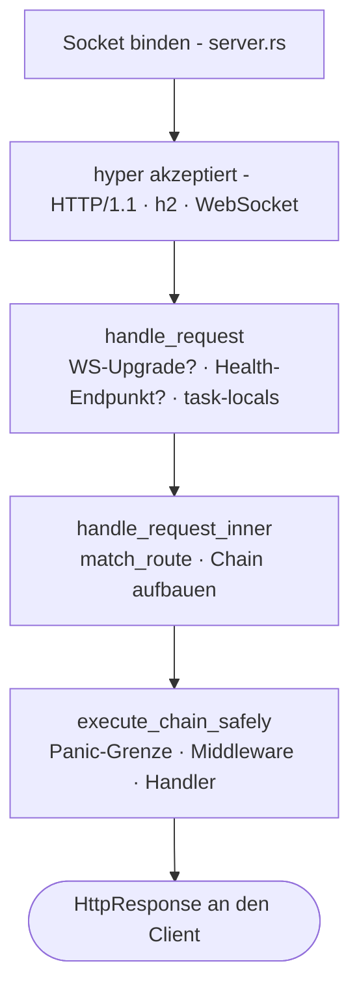

# Request-Lifecycle

Was geschieht tatsächlich zwischen dem TCP-Paket, das den Socket erreicht, und
Ihrem Handler, der eine `Response` zurückgibt? Sechs Dateien. Verfolgen Sie sie
einmal, und die Struktur des Frameworks wird auf einen Schlag klar.

## Der Pfad



## 1. Boot - `app.rs`

Das `main()` einer per Scaffold erzeugten App baut fließend eine
`Application` auf und führt sie aus:

```rust
Application::new()
    .config(my_app::config::register)
    .bootstrap(my_app::bootstrap::bootstrap)
    .http_bootstrap(|| async { my_app::bootstrap::register_http_stack() })
    .routes(my_app::routes::register)
    .migrations::<my_app::migrations::Migrator>()
    .run()
    .await
```

`Application::run()` parst die CLI der Binary (clap):

- `serve` - startet den HTTP-Server
- `web:run` - Alias für serve
- `migrate` / `migrate:rollback` / `migrate:status` / `migrate:fresh`
- `schedule:run` / `schedule:work` / `schedule:list`
- `workflow:work`
- `queue:work`
- `down` / `up` - schaltet den Wartungsmodus um

`db:sync` und `db:seed` liegen auf der frameworkweiten `suprnova`-CLI-Binary
(`suprnova-cli`) beziehungsweise der Pro-App-Binary `cmd/console` - nicht auf
dem `Application::run()`-Switch.

`.env` ist zu diesem Zeitpunkt bereits geladen. `#[suprnova::main]` lädt es
*vor* dem Aufbau der Tokio-Runtime, weil das Schreiben in die Prozessumgebung
nur sicher ist, solange der Prozess single-threaded ist - siehe
[Application Bootstrap](bootstrap.md#suprnovamain-not-tokiomain). `Application::run`
verweigert den Start, wenn dieser Schritt übersprungen wurde.

Für `serve` geschieht dann Folgendes:

1. Es wird geprüft, dass die Umgebung aus einem single-threaded Kontext
   geladen wurde
2. Das `#[policy]`-Inventory wird in das Autorisierungssystem geleert
3. Ihre `config_fn` wird aufgerufen (typisierte Konfigurationsregistrierung)
4. Migrationen werden ausgeführt
5. Ihre `bootstrap_fn` wird aufgerufen (Service-Registrierung, Observer,
   Listener)
6. Ihre `http_bootstrap_fn` wird nur auf dem Serverpfad aufgerufen (globale
   Middleware und `Inertia::install`)
7. Der `Router` wird aus `routes_fn` gebaut
8. Der Router wird an `Server::from_config(...)` übergeben
9. `server.run()` wird aufgerufen

Worker (`queue:work`, `workflow:work`, `schedule:run`) verwenden denselben
Boot-Pfad bis einschließlich `bootstrap_fn`; `http_bootstrap_fn` rufen sie
nicht auf. Nur `serve` / `web:run` tut dies. [Application Bootstrap](bootstrap.md)
erläutert, warum ein Worker-Image ohne gebautes Frontend-Manifest booten kann.

## 2. Server-Boot - `server.rs`

`Server::from_config` erledigt zwei Dinge, die für die Sicherheit wichtig
sind:

- Führt `App::init()` + `App::boot_services()` aus - initialisiert die
  Task-Local-Ebene des Containers und löst Boot-Zeit-Abhängigkeiten auf
- **Schlägt geschlossen fehl**, wenn `APP_KEY` erforderlich ist (in jeder
  Nicht-Entwicklungsumgebung), aber fehlt oder fehlerhaft ist - gibt `Err`
  zurück, und `app.rs` gibt eine Hinweismeldung zur Behebung aus und beendet
  sich mit Non-Zero, statt in Panic zu geraten

`server.run()` führt dann Folgendes aus:

1. Startet die Telemetrie (`tracing`-Subscriber, Log-Format)
2. Lädt die Verschlüsselungsschlüssel (`APP_KEY` + `APP_KEY_PREVIOUS`)
3. Startet die Runtime-Treiber **in genau dieser Reihenfolge**: Cache → Queue
   → RateLimit → Mail. Auch andere Subcommands als der Server rufen
   `bootstrap_runtime_drivers` auf, damit Worker dieselben Treiber sehen
4. Bindet den TCP-Socket
5. Bedient Anfragen über hyper mit `.with_upgrades()` (damit
   WebSocket-Upgrades funktionieren)

Die Boot-Reihenfolge der Treiber ist beabsichtigt - Queue kann von Cache
abhängen (für Sperren für Unique-Jobs), RateLimit kann Cache verwenden, Mail
kann über Queue versenden.

## 3. Request-Eingang - `handle_request`

Jede Anfrage landet in `handle_request(router, registry, req)`. **Das ist
zugleich die In-Process-Oberfläche, über die Integrationstests Anfragen
treiben, ohne einen Socket zu öffnen.** Sie wird als `suprnova::handle_request`
re-exportiert.

```rust
pub async fn handle_request(
    router: Arc<Router>,
    middleware_registry: Arc<MiddlewareRegistry>,
    req: hyper::Request<hyper::body::Incoming>,
) -> hyper::Response<ServerBody>;
```

Eine Peer-bewusste Variante, `handle_request_with_peer`, nimmt dieselben
Argumente plus ein `Option<std::net::IpAddr>` entgegen - die
Production-Accept-Loop verwendet sie; In-Process-Aufrufer verwenden
`handle_request`, und die Proxy-Header der Anfrage (oder `None`) bestimmen
`Request::ip()`.

Darin geschieht Folgendes:

1. Es wird über `router.match_ws(...)` auf ein WebSocket-Upgrade geprüft -
   passt eine `ws!()`-Route, wird an den WS-Handler übergeben
2. Die eingebauten Health-Endpunkte - `GET /_suprnova/health`,
   `/_suprnova/health/live`, `/_suprnova/health/ready` - werden gesondert
   behandelt. Eine Readiness-Probe, die die
   `SERVER_HEALTH_READINESS_TOKEN`-Prüfung nicht besteht, wird absichtlich
   *nicht* gesondert behandelt: Sie fällt durch ins Routing und liefert wie
   jeder ungeroutete Pfad einen 404, sodass der Endpunkt unsichtbar ist statt
   nur geschlossen
3. Per-Request-Task-Locals werden installiert (Flash-Bag, SSR-Disable-Flag)
4. Es wird an `handle_request_inner` weitergereicht

## 4. Routing + Chain-Zusammenstellung - `handle_request_inner`

Hier wird die Middleware-Chain zusammengesetzt. Der Router liefert ein
Tripel `(pattern, handler, params)`, und die `MiddlewareChain` wird in dieser
festen Reihenfolge aufgebaut:

```
[0] RequestIdMiddleware (immer ganz außen)
[1] globale Middleware in Registrierungsreihenfolge
[2] Route-Middleware (indiziert nach (method, matched pattern))
[3] handler
```

Drei Dinge sind bemerkenswert:

- **Pattern, nicht Pfad.** Route-Middleware wird nach dem gematchten
  Pattern indiziert (`"/posts/{id}"`), nicht nach dem rohen Pfad
  (`/posts/42`). Gruppen-Middleware auf parametrisierten Routen greift also
  tatsächlich.
- **Auch ohne Match läuft die Chain.** Matcht der Router keine
  Route, läuft die Chain (RequestId + Globals) trotzdem und endet in einem
  registrierten Fallback oder einem statischen 404. CORS-Preflight (OPTIONS
  matcht selten eine Route), Logging und die Request-ID erreichen damit
  auch ungerouteten Traffic.
- **Gruppen-Middleware wird flach kopiert, nicht gestapelt.**
  Gruppen-Middleware wird bei der Registrierung in die Middleware-Liste
  jeder gruppierten Route hineinkopiert - sie ist keine eigene
  Laufzeit-Schicht. Introspektion kann Gruppen- nicht von
  Routen-Middleware unterscheiden.

## 5. Panic-Grenze - `execute_chain_safely`

Die Chain läuft innerhalb von `AssertUnwindSafe(...).catch_unwind()`.
**Ein Panic in einer Middleware oder im Handler wird abgefangen**, mit
Methode und Pfad protokolliert und über denselben
`FrameworkError → HttpResponse`-Pfad konvertiert wie ein
zurückgegebener 5xx:

- Bereinigter Body: `{"message": "Internal Server Error"}`
- Die `request_id` wird eingefügt, damit Sie sie mit dem Log korrelieren
  können
- Ein `ErrorOccurred`-Event wird dispatcht, damit Listener (Sentry, Ihre
  Alert-Pipeline) den Fehler sehen
- Die Panic-Payload **gelangt niemals in den Response-Body**

Das ist ein Sicherheitsnetz, kein Vertrag. Öffentliche APIs in Ihrem Code
sollten `Result` zurückgeben, statt sich auf `catch_unwind` zu verlassen. Die
Grenze existiert, damit ein fehlerhafter Handler nicht den Worker-Thread
mitreißt oder einen Stacktrace zum Client durchreicht - sie ist keine
Erlaubnis, überall `.unwrap()` einzusetzen.

## 6. Chain-Komposition - `middleware/chain.rs`

`MiddlewareChain::execute` verschachtelt den Handler als innersten `Next`
und umhüllt dann jede Middleware von hinten nach vorn (`.rev()`), sodass
**die zuerst hinzugefügte Middleware zuerst läuft** (von außen nach innen).
Eine leere Chain ruft den Handler direkt auf:

```
Registrierungsreihenfolge: [Auth, CSRF, Throttle, handler]
Laufzeit-Reihenfolge:      Auth → CSRF → Throttle → handler → (wieder zurück)
```

Löst eine Middleware einen Short-Circuit aus (gibt sie also
`Err(response)` zurück), wickelt sich die Chain sofort ab, und die Response
geht durch die bereits ausgeführte Middleware in umgekehrter Reihenfolge
wieder zurück.

## Der `Response`-Vertrag

`http::Response` ist **`Result<HttpResponse, HttpResponse>`** - beide Arme
tragen eine `HttpResponse`. Handler und `Middleware::handle` geben
`Response` zurück:

- `Ok(resp)` bedeutet Erfolg
- `Err(resp)` löst einen Short-Circuit aus - zum Beispiel ein 401 direkt aus
  der Auth-Middleware. Die Runtime führt beide mit
  `result.unwrap_or_else(|e| e)` zusammen, ein `Err` ist also eine
  Response, kein Absturz.
- `?` propagiert jeden Fehler, der sich in `HttpResponse` konvertieren
  lässt. Das gilt für jeden `FrameworkError`, `AppError`,
  `ValidationErrors` und Ihre eigenen `HttpError`-Implementierungen -
  Handler-Bodys lesen sich damit von oben nach unten, und Fehler wandern
  automatisch zum Konverter.

Der Error-Konverter (`From<FrameworkError> for HttpResponse`) bereinigt
5xx-Bodys und lässt niemals Details an den Client dringen. Die Details bleiben
im strukturierten Log.

Siehe [Fehlerbehandlung](errors.md) und [Fehlermodell](error-model.md) für das
vollständige Bild.

## Per-Request-Zustand

Zwei Ebenen von Per-Request-Zustand, beide Task-Local:

- **Flash-Bag** - `req.flash()` liefert den Session-Flash zurück; hier
  gespeicherte Werte überleben einen Redirect und verschwinden danach
- **SSR-Disable-Flag** - Inertia nutzt dieses Flag, um serverseitiges
  Rendering in Testkontexten per Short-Circuit zu überspringen

Beide werden von `handle_request` installiert, bevor die Chain läuft, und
wieder abgebaut, sobald die Response abgeht. Eigener Per-Request-Zustand
läuft über das `Context`-System - siehe [Kontext](context.md).

## Worker nutzen denselben Lifecycle

Background-Worker (`queue:work`, `workflow:work`, `schedule:run`)
durchlaufen:

1. Derselbe Boot-Pfad (`Config::init`, `bootstrap_runtime_drivers`, Ihre
   `bootstrap()`-Funktion) - **nicht** `http_bootstrap()`; dieser Hook gilt
   nur für den Server, sodass ein Worker-Image ohne gebautes Frontend-Manifest
   booten kann
2. Ihre eigene Schleife, die sich Arbeit holt und Handler mit derselben
   **Panic-Grenze** ausführt (`execute_chain_safely`-Äquivalent für jeden
   Worker-Typ)
3. Graceful Shutdown bei `SIGTERM` / `SIGINT` - in-flight Arbeit wird
   abgeschlossen, keine neue Arbeit beginnt

Das bedeutet: Ein in `bootstrap()` registrierter Observer feuert für
Inserts aus einem Queue-Worker genauso wie für Inserts aus einem
HTTP-Handler.

## Sicherheitsgarantien in der Produktion

Eine kurze Liste von Invarianten, die der Lifecycle sicherstellt:

- **`APP_KEY` ist in Nicht-Entwicklungsumgebungen erforderlich.** Der Boot
  schlägt geschlossen fehl und beendet sich mit Non-Zero - keine
  Korruption verschlüsselter Daten.
- **Panics in Handler oder Middleware erreichen niemals den Client.** Die
  Panic-Grenze liefert einen bereinigten 500 und dispatcht `ErrorOccurred`.
- **5xx-Bodys werden immer bereinigt.** Details landen im Log, nicht an
  den Client.
- **Vergiftete Sperren brechen den Prozess niemals ab.** Zwei zugelassene
  Muster: Per-Request-Pfade wandeln eine vergiftete Sperre in einen
  `FrameworkError::Internal` mit einer `"<context> lock poisoned"`-Nachricht
  um (die Anfrage erhält dann einen 500); Hot-Path-Registries, die
  verfügbar bleiben müssen, erholen sich an Ort und Stelle mit
  `.unwrap_or_else(|e| e.into_inner())`. Siehe [Lock-Richtlinie](lock-policy.md).
- **Fehler im Treiber-Backend sind eine explizite Entscheidung zwischen
  Fail-Open und Fail-Closed.** Rate-Limit, Cache und Session wählen jeweils
  an der Aufrufstelle eine Richtlinie -
  `BackendErrorPolicy::FailClosed` gibt 503 zurück; `FailOpen` lässt die
  Anfrage durch. Es gibt keinen impliziten Standard. Siehe
  [Ratenbegrenzung](rate-limiting.md).
- **WebSocket-Upgrades laufen über denselben Router.** Dieselbe
  `match_ws`-Suche verwendet dieselbe `(method, pattern)`-Indizierung wie
  HTTP-Routen; Sie können Pro-Route-WS-Middleware genau wie
  HTTP-Middleware einsetzen.
- **Das Shutdown-Signal wird von der Verbindungsgrenze niemals
  ausgehungert.** Ist `SERVER_MAX_CONNECTIONS` gesetzt, konkurriert das
  Warten auf einen freien Slot mit dem Shutdown-Signal, statt die
  Accept-Loop zu blockieren - ein Server, dessen Slots vollständig von
  langlebigen WebSocket-Sessions belegt sind, leert sich also weiterhin
  bei `SIGTERM`, statt am Ende der Grace-Zeit des Orchestrators per
  `SIGKILL` beendet zu werden.
- **Jedes Leeren bricht ab, was es zurücklässt.** HTTP-Verbindungen,
  WebSocket-Handler und Supervisoren erhalten jeweils ein begrenztes
  Grace-Fenster und werden anschließend abgebrochen und abgewartet -
  einschließlich der inneren Task eines Supervisors, damit der Abbruch
  bis in die eigentliche Task vordringt und nicht nur den
  Restart-Wrapper stoppt. Nichts läuft über sein eigenes Leeren hinaus
  weiter, um nach dem Flush noch Telemetrie zu senden.

## Was das für Ihren Code bedeutet

Ein paar Erkenntnisse fürs alltägliche Schreiben von Handlern:

- **Geben Sie `Response` zurück und propagieren Sie mit `?`.** Nutzen Sie
  `match err` nur, wenn Sie wirklich die nackte `HttpResponse` brauchen.
- **Implementieren Sie `HttpError` auf Ihren Domain-Fehlertypen.** Sie
  konvertieren dann automatisch. Siehe [Fehlerbehandlung](errors.md).
- **Verlassen Sie sich nicht auf die Panic-Grenze.** Sie fängt echte Bugs
  ab und verhindert Prozessabstürze; Bibliothekscode sollte trotzdem
  `Result` zurückgeben.
- **Die Middleware-Reihenfolge ist wichtig und in drei festen Schichten
  verankert** - Request-ID ganz außen, dann Globals, dann Route-Middleware
  ganz innen vor dem Handler.
- **Worker und Handler teilen `bootstrap`, nicht `http_bootstrap`.** Alles,
  was Sie in `bootstrap` registrieren, ist für beide sichtbar; globale
  Middleware und `Inertia::install` gehören in `http_bootstrap` und laufen
  nur für den Server.

## Wo jeder Schritt lebt

| Schritt | Datei |
|---|---|
| Boot | `framework/src/app.rs` |
| Server-Lifecycle | `framework/src/server.rs` |
| `handle_request` (Eingang) | `framework/src/server.rs` (re-exportiert als `suprnova::handle_request`) |
| `handle_request_inner` (Routing + Chain) | `framework/src/server.rs` |
| `execute_chain_safely` (Panic-Grenze) | `framework/src/server.rs` |
| `MiddlewareChain::execute` (Komposition) | `framework/src/middleware/chain.rs` |
| Router-Matching | `framework/src/routing/router.rs` |

Um das Framework zu nutzen, müssten Sie das eigentlich nicht lesen - aber
wenn ein Bug Sie überrascht, ist die Spur kurz.

## Nächste Schritte

- [Service Container](container.md) - wie `App::*` Services auflöst
- [Application Bootstrap](bootstrap.md) - was `bootstrap.rs` tut
- [Middleware](middleware.md) - wie Sie eigene Middleware schreiben
- [Fehlermodell](error-model.md) - `FrameworkError`, `HttpError` und die
  Panic-Recovery im Detail
- [Routing](routing.md) - wozu `routes!` tatsächlich expandiert
