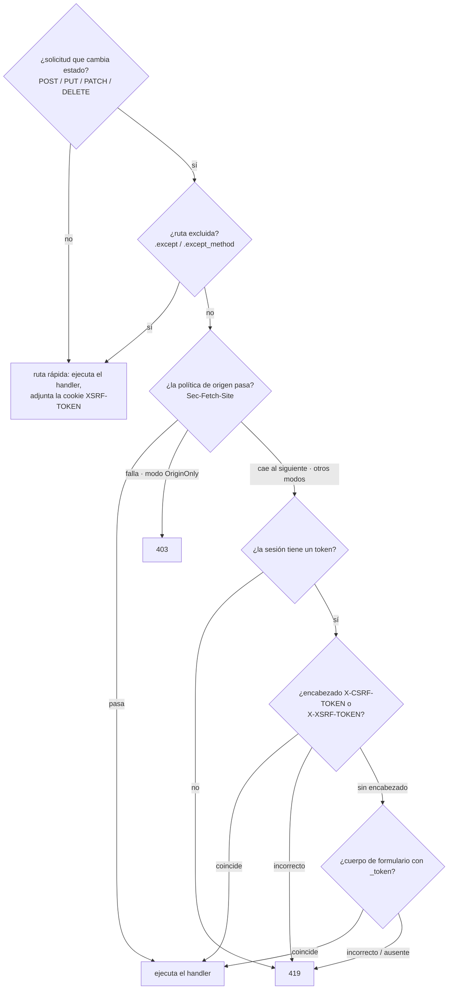

# CSRF

`CsrfMiddleware` valida un token por sesión en cada solicitud que cambia
estado (POST / PUT / PATCH / DELETE). Refleja el `PreventRequestForgery`
de Laravel 13 - las mismas fuentes de token, la misma convención de cookie
`XSRF-TOKEN`, la misma verificación de origen vía `Sec-Fetch-Site`, la
misma división 419 de token no coincidente / 403 de origen no coincidente -
implementado sobre el middleware de sesión de Suprnova.

## Instalarlo globalmente

CSRF se ejecuta después del middleware de sesión (necesita el token CSRF
de la sesión para comparar contra él). En `bootstrap.rs`:

```rust
use suprnova::{global_middleware, CsrfMiddleware, SessionConfig, SessionMiddleware};

pub async fn register() {
    let session_config = SessionConfig::from_env();
    global_middleware!(SessionMiddleware::new(session_config));
    global_middleware!(CsrfMiddleware::new());
}
```

`SessionMiddleware::new(SessionConfig)` recibe la config; el constructor
por defecto conecta internamente el `DatabaseSessionDriver` respaldado por
base de datos. Usa `SessionMiddleware::with_store(config, store)` para
conectar un `SessionStore` propio.

`CsrfMiddleware` debe ir **después** de `SessionMiddleware` en el orden de
registro - el middleware global se ejecuta de afuera hacia adentro, así
que la sesión se carga antes de que CSRF lea su token.

## Cómo fluye una solicitud



GET, HEAD y OPTIONS nunca se comprueban por token, pero igual llegan hasta
el final del middleware para que la cookie `XSRF-TOKEN` se adjunte a la
respuesta. Así es como los clientes SPA obtienen la cookie por primera
vez.

## Fuentes del token, en orden de prioridad

El middleware lee el token de uno de tres lugares, en este orden (igual
que Laravel):

1. **Encabezado `X-CSRF-TOKEN`** - lo que envían Inertia y las plantillas
   SPA con andamiaje.
2. **Encabezado `X-XSRF-TOKEN`** - convención de Laravel / Axios /
   Angular: JavaScript lee la cookie `XSRF-TOKEN` y repite su valor aquí.
3. **Campo de formulario `_token`** - para posts
   `application/x-www-form-urlencoded` desde un formulario HTML
   tradicional.

Si un encabezado está presente pero es incorrecto, el middleware rechaza
de inmediato sin analizar el cuerpo. Un cliente correcto elige un único
lugar para el token; combinar fuentes sería buscarse problemas, con el
token repartido entre varias.

Para la validación del cuerpo del formulario, el middleware almacena en
búfer el cuerpo de la solicitud hasta 64 KiB antes de leer `_token`. El
handler que viene después igual ve la bolsa de formulario completa - el
buffering es transparente, así que `_token` permanece en el formulario
analizado para cualquier handler que quiera consultarlo.

## El lado del frontend

El `main.ts` / `main.tsx` con andamiaje (Svelte / React / Vue) ya
configura Axios:

```ts
import axios from 'axios';

axios.defaults.headers.common['X-Requested-With'] = 'XMLHttpRequest';

const csrfToken = document
  .querySelector('meta[name="csrf-token"]')
  ?.getAttribute('content');
if (csrfToken) {
  axios.defaults.headers.common['X-CSRF-TOKEN'] = csrfToken;
}
```

La etiqueta `<meta name="csrf-token">` se inyecta automáticamente en la
vista base de Inertia mediante `framework/src/inertia/response.rs` - no
hace falta agregarla a mano en un proyecto generado. Cada respuesta de
Inertia lleva el token de la sesión actual en el shell de la página.

Los posts de `useForm` de Inertia pasan por Axios, así que heredan el
encabezado sin cableado adicional:

```tsx
import { useForm } from '@inertiajs/react';

const form = useForm({ title: '', content: '' });
form.post('/posts');  // X-CSRF-TOKEN viene de los valores por defecto de Axios
```

Para una llamada `fetch` sin envolver, lee el token de la etiqueta meta de
la misma forma:

```ts
const token = document
  .querySelector('meta[name="csrf-token"]')
  ?.getAttribute('content') ?? '';

await fetch('/api/data', {
  method: 'POST',
  headers: {
    'Content-Type': 'application/json',
    'X-CSRF-TOKEN': token,
  },
  body: JSON.stringify({ /* ... */ }),
});
```

## La cookie `XSRF-TOKEN`

En cada respuesta - de lectura o de escritura - `CsrfMiddleware` adjunta
una cookie `XSRF-TOKEN` que contiene el token de la sesión actual. Esta es
la convención Laravel-Axios: la biblioteca SPA lee la cookie vía JavaScript
y la repite como `X-XSRF-TOKEN` en la siguiente solicitud que cambia
estado, completando el round-trip sin tocar nunca una etiqueta meta.

La cookie **no** es `HttpOnly` - tiene que poder leerse desde JS. Por eso
el valor se guarda en texto plano (sin round-trip de cifrado), porque el
valor del lado de JS debe coincidir con lo que el middleware compara en
el servidor. Laravel cifra la cookie mediante `EncryptCookies`, que se
ejecuta delante de `PreventRequestForgery`; Suprnova la distribuye en
texto plano y documenta la divergencia - el mismo comportamiento de red
desde la perspectiva del cliente.

### Atributos de la cookie

Los valores por defecto coinciden con `SessionConfig::default()`:
`Path=/`, `Secure`, `SameSite=Lax`, `Max-Age=7200` (2 horas), sin
`Domain`. Anúlalos por builder:

```rust
use std::time::Duration;
use suprnova::{CsrfMiddleware, http::SameSite};

CsrfMiddleware::new()
    .xsrf_cookie_path("/app")
    .xsrf_cookie_domain(".example.com")
    .xsrf_cookie_secure(false)             // para desarrollo local por HTTP
    .xsrf_cookie_same_site(SameSite::Strict)
    .xsrf_cookie_lifetime(Duration::from_secs(15 * 60));
```

### Sincronizar desde `SessionConfig`

Si se anulan `SESSION_PATH` / `SESSION_DOMAIN` / `SESSION_SECURE` /
`SESSION_SAME_SITE` / `SESSION_LIFETIME` en `.env`, la cookie de sesión
respeta esas anulaciones - pero los valores por defecto de la cookie XSRF
no lo harían, lo cual desincroniza ambas en silencio. La solución es una
alineación de una sola llamada:

```rust
let session_config = SessionConfig::from_env();
let csrf = CsrfMiddleware::new().with_session_config(&session_config);
global_middleware!(SessionMiddleware::new(session_config));
global_middleware!(csrf);
```

`with_session_config` copia `cookie_path`, `cookie_domain`,
`cookie_secure`, `lifetime`, y analiza `cookie_same_site` con la misma
matriz insensible a mayúsculas/minúsculas que usa el middleware de sesión
(`"strict"` → `Strict`, `"none"` → `None`, cualquier otra cosa → `Lax`).

### Desactivarlo

Para una app puramente renderizada en el servidor, donde el token solo se
emite vía `{{ csrf_meta_tag() }}` (sin round-trip de SPA), elimina la
cookie:

```rust
global_middleware!(CsrfMiddleware::new().without_xsrf_cookie());
```

## Excluir rutas

Los endpoints de webhooks, los callbacks de OAuth y otras integraciones
externas no pueden llevar un token CSRF. Exímelos con `.except(...)`:

```rust
global_middleware!(
    CsrfMiddleware::new()
        .except(vec!["/webhooks/*", "/api/external/*"])
);
```

Cada entrada es un glob al estilo Laravel (semántica de `Str::is`): `*`
coincide con cualquier secuencia de caracteres, incluido `/`.

| Patrón | Coincide con |
|---|---|
| `"/login"` | solo `/login` |
| `"/webhooks/*"` | `/webhooks/stripe`, `/webhooks/github/events`, … |
| `"/api/*/internal"` | `/api/v1/internal`, `/api/v2/internal` |
| `"*/healthz"` | cualquier ruta que contenga `/healthz` en algún punto |

Las barras iniciales se normalizan - `"webhooks/*"` y `"/webhooks/*"` se
comportan de forma idéntica. `/healthz` a secas (sin segmento de prefijo)
**no** coincide con `"*/healthz"`, igual que el `Str::is` de Laravel
exactamente.

### Exenciones por método

A veces un prefijo de webhook maneja legítimamente tanto callbacks `POST`
sin autenticar (que no pueden llevar un token) como solicitudes `DELETE`
de administración autenticadas (que sí pueden y deben llevarlo). Usa
`.except_method`:

```rust
global_middleware!(
    CsrfMiddleware::new()
        // Los callbacks POST de Stripe evitan CSRF…
        .except_method("POST", "/webhooks/stripe/*")
        // …pero los DELETE contra el mismo prefijo siguen exigiendo un token.
);
```

La comparación de método es insensible a mayúsculas/minúsculas. Las
reglas de `.except(...)` aplican a todos los métodos; las reglas de
`.except_method(...)` solo se disparan para el verbo que nombran.

## Verificación de origen

Los navegadores modernos fijan `Sec-Fetch-Site` en cada fetch sobre
HTTPS. Un valor coincidente indica que la solicitud vino del mismo origen
(o del mismo dominio registrable) sin ningún round-trip de token.
`CsrfMiddleware` puede consultar este encabezado además de - o en lugar
de - la comprobación de token.

`OriginPolicy` es el tipo de valor que elige qué modo se ejecuta:

| Variante | Comportamiento |
|---|---|
| `Disabled` (por defecto) | Ignora `Sec-Fetch-Site`. Solo se ejecuta la validación de token. |
| `SameOriginOnly` | `same-origin` pasa; cualquier otra cosa cae a la validación de token. |
| `AllowSameSite` | `same-origin` y `same-site` pasan; cualquier otra cosa cae al siguiente paso. |
| `OriginOnly` | `Sec-Fetch-Site` es la **única** compuerta. Se omite la comprobación de token. Un fallo es un **403** (no 419). |

Dos builders de conveniencia cubren los casos comunes:

```rust
CsrfMiddleware::new().allow_same_site();   // OriginPolicy::AllowSameSite
CsrfMiddleware::new().origin_only();       // OriginPolicy::OriginOnly
```

Usa `.with_origin_policy(OriginPolicy::SameOriginOnly)` para la opción
intermedia sin `allow-same-site`.

**Salvedad de HTTPS:** los navegadores solo emiten `Sec-Fetch-Site` sobre
HTTPS. Una app que corre HTTP plano no puede usar `origin_only()` - toda
solicitud que cambie estado recibirá un 403 porque falta el encabezado.

`origin_only()` también desactiva automáticamente la cookie
`XSRF-TOKEN` - no hay ningún round-trip de token que alimentar, así que
enviar la cookie es peso muerto.

### 419 frente a 403

| Estado | Qué falló |
|---|---|
| **419** | Comprobación de token (`TokenMismatchException` de Laravel) - token de sesión ausente, token de solicitud ausente, o token de solicitud incorrecto |
| **403** | Comprobación de origen bajo el modo `OriginOnly` (`OriginMismatchException` de Laravel) |

Los clientes pueden distinguir los dos modos de fallo solo por el estado.
Un 419 en general significa "recarga la página y reintenta"; un 403 de la
verificación de origen significa que la solicitud no vino de un origen
confiable, y reintentar no ayudará.

## Funciones ayudantes

Tres funciones libres leen o renderizan el token de la sesión actual.
Devuelven vacío / `None` cuando no hay ninguna sesión activa (en ese caso
el middleware rechazará la solicitud antes de que un handler se ejecute,
así que un token ausente fuera del alcance de una solicitud es
inofensivo).

```rust
use suprnova::csrf::{csrf_token, csrf_meta_tag, csrf_field};

let token: Option<String> = csrf_token();
let meta: String = csrf_meta_tag();
// → <meta name="csrf-token" content="...">
let field: String = csrf_field();
// → <input type="hidden" name="_token" value="...">
```

La vista base de Inertia ya llama a `csrf_meta_tag()` automáticamente -
usa `csrf_field()` al renderizar un formulario HTML tradicional desde una
plantilla Tera / Askama / minijinja, y `csrf_token()` cuando necesites el
valor crudo para algo personalizado.

## Comparación en tiempo constante

La comparación de tokens pasa por `subtle::ConstantTimeEq`, una primitiva
de igualdad en tiempo constante ya revisada, en lugar de un bucle XOR
hecho a mano. Los tokens de Suprnova tienen longitud fija (40 caracteres
alfanuméricos en minúscula), así que una comparación de longitudes
distintas hace cortocircuito como un rechazo estructural - un desajuste de
longitud solo puede venir de un token malformado o de la clase incorrecta,
no de un atacante sondeando en busca de un timing oracle de igual
longitud.

## Regeneración del token

El middleware de sesión regenera el token CSRF en el login y el logout
para prevenir la fijación de sesión. Si hace falta forzar un token nuevo
fuera de esos flujos (por ejemplo, después de un cambio de privilegios
sensible), llama a `regenerate_csrf_token()`:

```rust
use suprnova::regenerate_csrf_token;

if let Some(new_token) = regenerate_csrf_token() {
    // El token rotó; la siguiente solicitud de la SPA debe repetir este valor.
}
```

Devuelve `None` si no hay ninguna sesión activa.

## Manejar el 419 en el cliente

Cuando una sesión expira a mitad de camino y se dispara la siguiente
solicitud que cambia estado, el servidor devuelve 419. El patrón estándar
es recargar la página para que la SPA tome una etiqueta meta y una cookie
nuevas:

```ts
axios.interceptors.response.use(
  response => response,
  error => {
    if (error.response?.status === 419) {
      window.location.reload();
    }
    return Promise.reject(error);
  },
);
```

Las visitas de Inertia ya siguen las redirecciones, así que un controlador
que hace `redirect` después de refrescar la sesión (por ejemplo, a través
de un flujo de login) devuelve al usuario a la página con un token
funcional.

## Pruebas

Los tests conducen el mismo pipeline de `handle_request` que usa
producción - consulta [Pruebas HTTP](http-tests.md) para la configuración
completa. El patrón más limpio para un endpoint protegido por CSRF es
hacer pasar la solicitud por el mismo baile de dos saltos que realiza una
SPA real:

1. **Primero un `GET`** bajo el mismo listener TCP loopback. El
   middleware de sesión acuña una cookie de sesión; `CsrfMiddleware`
   adjunta la cookie `XSRF-TOKEN` a la salida.
2. **Luego un `POST`** a la ruta real, devolviendo la cookie de sesión
   para que se cargue la misma sesión, y repitiendo el valor capturado de
   `XSRF-TOKEN` en `X-XSRF-TOKEN`.

Ese es el round-trip de producción, sin ninguna superficie de test
especial - el middleware no puede distinguir el cliente de test de un
navegador. Los propios tests del middleware CSRF del framework ejercitan
esto de punta a punta vía hyper loopback; el harness vive en el módulo
`tests` de `framework/src/csrf/middleware.rs` y es la forma de referencia
para tests de integración de más alto nivel.

## Garantías de seguridad

- **Tokens por sesión.** Cada sesión tiene su propio token aleatorio de 40
  caracteres; el logout lo rota.
- **Respaldado por CSPRNG.** Los tokens vienen del mismo generador que los
  IDs de sesión (`rand::Rng::random_range` sobre un charset alfanumérico,
  sembrado por el CSPRNG del sistema operativo).
- **Comparación en tiempo constante.** `subtle::ConstantTimeEq` para el
  cuerpo de la comparación; atajo estructural de desajuste de longitud
  para el caso de longitudes distintas.
- **Rotación en login / logout.** La regeneración de sesión genera un
  token nuevo, derrotando la fijación de sesión.
- **Cookies SameSite.** Combinadas con el valor por defecto
  `SameSite=Lax` de la cookie `XSRF-TOKEN`, para defensa en profundidad.
- **419, no 500, ante una sesión ausente.** Una sesión ausente es una
  condición del lado del cliente (sin cookie / sesión expirada), no una
  mala configuración del servidor - Laravel devuelve 419 en el mismo
  caso, y Suprnova también.

## Matriz de paridad con Laravel

| Laravel | Suprnova |
|---|---|
| Middleware `VerifyCsrfToken` / `PreventRequestForgery` | `CsrfMiddleware` |
| Ayudante `csrf_token()` | `suprnova::csrf::csrf_token()` |
| Ayudante Blade `csrf_field()` | `suprnova::csrf::csrf_field()` |
| `<meta name="csrf-token">` (Blade `@csrf` para formularios) | `suprnova::csrf::csrf_meta_tag()` + inyectado automáticamente por la vista base de Inertia |
| `$except = ['stripe/*']` | `.except(["stripe/*"])` |
| Glob `*` (en medio / al inicio / al final) | Igual - semántica completa de `Str::is` |
| Round-trip de la cookie `XSRF-TOKEN` + encabezado `X-XSRF-TOKEN` | Misma convención |
| `$addHttpCookie = false` | `.without_xsrf_cookie()` |
| `PreventRequestForgery::allowSameSite(true)` | `.allow_same_site()` |
| `PreventRequestForgery::useOriginOnly(true)` | `.origin_only()` |
| `TokenMismatchException` (419) | 419 `{"message": "CSRF token mismatch."}` |
| `OriginMismatchException` (403) | 403 `{"message": "Origin mismatch."}` |
| `EncryptCookies` cifra `XSRF-TOKEN` | **Diverge:** texto plano (legible por JS; mismo comportamiento de red para los clientes) |
| `config('session.*')` controla los atributos de la cookie | `.with_session_config(&SessionConfig)` |

## Siguiente

- [Sesiones](session.md) - cómo `SessionMiddleware` puebla el token que
  compara el middleware CSRF
- [CORS](cors.md) - el otro middleware global que la mayoría de las apps
  instala junto a CSRF
- [Middleware](middleware.md) - el orden de registro, la pila global,
  cómo escribir el propio
- [Pruebas HTTP](http-tests.md) - conducir `handle_request` de punta a
  punta, incluidas las rutas protegidas por CSRF
- [Autenticación](authentication.md) - flujos de login / logout que rotan
  la sesión y su token CSRF
