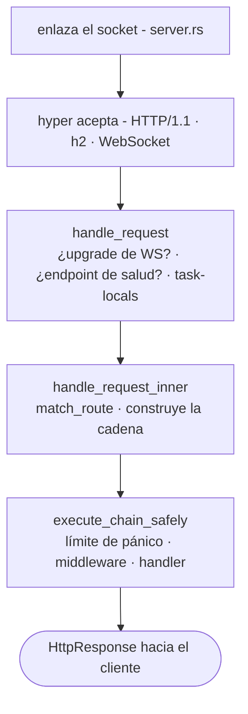

# Ciclo de vida de la solicitud

¿Qué sucede realmente entre el paquete TCP que llega al socket y el
handler que devuelve una `Response`? Seis archivos. Recórrelos una vez
y la forma del framework encaja en su lugar.

## La ruta



## 1. Arranque - `app.rs`

El `main()` de una aplicación con andamiaje construye una
`Application` de forma fluida y la ejecuta:

```rust
Application::new()
    .config(my_app::config::register)
    .bootstrap(my_app::bootstrap::bootstrap)
    .routes(my_app::routes::register)
    .migrations::<my_app::migrations::Migrator>()
    .run()
    .await
```

`Application::run()` analiza la CLI del binario (clap):

- `serve` - inicia el servidor HTTP
- `web:run` - alias de serve
- `migrate` / `migrate:rollback` / `migrate:status` / `migrate:fresh`
- `schedule:run` / `schedule:work` / `schedule:list`
- `workflow:work`
- `queue:work`
- `down` / `up` - alterna el modo de mantenimiento

`db:sync` y `db:seed` residen en el binario CLI `suprnova` de todo el
framework (`suprnova-cli`) y en el binario `cmd/console` de cada
aplicación respectivamente - no en el switch de `Application::run()`.

`.env` ya está cargado en este punto. `#[suprnova::main]` lo carga
*antes* de construir el runtime de Tokio, porque escribir en el
entorno del proceso solo es seguro mientras el proceso es monohilo -
ver [Arranque de la
aplicación](bootstrap.md#suprnovamain-not-tokiomain).
`Application::run` se niega a arrancar si ese paso se omitió.

Para `serve`, a continuación:

1. Verifica que el entorno se cargó desde un contexto monohilo
2. Drena el inventario `#[policy]` hacia el sistema de autorización
3. Llama al `config_fn` (registro de configuración tipada)
4. Ejecuta las migraciones
5. Llama al `bootstrap_fn` (registro de servicios, observadores,
   oyentes)
6. Construye el `Router` a partir de `routes_fn`
7. Entrega el router a `Server::from_config(...)`
8. Llama a `server.run()`

La misma ruta de arranque la usan los workers (`queue:work`,
`workflow:work`, `schedule:run`), de modo que ven los mismos servicios
configurados y los mismos valores vinculados en el contenedor.

## 2. Arranque del servidor - `server.rs`

`Server::from_config` hace dos cosas que importan para la seguridad:

- Ejecuta `App::init()` + `App::boot_services()` - inicializa la capa
  task-local del contenedor y resuelve las dependencias en tiempo de
  arranque
- **Falla cerrado** cuando se requiere `APP_KEY` (cualquier
  entorno que no sea de desarrollo) pero falta o está malformada -
  devuelve `Err`, y `app.rs` imprime un mensaje de remediación y sale
  con código distinto de cero en lugar de entrar en pánico

`server.run()` luego:

1. Arranca la telemetría (subscriber de `tracing`, formato de
   registro)
2. Carga las claves de cifrado (`APP_KEY` + `APP_KEY_PREVIOUS`)
3. Arranca los drivers de runtime **en este orden exacto**: Cache →
   Queue → RateLimit → Mail. Los subcomandos que no son de servidor
   también llaman a `bootstrap_runtime_drivers` para que los workers
   vean los mismos drivers
4. Enlaza el socket TCP
5. Sirve sobre hyper con `.with_upgrades()` (para que las
   actualizaciones de WebSocket funcionen)

El orden de arranque de los drivers es intencional - Queue puede
depender de Cache (para bloqueos de trabajos únicos), RateLimit puede
usar Cache, Mail puede despachar a través de Queue.

## 3. Entrada de solicitud - `handle_request`

Cada solicitud llega a `handle_request(router, registry, req)`. **Esta
es también la superficie de solicitud en proceso que los tests de
integración manejan sin abrir un socket.** Se re-exporta como
`suprnova::handle_request`.

```rust
pub async fn handle_request(
    router: Arc<Router>,
    middleware_registry: Arc<MiddlewareRegistry>,
    req: hyper::Request<hyper::body::Incoming>,
) -> hyper::Response<ServerBody>;
```

Una variante consciente del peer, `handle_request_with_peer`, toma los
mismos argumentos más un `Option<std::net::IpAddr>` - el bucle de
aceptación de producción la usa; los llamadores en proceso usan
`handle_request`, y los encabezados proxy de la solicitud (o `None`)
determinan `Request::ip()`.

Internamente:

1. Comprueba si hay una actualización de WebSocket mediante
   `router.match_ws(...)` - si coincide con una ruta `ws!()`, la
   entrega al handler de WS
2. Trata como caso especial los endpoints de salud integrados -
   `GET /_suprnova/health`, `/_suprnova/health/live`,
   `/_suprnova/health/ready`. Una prueba de disponibilidad (readiness)
   que falla la comprobación de `SERVER_HEALTH_READINESS_TOKEN`
   deliberadamente *no* se trata como caso especial: cae al
   enrutamiento y devuelve 404 como cualquier ruta no enrutada, de
   modo que el endpoint queda invisible en lugar de simplemente
   cerrado
3. Instala los task-locals por solicitud (flash bag, flag de
   deshabilitación de SSR)
4. Despacha hacia `handle_request_inner`

## 4. Enrutamiento + ensamblaje de cadena - `handle_request_inner`

Aquí es donde se compone la cadena de middleware. El router produce
una tripleta `(pattern, handler, params)`, y el `MiddlewareChain` se
ensambla en este orden fijo:

```
[0] RequestIdMiddleware (siempre más externo)
[1] middleware global en orden de registro
[2] middleware de ruta (indexado por (method, patrón coincidente))
[3] handler
```

Tres cosas a tener en cuenta:

- **Patrón, no ruta.** El middleware de ruta se indexa por el patrón
  coincidente (`"/posts/{id}"`), no por la ruta cruda (`/posts/42`).
  El middleware de grupo en rutas parametrizadas sí se activa.
- **Sin coincidencia, la cadena igual se ejecuta.** Si el router no
  coincide con ninguna ruta, la cadena (RequestId + globales) igual se
  ejecuta y termina en un fallback registrado o en un 404 estático. El
  preflight de CORS (OPTIONS rara vez coincide con una ruta), el
  logging y el request-id llegan todos al tráfico no enrutado.
- **El middleware de grupo se aplana, no se apila.** El middleware de
  grupo se copia en la lista de middleware de cada ruta agrupada en el
  momento del registro - no es una capa de runtime separada. La
  introspección no puede distinguir el middleware de grupo del
  middleware de ruta.

## 5. Límite de pánico - `execute_chain_safely`

La cadena se ejecuta dentro de `AssertUnwindSafe(...).catch_unwind()`.
**Un pánico en cualquier middleware o en el handler se captura**, se
registra con method+path, y se convierte a través de la misma ruta
`FrameworkError → HttpResponse` que un 5xx devuelto:

- Cuerpo sanitizado: `{"message": "Internal Server Error"}`
- `request_id` inyectado para poder correlacionar con el registro
- Evento `ErrorOccurred` despachado para que los oyentes (Sentry, el
  pipeline de alertas) vean el fallo
- La carga del pánico **nunca se filtra al cuerpo de la respuesta**

Esto es una red de seguridad, no un contrato. Las APIs públicas del
código de la aplicación deben devolver `Result`, no depender de
`catch_unwind`. El límite existe para evitar que un handler con
errores mate el hilo de trabajo o filtre un stack trace al cliente -
no es una licencia para usar `.unwrap()` en todas partes.

## 6. Composición de cadena - `middleware/chain.rs`

`MiddlewareChain::execute` anida el handler como el `Next` más
interno, y luego envuelve cada middleware de último a primero
(`.rev()`), de modo que **el middleware agregado primero se ejecuta
primero** (de afuera hacia adentro). Una cadena vacía llama al handler
directamente:

```
orden de registro:   [Auth, CSRF, Throttle, handler]
orden de runtime:    Auth → CSRF → Throttle → handler → (salir)
```

Si un middleware hace cortocircuito (devuelve `Err(response)`), la
cadena se desenrolla inmediatamente y la respuesta regresa a través
del middleware ya ejecutado en orden inverso.

## El contrato `Response`

`http::Response` es **`Result<HttpResponse, HttpResponse>`** - ambas
ramas llevan un `HttpResponse`. Los handlers y `Middleware::handle`
devuelven `Response`:

- `Ok(resp)` es éxito
- `Err(resp)` hace cortocircuito - por ejemplo, un 401 directamente
  desde el middleware de autenticación. El runtime colapsa ambos casos
  con `result.unwrap_or_else(|e| e)`, de modo que un `Err` es una
  respuesta, no un crash.
- `?` propaga cualquier error que se convierta a `HttpResponse`. Todos
  los `FrameworkError`, `AppError`, `ValidationErrors`, y las
  implementaciones propias de `HttpError` lo hacen - de modo que el
  cuerpo del handler se lee de arriba a abajo y los fallos burbujean
  hacia el conversor.

El conversor de errores (`From<FrameworkError> for HttpResponse`)
sanitiza los cuerpos 5xx y nunca filtra detalles en la respuesta. El
detalle permanece en el registro estructurado.

Consulta [Manejo de errores](errors.md) y [Modelo de
errores](error-model.md) para el panorama completo.

## Estado por solicitud

Dos capas de estado por solicitud, ambas task-local:

- **Flash bag** - `req.flash()` devuelve el flash de la sesión; los
  valores almacenados aquí sobreviven a una redirección y luego
  desaparecen
- **Flag de deshabilitación de SSR** - Inertia lo usa para
  cortocircuitar el renderizado del lado del servidor en contextos de
  prueba

Ambas son instaladas por `handle_request` antes de que la cadena se
ejecute, y se desmontan cuando la respuesta sale. El estado
personalizado por solicitud pasa por el sistema `Context` - consulta
[Contexto](context.md).

## Los workers reutilizan el mismo ciclo de vida

Los workers en segundo plano (`queue:work`, `workflow:work`,
`schedule:run`) pasan por:

1. La misma ruta de arranque (`Config::init`,
   `bootstrap_runtime_drivers`, la función `bootstrap()` de la
   aplicación)
2. Su propio bucle que extrae trabajo y ejecuta handlers con el
   **mismo límite de pánico** (el equivalente de
   `execute_chain_safely` para cada tipo de worker)
3. Apagado ordenado ante `SIGTERM` / `SIGINT` - el trabajo en curso
   termina, no se inicia trabajo nuevo

Esto significa que un observador registrado en `bootstrap()` se
dispara para inserciones desde un worker de cola exactamente igual que
para inserciones desde un handler HTTP.

## Garantías de seguridad en producción

Una breve lista de invariantes que establece el ciclo de vida:

- **`APP_KEY` es obligatoria en entornos que no son de desarrollo.**
  El arranque falla cerrado, sale con código distinto de cero,
  sin corrupción de datos cifrados.
- **Los pánicos en el handler o en el middleware nunca llegan al
  cliente.** El límite de pánico devuelve un 500 sanitizado y despacha
  `ErrorOccurred`.
- **Los cuerpos 5xx siempre están sanitizados.** El detalle va al
  registro, no a la respuesta.
- **Los bloqueos envenenados nunca abortan el proceso.** Dos patrones
  autorizados: las rutas por solicitud enrutan el envenenamiento hacia
  un `FrameworkError::Internal` que lleva un mensaje
  `"<context> lock poisoned"` (y la solicitud recibe un 500); los
  registros internos de la ruta de ejecución frecuente que deben
  permanecer activos se recuperan en el sitio con
  `.unwrap_or_else(|e| e.into_inner())`. Consulta [Política de
  bloqueos](lock-policy.md).
- **Los fallos del backend de los drivers son una elección explícita
  entre fail-open y fail-closed.** Rate-limit, cache y session eligen
  cada uno una política en el sitio de la llamada -
  `BackendErrorPolicy::FailClosed` devuelve 503; `FailOpen` deja pasar
  la solicitud. No hay un valor por defecto implícito. Consulta
  [Limitación de velocidad](rate-limiting.md).
- **Las actualizaciones de WebSocket pasan por el mismo router.** La
  misma búsqueda `match_ws` usa el mismo indexado `(method, pattern)`
  que las rutas HTTP; se puede aplicar middleware de WS por ruta
  exactamente igual que middleware HTTP.
- **La señal de apagado nunca sufre inanición por el límite de
  conexiones.** Con `SERVER_MAX_CONNECTIONS` configurado, esperar un
  slot libre compite contra la señal de apagado en lugar de bloquear
  el bucle de aceptación, de modo que un servidor cuyos slots están
  todos ocupados por sesiones de WebSocket de larga duración igual se
  drena ante `SIGTERM` en lugar de recibir un SIGKILL al final del
  período de gracia del orquestador.
- **Cada drenaje aborta lo que abandona.** Las conexiones HTTP, los
  handlers de WebSocket y los supervisores obtienen cada uno una
  ventana de gracia acotada, y luego se abortan y se esperan (`await`) -
  incluida la tarea interna de un supervisor, de modo que la
  cancelación llega al cuerpo y no solo al wrapper de reinicio. Nada
  sigue ejecutándose más allá de su drenaje para emitir telemetría
  después del flush.

## Lo que esto significa para el código

Algunas conclusiones prácticas para la escritura diaria de handlers:

- **Devuelve `Response`, propaga con `?`.** No hagas `match err` a
  menos que necesites el `HttpResponse` desnudo.
- **Implementa `HttpError` en los tipos de error del dominio.** Se
  convertirán automáticamente. Consulta [Manejo de
  errores](errors.md).
- **No dependas del límite de pánico.** Este límite atrapa bugs
  genuinos y evita caídas del proceso; el código de biblioteca debería
  seguir devolviendo `Result`.
- **El orden del middleware importa y está fijado en tres capas** -
  request-id más externo, luego los globales, y el middleware de ruta
  más interno justo antes del handler.
- **Los workers y los handlers comparten el bootstrap.** Cualquier
  cosa que se registre en el arranque es visible para ambos.

## Dónde vive cada paso

| Paso | Archivo |
|---|---|
| Arranque | `framework/src/app.rs` |
| Ciclo de vida del servidor | `framework/src/server.rs` |
| `handle_request` (entrada) | `framework/src/server.rs` (re-exportado como `suprnova::handle_request`) |
| `handle_request_inner` (enrutamiento + cadena) | `framework/src/server.rs` |
| `execute_chain_safely` (límite de pánico) | `framework/src/server.rs` |
| `MiddlewareChain::execute` (composición) | `framework/src/middleware/chain.rs` |
| Coincidencia del router | `framework/src/routing/router.rs` |

No hace falta leer estos archivos para usar el framework, pero si
surge un bug inesperado, el rastro es corto.

## Siguiente

- [Contenedor de servicios](container.md) - cómo `App::*` resuelve los
  servicios
- [Arranque de la aplicación](bootstrap.md) - qué hace `bootstrap.rs`
- [Middleware](middleware.md) - cómo escribir middleware propio
- [Modelo de errores](error-model.md) - `FrameworkError`, `HttpError`,
  la recuperación de pánico en detalle
- [Enrutamiento](routing.md) - en qué se expande realmente `routes!`
