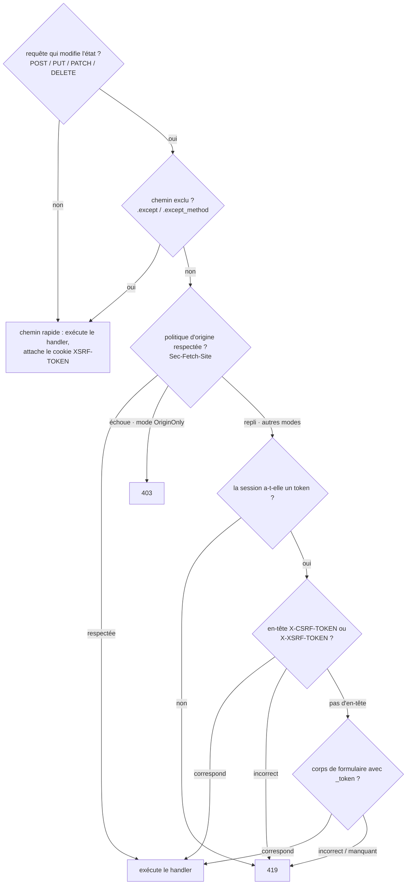

# CSRF

`CsrfMiddleware` valide un token par session à chaque requête qui modifie
l'état (POST / PUT / PATCH / DELETE). Il reproduit le `PreventRequestForgery`
de Laravel 13 - mêmes sources de token, même convention de cookie
`XSRF-TOKEN`, même vérification d'origine `Sec-Fetch-Site`, même répartition
419 pour un token invalide / 403 pour une origine invalide - implémenté
au-dessus du middleware de session de Suprnova.

## Installation globale

CSRF s'exécute après le middleware de session (il a besoin du token CSRF de
la session pour effectuer la comparaison). Dans `bootstrap.rs` :

```rust
use suprnova::{global_middleware, CsrfMiddleware, SessionConfig, SessionMiddleware};

pub async fn register() {
    let session_config = SessionConfig::from_env();
    global_middleware!(SessionMiddleware::new(session_config));
    global_middleware!(CsrfMiddleware::new());
}
```

`SessionMiddleware::new(SessionConfig)` prend la config ; le constructeur
par défaut câble en interne le `DatabaseSessionDriver` adossé à la base de
données. Utilisez `SessionMiddleware::with_store(config, store)` pour
brancher un `SessionStore` personnalisé.

`CsrfMiddleware` doit venir **après** `SessionMiddleware` dans l'ordre
d'enregistrement - le middleware global s'exécute de l'extérieur vers
l'intérieur, donc la session est chargée avant que CSRF ne lise son token.

## Le parcours d'une requête



GET, HEAD et OPTIONS ne sont jamais vérifiés par token, mais ils traversent
quand même le bas du middleware afin que le cookie `XSRF-TOKEN` soit
attaché à la réponse. C'est ainsi que les clients SPA obtiennent le cookie
pour la première fois.

## Sources du token, par ordre de priorité

Le middleware lit le token depuis l'un de ces trois emplacements, dans cet
ordre (comme Laravel) :

1. **En-tête `X-CSRF-TOKEN`** - ce qu'Inertia et les templates SPA
   scaffoldés envoient.
2. **En-tête `X-XSRF-TOKEN`** - convention Laravel / Axios / Angular :
   JavaScript lit le cookie `XSRF-TOKEN` et renvoie sa valeur ici.
3. **Champ de formulaire `_token`** - pour les envois
   `application/x-www-form-urlencoded` provenant d'un formulaire HTML
   traditionnel.

Si un en-tête est présent mais incorrect, le middleware rejette
immédiatement sans analyser le corps. Un client correct choisit un seul
emplacement pour le token ; combiner les sources serait un piège de
fractionnement du token.

Pour la validation du corps de formulaire, le middleware met en tampon le
corps de la requête jusqu'à 64 Kio avant de lire `_token`. Le handler en
aval voit quand même le sac de formulaire complet - la mise en tampon est
transparente, donc `_token` reste dans le formulaire analysé pour tout
handler qui souhaite le consulter.

## Côté frontend

Le `main.ts` / `main.tsx` scaffoldé (Svelte / React / Vue) configure déjà
Axios :

```ts
import axios from 'axios';

axios.defaults.headers.common['X-Requested-With'] = 'XMLHttpRequest';

const csrfToken = document
  .querySelector('meta[name="csrf-token"]')
  ?.getAttribute('content');
if (csrfToken) {
  axios.defaults.headers.common['X-CSRF-TOKEN'] = csrfToken;
}
```

La balise `<meta name="csrf-token">` est injectée automatiquement dans la
vue de base Inertia par `framework/src/inertia/response.rs` - vous n'avez
pas besoin de l'ajouter vous-même dans un projet généré. Chaque réponse
Inertia transporte le token de la session courante dans le shell de page.

Les envois `useForm` d'Inertia passent par Axios, ils héritent donc de
l'en-tête sans câblage supplémentaire :

```tsx
import { useForm } from '@inertiajs/react';

const form = useForm({ title: '', content: '' });
form.post('/posts');  // X-CSRF-TOKEN provient des valeurs par défaut d'Axios
```

Pour un appel `fetch` brut, lisez le token depuis la balise meta de la même
façon :

```ts
const token = document
  .querySelector('meta[name="csrf-token"]')
  ?.getAttribute('content') ?? '';

await fetch('/api/data', {
  method: 'POST',
  headers: {
    'Content-Type': 'application/json',
    'X-CSRF-TOKEN': token,
  },
  body: JSON.stringify({ /* ... */ }),
});
```

## Le cookie `XSRF-TOKEN`

Sur chaque réponse - lecture ou écriture - `CsrfMiddleware` attache un
cookie `XSRF-TOKEN` contenant le token de la session courante. C'est la
convention Laravel-Axios : la bibliothèque SPA lit le cookie via
JavaScript et le renvoie en tant que `X-XSRF-TOKEN` à la prochaine requête
qui modifie l'état, complétant l'aller-retour sans jamais toucher à une
balise meta.

Le cookie n'est **pas** `HttpOnly` - il doit être lisible depuis JS. La
valeur est donc stockée en clair (sans aller-retour de chiffrement), car la
valeur côté JS doit correspondre à ce que le middleware compare côté
serveur. Laravel chiffre le cookie via `EncryptCookies` exécuté en amont de
`PreventRequestForgery` ; Suprnova l'expédie en clair et documente cette
divergence - même comportement sur le réseau du point de vue du client.

### Attributs du cookie

Les valeurs par défaut correspondent à `SessionConfig::default()` :
`Path=/`, `Secure`, `SameSite=Lax`, `Max-Age=7200` (2 heures), pas de
`Domain`. Redéfinissez-les via le builder :

```rust
use std::time::Duration;
use suprnova::{CsrfMiddleware, http::SameSite};

CsrfMiddleware::new()
    .xsrf_cookie_path("/app")
    .xsrf_cookie_domain(".example.com")
    .xsrf_cookie_secure(false)             // pour le développement HTTP local
    .xsrf_cookie_same_site(SameSite::Strict)
    .xsrf_cookie_lifetime(Duration::from_secs(15 * 60));
```

### Synchronisation depuis `SessionConfig`

Si vous redéfinissez `SESSION_PATH` / `SESSION_DOMAIN` / `SESSION_SECURE` /
`SESSION_SAME_SITE` / `SESSION_LIFETIME` dans `.env`, le cookie de session
respecte ces redéfinitions - mais les valeurs par défaut du cookie XSRF ne
le feraient pas, ce qui désynchronise silencieusement les deux. Le
correctif tient en un seul appel d'alignement :

```rust
let session_config = SessionConfig::from_env();
let csrf = CsrfMiddleware::new().with_session_config(&session_config);
global_middleware!(SessionMiddleware::new(session_config));
global_middleware!(csrf);
```

`with_session_config` copie `cookie_path`, `cookie_domain`,
`cookie_secure`, `lifetime`, et analyse `cookie_same_site` avec la même
matrice insensible à la casse que celle utilisée par le middleware de
session (`"strict"` → `Strict`, `"none"` → `None`, tout le reste → `Lax`).

### Désactivation

Pour une application purement rendue côté serveur où vous n'émettez le
token que via `{{ csrf_meta_tag() }}` (pas d'aller-retour SPA), supprimez
le cookie :

```rust
global_middleware!(CsrfMiddleware::new().without_xsrf_cookie());
```

## Exclure des routes

Les points de terminaison de webhook, les callbacks OAuth et les autres
intégrations externes ne peuvent pas porter de token CSRF. Exemptez-les
avec `.except(...)` :

```rust
global_middleware!(
    CsrfMiddleware::new()
        .except(vec!["/webhooks/*", "/api/external/*"])
);
```

Chaque entrée est un glob à la Laravel (sémantique `Str::is`) : `*`
correspond à n'importe quelle suite de caractères, `/` compris.

| Pattern | Correspond à |
|---|---|
| `"/login"` | uniquement `/login` |
| `"/webhooks/*"` | `/webhooks/stripe`, `/webhooks/github/events`, … |
| `"/api/*/internal"` | `/api/v1/internal`, `/api/v2/internal` |
| `"*/healthz"` | tout chemin contenant `/healthz` quelque part |

Les barres obliques de début sont normalisées - `"webhooks/*"` et
`"/webhooks/*"` se comportent de façon identique. `/healthz` seul (sans
segment de préfixe) ne correspond **pas** à `"*/healthz"`, exactement
comme le `Str::is` de Laravel.

### Exemptions par méthode

Il arrive qu'un préfixe de webhook gère légitimement à la fois des
callbacks `POST` non authentifiés (qui ne peuvent pas porter de token) et
des requêtes admin `DELETE` authentifiées (qui peuvent et doivent en
porter un). Utilisez `.except_method` :

```rust
global_middleware!(
    CsrfMiddleware::new()
        // Les callbacks POST de Stripe contournent CSRF…
        .except_method("POST", "/webhooks/stripe/*")
        // …mais les DELETE sur le même préfixe exigent quand même un token.
);
```

La comparaison de méthode est insensible à la casse. Les règles
`.except(...)` s'appliquent à toutes les méthodes ; les règles
`.except_method(...)` ne se déclenchent que pour le verbe qu'elles
nomment.

## Vérification de l'origine

Les navigateurs modernes définissent `Sec-Fetch-Site` sur chaque fetch en
HTTPS. Une valeur correspondante indique que la requête provient de la
même origine (ou du même domaine enregistrable) sans aucun aller-retour de
token. `CsrfMiddleware` peut consulter cet en-tête en plus de - ou à la
place de - la vérification du token.

`OriginPolicy` est le type de valeur qui choisit le mode exécuté :

| Variante | Comportement |
|---|---|
| `Disabled` (par défaut) | Ignore `Sec-Fetch-Site`. Seule la validation du token s'exécute. |
| `SameOriginOnly` | `same-origin` passe ; tout le reste retombe sur la validation du token. |
| `AllowSameSite` | `same-origin` et `same-site` passent ; tout le reste retombe sur la validation. |
| `OriginOnly` | `Sec-Fetch-Site` est **le seul** filtre. La vérification du token est ignorée. Un échec donne un **403** (pas 419). |

Deux builders pratiques couvrent les cas courants :

```rust
CsrfMiddleware::new().allow_same_site();   // OriginPolicy::AllowSameSite
CsrfMiddleware::new().origin_only();       // OriginPolicy::OriginOnly
```

Utilisez `.with_origin_policy(OriginPolicy::SameOriginOnly)` pour l'option
intermédiaire sans `allow-same-site`.

**Mise en garde HTTPS :** les navigateurs n'émettent `Sec-Fetch-Site` qu'en
HTTPS. Une application qui tourne en HTTP simple ne peut pas utiliser
`origin_only()` - chaque requête qui modifie l'état recevra un 403 car
l'en-tête est absent.

`origin_only()` désactive aussi automatiquement le cookie `XSRF-TOKEN` -
il n'y a plus d'aller-retour de token à alimenter, donc expédier le
cookie ne sert plus à rien.

### 419 contre 403

| Statut | Ce qui a échoué |
|---|---|
| **419** | Vérification du token (`TokenMismatchException` de Laravel) - token de session manquant, token de requête manquant, ou token de requête incorrect |
| **403** | Vérification de l'origine en mode `OriginOnly` (`OriginMismatchException` de Laravel) |

Les clients peuvent distinguer les deux modes d'échec par le seul statut.
Un 419 signifie en général « rechargez la page et réessayez » ; un 403
issu de la vérification d'origine signifie que la requête ne provenait pas
d'une origine de confiance, et réessayer n'y changera rien.

## Fonctions utilitaires

Trois fonctions libres lisent ou rendent le token de la session courante.
Elles retournent une valeur vide / `None` quand aucune session n'est
active (dans ce cas, le middleware rejette la requête avant qu'un handler
ne s'exécute, donc un token absent en dehors d'une portée de requête est
sans conséquence).

```rust
use suprnova::csrf::{csrf_token, csrf_meta_tag, csrf_field};

let token: Option<String> = csrf_token();
let meta: String = csrf_meta_tag();
// → <meta name="csrf-token" content="...">
let field: String = csrf_field();
// → <input type="hidden" name="_token" value="...">
```

La vue de base Inertia appelle déjà `csrf_meta_tag()` pour vous - utilisez
`csrf_field()` lors du rendu d'un formulaire HTML traditionnel depuis un
template Tera / Askama / minijinja, et `csrf_token()` quand vous avez
besoin de la valeur brute pour quelque chose de personnalisé.

## Comparaison en temps constant

La comparaison des tokens passe par `subtle::ConstantTimeEq`, une
primitive d'égalité en temps constant qui a fait l'objet d'une revue,
plutôt qu'une boucle XOR maison. Les tokens de Suprnova ont une longueur
fixe (40 caractères alphanumériques en minuscules), donc une comparaison
de longueurs différentes court-circuite en un rejet structurel - une
différence de longueur ne peut provenir que d'un token malformé ou de la
mauvaise catégorie, pas d'un attaquant sondant un oracle temporel à
longueur égale.

## Régénération du token

Le middleware de session régénère le token CSRF à la connexion et à la
déconnexion pour prévenir la fixation de session. Si vous devez forcer un
nouveau token en dehors de ces flux (par exemple après un changement de
privilège sensible), appelez `regenerate_csrf_token()` :

```rust
use suprnova::regenerate_csrf_token;

if let Some(new_token) = regenerate_csrf_token() {
    // Token pivoté ; la prochaine requête du SPA doit renvoyer cette valeur.
}
```

Retourne `None` si aucune session n'est active.

## Gestion du 419 côté client

Quand une session expire en cours de route et que la requête suivante
modifie l'état, le serveur retourne 419. Le motif standard consiste à
recharger la page afin que le SPA récupère une balise meta et un cookie
frais :

```ts
axios.interceptors.response.use(
  response => response,
  error => {
    if (error.response?.status === 419) {
      window.location.reload();
    }
    return Promise.reject(error);
  },
);
```

Les visites Inertia suivent déjà les redirections, donc un contrôleur qui
fait un `redirect` après un rafraîchissement de session (par exemple via
un flux de connexion) ramène l'utilisateur sur la page avec un token qui
fonctionne.

## Tests

Les tests pilotent le même pipeline `handle_request` que la production -
voir [Tests HTTP](http-tests.md) pour la configuration complète. Le
motif le plus propre pour un point de terminaison protégé par CSRF
consiste à faire passer la requête par la même chorégraphie en deux sauts
qu'exécute un vrai SPA :

1. **Faites d'abord un `GET`** sur quelque chose, sous le même listener
   TCP en boucle locale. Le middleware de session émet un cookie de
   session ; `CsrfMiddleware` attache le cookie `XSRF-TOKEN` à la sortie.
2. **Faites un `POST`** sur la route réelle, en renvoyant le cookie de
   session pour que la même session se charge, et en renvoyant la valeur
   `XSRF-TOKEN` capturée dans `X-XSRF-TOKEN`.

C'est l'aller-retour de production, sans surface de test particulière - le
middleware ne peut pas distinguer le client de test d'un navigateur. Les
propres tests du middleware CSRF du framework exercent ceci de bout en
bout via une boucle locale hyper ; le harnais réside dans le module
`tests` de `framework/src/csrf/middleware.rs` et sert de forme de
référence pour les tests d'intégration de plus haut niveau.

## Garanties de sécurité

- **Tokens par session.** Chaque session a son propre token aléatoire de
  40 caractères ; la déconnexion le fait tourner.
- **Adossé à un CSPRNG.** Les tokens proviennent du même générateur que
  les ID de session (`rand::Rng::random_range` sur un jeu de caractères
  alphanumérique, initialisé par le CSPRNG de l'OS).
- **Comparaison en temps constant.** `subtle::ConstantTimeEq` pour le
  corps de la comparaison ; raccourci structurel de différence de
  longueur pour le cas des longueurs inégales.
- **Rotation à la connexion / déconnexion.** La régénération de session
  génère un nouveau token, ce qui déjoue la fixation de session.
- **Cookies SameSite.** Combinés avec la valeur par défaut `SameSite=Lax`
  du cookie `XSRF-TOKEN`, pour une défense en profondeur.
- **419 et non 500 en cas de session absente.** Une session absente est
  une condition côté client (pas de cookie / session expirée), pas une
  mauvaise configuration serveur - Laravel retourne 419 dans le même cas,
  et nous aussi.

## Matrice de parité avec Laravel

| Laravel | Suprnova |
|---|---|
| Middleware `VerifyCsrfToken` / `PreventRequestForgery` | `CsrfMiddleware` |
| Helper `csrf_token()` | `suprnova::csrf::csrf_token()` |
| Helper Blade `csrf_field()` | `suprnova::csrf::csrf_field()` |
| `<meta name="csrf-token">` (`@csrf` Blade pour les formulaires) | `suprnova::csrf::csrf_meta_tag()` + injecté automatiquement par la vue de base Inertia |
| `$except = ['stripe/*']` | `.except(["stripe/*"])` |
| Glob `*` (milieu / début / fin) | Identique - sémantique `Str::is` complète |
| Aller-retour cookie `XSRF-TOKEN` + en-tête `X-XSRF-TOKEN` | Même convention |
| `$addHttpCookie = false` | `.without_xsrf_cookie()` |
| `PreventRequestForgery::allowSameSite(true)` | `.allow_same_site()` |
| `PreventRequestForgery::useOriginOnly(true)` | `.origin_only()` |
| `TokenMismatchException` (419) | 419 `{"message": "CSRF token mismatch."}` |
| `OriginMismatchException` (403) | 403 `{"message": "Origin mismatch."}` |
| `EncryptCookies` chiffre `XSRF-TOKEN` | **Diverge :** en clair (lisible en JS ; même forme réseau pour les clients) |
| `config('session.*')` pilote les attributs du cookie | `.with_session_config(&SessionConfig)` |

## Suivant

- [Sessions](session.md) - comment `SessionMiddleware` alimente le token
  que le middleware CSRF compare
- [CORS](cors.md) - l'autre middleware global que la plupart des
  applications installent aux côtés de CSRF
- [Middleware](middleware.md) - ordre d'enregistrement, la pile globale,
  écrire le vôtre
- [Tests HTTP](http-tests.md) - piloter `handle_request` de bout en bout,
  y compris les routes protégées par CSRF
- [Authentification](authentication.md) - les flux de connexion /
  déconnexion qui font tourner la session et son token CSRF
