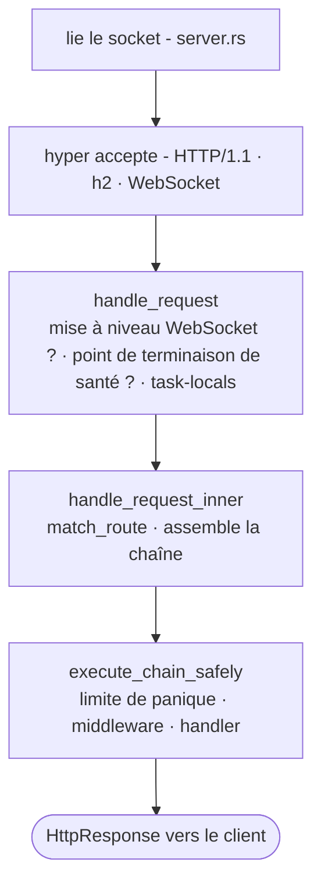

# Cycle de vie des requêtes

Que se passe-t-il réellement entre l'arrivée du paquet TCP sur le socket et le retour d'une `Response` par votre handler ? Six fichiers. Suivez-les une fois et la structure du framework devient limpide.

## Le chemin



## 1. Amorçage - `app.rs`

Le `main()` d'une application scaffoldée construit une `Application` de façon fluide, puis l'exécute :

```rust
Application::new()
    .config(my_app::config::register)
    .http_bootstrap(|| async { my_app::bootstrap::register_http_stack() })
    .routes(my_app::routes::register)
    .migrations::<my_app::migrations::Migrator>()
    .run()
    .await
```

`Application::run()` analyse la CLI du binaire (clap) :

- `serve` - démarre le serveur HTTP
- `web:run` - alias de serve
- `migrate` / `migrate:rollback` / `migrate:status` / `migrate:fresh`
- `schedule:run` / `schedule:work` / `schedule:list`
- `workflow:work`
- `queue:work`
- `down` / `up` - bascule le mode maintenance

`db:sync` et `db:seed` résident respectivement dans le binaire CLI `suprnova`, commun à tout le framework (`suprnova-cli`), et dans le binaire `cmd/console` propre à chaque application - pas dans l'aiguillage de `Application::run()`.

`.env` est déjà chargé à ce stade. `#[suprnova::main]` le charge *avant* de construire le runtime Tokio, car écrire dans l'environnement du processus n'est sûr que tant que celui-ci est mono-thread - voir [Amorçage](bootstrap.md#suprnovamain-not-tokiomain). `Application::run` refuse de démarrer si cette étape a été sautée.

Pour `serve`, il fait ensuite :

1. Vérifie que l'environnement a été chargé depuis un contexte mono-thread
2. Vide l'inventaire `#[policy]` dans le système d'autorisation
3. Appelle votre `config_fn` (enregistrement de configuration typée)
4. Exécute les migrations
5. Appelle votre `bootstrap_fn` (enregistrement des services, observateurs, écouteurs)
6. Appelle votre `http_bootstrap_fn` (middleware global, `Inertia::install`)
7. Construit le `Router` à partir de `routes_fn`
8. Transmet le routeur à `Server::from_config(...)`
9. Appelle `server.run()`

Les workers (`queue:work`, `workflow:work`, `schedule:run`) et le binaire console exécutent le même chemin d'amorçage *jusqu'à et en incluant* `bootstrap_fn`, afin qu'ils bénéficient des mêmes services configurés et des mêmes valeurs liées dans le conteneur - mais ils n'appellent jamais `http_bootstrap_fn`. Seul `serve` / `web:run` le fait. Voir [Amorçage de l'application](bootstrap.md) pour la raison : `Inertia::install` échoue de façon fermée lorsque le manifeste frontend construit est manquant, et une image de worker ou de console est censée s'expédier sans.

## 2. Amorçage du serveur - `server.rs`

`Server::from_config` fait deux choses qui comptent pour la sécurité :

- Exécute `App::init()` + `App::boot_services()` - initialise la couche task-local du conteneur et résout les dépendances d'amorçage
- **Échoue de façon fermée** lorsque `APP_KEY` est requis (tout environnement non-développement) mais manquant ou mal formé - retourne `Err`, et `app.rs` imprime un message de remédiation et quitte avec un code non nul au lieu de paniquer

`server.run()` fait ensuite :

1. Amorce la télémétrie (subscriber `tracing`, format des journaux)
2. Charge les clés de chiffrement (`APP_KEY` + `APP_KEY_PREVIOUS`)
3. Amorce les drivers de runtime **dans cet ordre exact** : Cache → Queue → RateLimit → Mail. Les sous-commandes non-serveur appellent aussi `bootstrap_runtime_drivers`, donc les workers voient les mêmes drivers
4. Lie le socket TCP
5. Sert via hyper avec `.with_upgrades()` (pour que les mises à niveau WebSocket fonctionnent)

L'ordre d'amorçage des drivers est intentionnel - Queue peut dépendre de Cache (pour les verrous de jobs uniques), RateLimit peut utiliser Cache, Mail peut envoyer via Queue.

## 3. Entrée de requête - `handle_request`

Chaque requête arrive dans `handle_request(router, registry, req)`. **C'est aussi la surface de requête in-process que les tests d'intégration pilotent sans ouvrir de socket.** Elle est réexportée en tant que `suprnova::handle_request`.

```rust
pub async fn handle_request(
    router: Arc<Router>,
    middleware_registry: Arc<MiddlewareRegistry>,
    req: hyper::Request<hyper::body::Incoming>,
) -> hyper::Response<ServerBody>;
```

Une variante qui tient compte du pair, `handle_request_with_peer`, prend les mêmes arguments plus une `Option<std::net::IpAddr>` - la boucle d'acceptation de production l'utilise ; les appelants in-process utilisent `handle_request` et les en-têtes proxy de la requête (ou `None`) déterminent `Request::ip()`.

À l'intérieur, elle :

1. Vérifie une mise à niveau WebSocket via `router.match_ws(...)` - si elle correspond à une route `ws!()`, transmet au handler WS
2. Traite spécialement les points de terminaison de santé intégrés - `GET /_suprnova/health`, `/_suprnova/health/live`, `/_suprnova/health/ready`. Une sonde de disponibilité qui échoue au contrôle `SERVER_HEALTH_READINESS_TOKEN` n'est intentionnellement *pas* traitée spécialement : elle passe au routage et renvoie un 404 comme n'importe quel chemin non routé, donc le point de terminaison est invisible plutôt que simplement fermé
3. Installe les task-locals par requête (flash bag, flag de désactivation SSR)
4. Transmet à `handle_request_inner`

## 4. Routage et assemblage de la chaîne - `handle_request_inner`

C'est ici que la chaîne middleware se compose. Le routeur produit un triplet `(pattern, handler, params)`, et le `MiddlewareChain` est assemblé dans cet ordre fixe :

```
[0] RequestIdMiddleware (toujours le plus extérieur)
[1] middleware global dans l'ordre d'enregistrement
[2] middleware de route (indexé par (method, motif correspondant))
[3] handler
```

Trois choses à noter :

- **Motif, pas chemin.** Le middleware de route est indexé par le motif correspondant (`"/posts/{id}"`), pas le chemin brut (`/posts/42`). Le middleware de groupe sur les routes paramétrées fonctionne réellement.
- **Une absence de correspondance exécute quand même la chaîne.** Si le routeur ne correspond à aucune route, la chaîne (RequestId + middleware globaux) s'exécute quand même et se termine par un fallback enregistré ou un 404 statique. Le préflight CORS (OPTIONS correspond rarement à une route), la journalisation et l'ID de requête atteignent tous le trafic non routé.
- **Le middleware de groupe est aplati, pas empilé.** Le middleware de groupe est copié dans la liste des middleware de chaque route groupée au moment de l'enregistrement - ce n'est pas une couche de runtime séparée. L'introspection ne peut pas distinguer le groupe du middleware de route.

## 5. Limite de panique - `execute_chain_safely`

La chaîne s'exécute à l'intérieur de `AssertUnwindSafe(...).catch_unwind()`. **Une panique dans n'importe quel middleware ou dans le handler est capturée**, journalisée avec method+path, et convertie via le même chemin `FrameworkError → HttpResponse` qu'un 5xx retourné :

- Corps assaini : `{"message": "Internal Server Error"}`
- `request_id` injecté afin que vous puissiez le corréler avec le journal
- Événement `ErrorOccurred` envoyé afin que les écouteurs (Sentry, votre pipeline d'alerte) voient l'échec
- La charge utile de la panique ne fuit **jamais** dans le corps de la réponse

C'est un filet de sécurité, pas un contrat. Les API publiques de votre code devraient retourner `Result`, pas se fier à `catch_unwind`. La limite existe pour empêcher un handler bogué de tuer le thread de travail ou de laisser fuir une stack trace au client - ce n'est pas un blanc-seing pour utiliser `.unwrap()` partout.

## 6. Composition de la chaîne - `middleware/chain.rs`

`MiddlewareChain::execute` imbrique le handler comme le `Next` le plus intérieur, puis enveloppe chaque middleware du dernier au premier (`.rev()`), donc **le premier middleware ajouté s'exécute en premier** (de l'extérieur vers l'intérieur). Une chaîne vide appelle le handler directement :

```
ordre d'enregistrement :  [Auth, CSRF, Throttle, handler]
ordre d'exécution :       Auth → CSRF → Throttle → handler → (retour vers l'extérieur)
```

Si le middleware court-circuite (retourne `Err(response)`), la chaîne remonte immédiatement et la réponse repasse par le middleware déjà exécuté, en sens inverse.

## Le contrat `Response`

`http::Response` est **`Result<HttpResponse, HttpResponse>`** - les deux branches portent une `HttpResponse`. Les handlers et `Middleware::handle` retournent `Response` :

- `Ok(resp)` est le succès
- `Err(resp)` court-circuite - par exemple, un 401 directement depuis le middleware d'authentification. Le runtime réduit les deux branches avec `result.unwrap_or_else(|e| e)`, donc un `Err` est une réponse, pas un crash.
- `?` propage toute erreur qui se convertit en `HttpResponse`. Chaque `FrameworkError`, `AppError`, `ValidationErrors`, et vos propres impls `HttpError` le font - donc le corps du handler se lit de haut en bas et les défaillances remontent au convertisseur.

Le convertisseur d'erreur (`From<FrameworkError> for HttpResponse`) assainit les corps 5xx et ne laisse jamais fuiter le moindre détail vers le client. Le détail reste dans le journal structuré.

Voir [Gestion des erreurs](errors.md) et [Modèle d'erreur](error-model.md) pour le tableau complet.

## État par requête

Deux couches d'état par requête, toutes deux task-local :

- **Flash bag** - `req.flash()` retourne le flash de session ; les valeurs stockées ici survivent à une redirection puis disparaissent
- **Flag de désactivation SSR** - Inertia l'utilise pour court-circuiter le rendu côté serveur dans les contextes de test

Les deux sont installés par `handle_request` avant l'exécution de la chaîne et démontés quand la réponse part. L'état personnalisé par requête passe par le système `Context` - voir [Contexte](context.md).

## Les workers réutilisent le même cycle de vie

Les workers en arrière-plan (`queue:work`, `workflow:work`, `schedule:run`) passent par :

1. Le même chemin d'amorçage (`Config::init`, `bootstrap_runtime_drivers`, votre fonction `bootstrap()`) - **pas** `http_bootstrap()` ; ce crochet est réservé au serveur, ce qui permet à une image de worker de démarrer sans un manifeste frontend construit
2. Leur propre boucle qui récupère le travail et exécute les handlers avec la
   **même limite de panique** (équivalent de `execute_chain_safely` pour
   chaque type de worker)
3. Arrêt gracieux sur `SIGTERM` / `SIGINT` - le travail en cours finit, aucun nouveau travail ne démarre

Cela signifie qu'un observateur enregistré dans `bootstrap()` se déclenche pour les insertions d'un worker de file d'attente exactement comme il le ferait pour les insertions d'un handler HTTP.

## Garanties de sécurité en production

Une courte liste d'invariants que le cycle de vie établit :

- **`APP_KEY` est requis dans les environnements non-développement.** L'amorçage échoue de façon fermée, quitte avec un code non nul, pas de corruption de données chiffrées.
- **Les paniques dans le handler ou le middleware n'atteindront jamais le client.** La limite de panique renvoie un 500 assaini et envoie `ErrorOccurred`.
- **Les corps 5xx sont toujours assainis.** Le détail va dans le journal, pas au client.
- **Les verrous empoisonnés n'interrompent jamais le processus.** Deux motifs autorisés : les chemins par requête convertissent l'empoisonnement du verrou en une `FrameworkError::Internal` portant un message `"<context> lock poisoned"` (et la requête reçoit un 500) ; les registres du hot path qui doivent rester disponibles récupèrent sur place avec `.unwrap_or_else(|e| e.into_inner())`. Voir [Politique de verrouillage](lock-policy.md).
- **Les défaillances du driver backend sont un choix explicite fail-open ou fail-closed.** La limitation de débit, le cache, la session choisissent chacun une politique au site d'appel - `BackendErrorPolicy::FailClosed` retourne 503 ; `FailOpen` laisse la requête passer. Il n'y a pas de politique par défaut implicite. Voir [Limitation de débit](rate-limiting.md).
- **Les mises à niveau WebSocket passent par le même routeur.** La même recherche `match_ws` utilise la même indexation `(method, pattern)` que les routes HTTP ; vous pouvez appliquer le middleware WS par route exactement comme le middleware HTTP.
- **Le signal d'arrêt n'est jamais affamé par le plafond de connexion.** Avec `SERVER_MAX_CONNECTIONS` défini, l'attente d'un slot libre est mise en concurrence avec le signal d'arrêt plutôt que de bloquer la boucle d'acceptation, donc un serveur dont les slots sont tous tenus par des sessions WebSocket longue durée se vide quand même sur `SIGTERM` au lieu d'être SIGKILLé à la fin du délai de grâce de l'orchestrateur.
- **Chaque vidage interrompt ce qu'il abandonne.** Les connexions HTTP, les handlers WebSocket et les superviseurs bénéficient chacun d'une fenêtre de grâce bornée, puis sont interrompus et attendus - y compris la tâche interne d'un superviseur, de sorte que l'annulation atteint le corps et pas seulement le wrapper de redémarrage. Rien ne continue de s'exécuter au-delà de son vidage pour émettre de la télémétrie après la purge.

## Ce que cela signifie pour votre code

Quelques points clés pour l'écriture quotidienne de handlers :

- **Retournez `Response`, propagez avec `?`.** Ne faites pas `match err` à moins que vous n'ayez besoin de la `HttpResponse` brute.
- **Implémentez `HttpError` sur vos types d'erreur de domaine.** Ils se convertiront automatiquement. Voir [Gestion des erreurs](errors.md).
- **Ne vous fiez pas à la limite de panique.** Elle capture les vrais bugs et prévient les crashs de processus ; le code de bibliothèque devrait quand même retourner `Result`.
- **L'ordre du middleware est important et est fixé en trois couches** - request-id le plus à l'extérieur, middleware globaux ensuite, middleware de route le plus à l'intérieur avant le handler.
- **Les workers et handlers partagent l'amorçage.** Tout ce que vous enregistrez à l'amorçage est visible pour les deux.

## Où réside chaque étape

| Étape | Fichier |
|---|---|
| Amorçage | `framework/src/app.rs` |
| Cycle de vie du serveur | `framework/src/server.rs` |
| `handle_request` (entrée) | `framework/src/server.rs` (réexporté en tant que `suprnova::handle_request`) |
| `handle_request_inner` (routage + chaîne) | `framework/src/server.rs` |
| `execute_chain_safely` (limite de panique) | `framework/src/server.rs` |
| `MiddlewareChain::execute` (composition) | `framework/src/middleware/chain.rs` |
| Correspondance du routeur | `framework/src/routing/router.rs` |

Vous ne devriez pas avoir besoin de lire ces fichiers pour utiliser le framework, mais si un bug vous surprend, la piste est courte.

## Suivant

- [Conteneur de service](container.md) - comment `App::*` résout les services
- [Amorçage de l'application](bootstrap.md) - ce que fait `bootstrap.rs`
- [Middleware](middleware.md) - écrire votre propre middleware
- [Modèle d'erreur](error-model.md) - `FrameworkError`, `HttpError`, récupération de panique en détail
- [Routage](routing.md) - ce en quoi `routes!` se développe réellement
