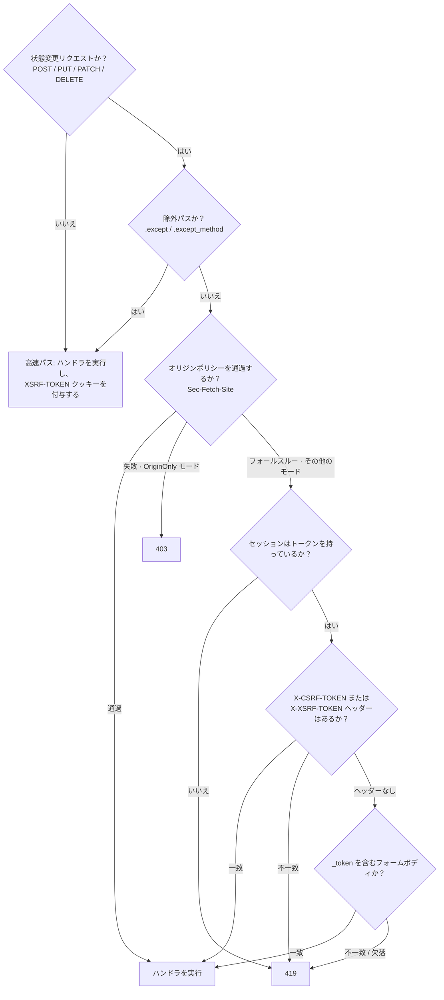

# CSRF

`CsrfMiddleware` は、あらゆる状態変更リクエスト（POST / PUT / PATCH / DELETE）に対して、セッションごとのトークンを検証します。これはLaravel 13の `PreventRequestForgery` を反映したものです - 同じトークン取得元、同じ `XSRF-TOKEN` クッキーの規約、同じ `Sec-Fetch-Site` オリジン検証、同じ419トークン不一致 / 403オリジン不一致の分岐であり、Suprnovaのセッションミドルウェアの上に実装されています。

## グローバルにインストールする

CSRFはセッションミドルウェアの後に実行されます（比較対象となるセッションのCSRFトークンが必要だからです）。`bootstrap.rs` で:

```rust
use suprnova::{global_middleware, CsrfMiddleware, SessionConfig, SessionMiddleware};

pub async fn register() {
    let session_config = SessionConfig::from_env();
    global_middleware!(SessionMiddleware::new(session_config));
    global_middleware!(CsrfMiddleware::new());
}
```

`SessionMiddleware::new(SessionConfig)` は設定を受け取ります。デフォルトのコンストラクタは、内部でデータベースを裏付けとする `DatabaseSessionDriver` を配線します。独自の `SessionStore` を差し込むには `SessionMiddleware::with_store(config, store)` を使ってください。

`CsrfMiddleware` は、登録順で `SessionMiddleware` の**後**に来なければなりません - グローバルミドルウェアは外側から内側へ実行されるため、CSRFがトークンを読む前にセッションが読み込まれます。

## リクエストがどのように流れるか



GET、HEAD、OPTIONSは決してトークンチェックの対象になりませんが、それでもミドルウェアの最下部までは到達するため、`XSRF-TOKEN` クッキーがレスポンスに付与されます。これが、SPAクライアントが最初にクッキーを取得する仕組みです。

## トークンの取得元と優先順位

ミドルウェアは、次の順序（Laravelと一致します）で、3つの場所のいずれかからトークンを読み取ります:

1. **`X-CSRF-TOKEN` ヘッダー** - InertiaとスキャフォルドされたSPAテンプレートが送るものです。
2. **`X-XSRF-TOKEN` ヘッダー** - Laravel / Axios / Angularの規約です。JavaScriptが `XSRF-TOKEN` クッキーを読み取り、その値をここにエコーします。
3. **`_token` フォームフィールド** - 従来のHTMLフォームからの `application/x-www-form-urlencoded` なPOST用です。

ヘッダーが存在するのに間違っている場合、ミドルウェアはボディをパースすることなく即座に拒否します。正しいクライアントはトークンの置き場所を一つに定めます。複数の取得元を組み合わせることは、トークンを分裂させかねない危険な設計です。

フォームボディの検証のために、ミドルウェアは `_token` を読み取る前に、リクエストボディを最大64 KiBまでバッファリングします。下流のハンドラは、それでもなお完全なフォームバッグを目にします - バッファリングは透過的であるため、`_token` はそれを見たいと思うどのハンドラのためにも、パースされたフォームの中に残り続けます。

## フロントエンド側

スキャフォルドされたSvelte、React、Vueのエントリーポイントは、Axiosではなく、Inertia 3のネイティブなvisitパイプラインを使用します。それぞれのエントリーポイントは、InertiaアダプターからRouterをインポートし、metaタグからトークンを読み取り、ルーターのフックで付属させます:

```ts
const csrfToken = document
  .querySelector('meta[name="csrf-token"]')
  ?.getAttribute('content');
if (csrfToken) {
  router.on('before', (event) => {
    event.detail.visit.headers['X-CSRF-TOKEN'] = csrfToken;
  });
}
```

InertiaのuseFormは、同じvisitパイプラインを使用するため、このフックからヘッダーを受け取ります:
```tsx
import { useForm } from '@inertiajs/react';

const form = useForm({ title: '', content: '' });
form.post('/posts');  // X-CSRF-TOKEN はルーターのフックから来る
```

生の `fetch` 呼び出しの場合は、同じようにmeta タグからトークンを読み取ってください:

```ts
const token = document
  .querySelector('meta[name="csrf-token"]')
  ?.getAttribute('content') ?? '';

await fetch('/api/data', {
  method: 'POST',
  headers: {
    'Content-Type': 'application/json',
    'X-CSRF-TOKEN': token,
  },
  body: JSON.stringify({ /* ... */ }),
});
```

## `XSRF-TOKEN` クッキー

あらゆるレスポンスに対して - 読み取りであれ書き込みであれ - `CsrfMiddleware` は、現在のセッションのトークンを含む `XSRF-TOKEN` クッキーを付与します。これはLaravel-Axiosの規約です: SPAのライブラリがJavaScript経由でクッキーを読み取り、次の状態変更リクエストで `X-XSRF-TOKEN` としてそれをエコーします。meta タグに一切触れることなく、往復が完了します。

このクッキーは `HttpOnly` では**ありません** - JSから読み取れる必要があるからです。そのため値は平文で保存されます（暗号化の往復はありません）。JS側の値が、ミドルウェアがサーバー側で比較するものと一致していなければならないからです。Laravelは `PreventRequestForgery` の前段で動く `EncryptCookies` によってクッキーを暗号化しますが、Suprnovaはこれを平文で出荷し、その相違点を文書化しています - クライアントの視点から見れば、通信上の挙動は同じです。

### クッキーの属性

デフォルトは `SessionConfig::default()` と一致します: `Path=/`、`Secure`、`SameSite=Lax`、`Max-Age=7200`（2時間）、`Domain` はなし。ビルダーで上書きできます:

```rust
use std::time::Duration;
use suprnova::{CsrfMiddleware, http::SameSite};

CsrfMiddleware::new()
    .xsrf_cookie_path("/app")
    .xsrf_cookie_domain(".example.com")
    .xsrf_cookie_secure(false)             // ローカルの HTTP 開発向け
    .xsrf_cookie_same_site(SameSite::Strict)
    .xsrf_cookie_lifetime(Duration::from_secs(15 * 60));
```

### `SessionConfig` との同期

`.env` で `SESSION_PATH` / `SESSION_DOMAIN` / `SESSION_SECURE` / `SESSION_SAME_SITE` / `SESSION_LIFETIME` を上書きすると、セッションクッキーはその上書きを尊重します - しかしXSRFクッキーのデフォルトはそうならず、両者は気づかないうちに同期しなくなります。この修正は、1回の呼び出しで揃えるというものです:

```rust
let session_config = SessionConfig::from_env();
let csrf = CsrfMiddleware::new().with_session_config(&session_config);
global_middleware!(SessionMiddleware::new(session_config));
global_middleware!(csrf);
```

`with_session_config` は `cookie_path`、`cookie_domain`、`cookie_secure`、`lifetime` をコピーし、セッションミドルウェアが使うのと同じ大文字小文字を区別しないマトリクスで `cookie_same_site` をパースします（`"strict"` → `Strict`、`"none"` → `None`、それ以外 → `Lax`）。

`with_session_config` は、意図的に `SessionConfig::cookie_prefix` をコピーしません。セッションとremember-meクッキーはワイヤプレフィックスを使用しますが、Axiosなどのクライアントは一般にリテラルの `XSRF-TOKEN` 名を検索します（Axiosでは `xsrfCookieName`）。副作用としてプレフィックスを付けると、ブラウザとクライアントの間でトークンの場所に関する認識が食い違います。

クライアントがプレフィックス付きのXSRFクッキー用に構成されている場合は、その名前を明示的に選択してください:

```rust
let csrf = CsrfMiddleware::new().xsrf_cookie_name("__Host-XSRF-TOKEN");
```

その場合、クッキーレンダラーは `__Host-` 名に対して `Secure`、`Path=/`、および `Domain` なしを提供します。セッションプレフィックスは独立した設定のままです。両方のクッキーにホストロックが必要な場合は、両方を意図的に構成してください。

### 無効化する

`{{ csrf_meta_tag() }}` を通じてのみトークンを発行する、純粋なサーバーサイドレンダリングのアプリ（SPAの往復がない場合）では、クッキーを外してください:

```rust
global_middleware!(CsrfMiddleware::new().without_xsrf_cookie());
```

## ルートを除外する

Webhookのエンドポイント、OAuthのコールバック、その他の外部統合は、CSRFトークンを運べません。`.except(...)` でそれらを除外してください:

```rust
global_middleware!(
    CsrfMiddleware::new()
        .except(vec!["/webhooks/*", "/api/external/*"])
);
```

各エントリはLaravelスタイルのグロブ（`Str::is` のセマンティクス）です: `*` は `/` を含む、あらゆる文字の連なりにマッチします。

| パターン | マッチするもの |
|---|---|
| `"/login"` | `/login` のみ |
| `"/webhooks/*"` | `/webhooks/stripe`、`/webhooks/github/events`、… |
| `"/api/*/internal"` | `/api/v1/internal`、`/api/v2/internal` |
| `"*/healthz"` | どこかに `/healthz` を含むあらゆるパス |

先頭のスラッシュは正規化されます - `"webhooks/*"` と `"/webhooks/*"` は同じように振る舞います。裸の `/healthz`（プレフィックスセグメントがない）は `"*/healthz"` に**マッチしません**。これはLaravelの `Str::is` と正確に一致する挙動です。

### メソッド単位の除外

Webhookのプレフィックスが、トークンを運べない未認証の `POST` コールバックと、運ぶべき・運べる認証済みの `DELETE` 管理者リクエストの両方を正当に扱うことがあります。`.except_method` を使ってください:

```rust
global_middleware!(
    CsrfMiddleware::new()
        // Stripe の POST コールバックは CSRF を迂回します…
        .except_method("POST", "/webhooks/stripe/*")
        // …しかし同じプレフィックスへの DELETE は、依然としてトークンを必要とします。
);
```

メソッドの比較では大文字小文字は区別されません。`.except(...)` のルールはすべてのメソッドに適用され、`.except_method(...)` のルールは名指しされたメソッドに対してのみ発火します。

## オリジン検証

最近のブラウザは、HTTPS上のあらゆるフェッチに `Sec-Fetch-Site` を設定します。一致する値は、トークンの往復を一切行わなくても、リクエストが同一オリジン（あるいは同じ登録可能ドメイン）から来たことを教えてくれます。`CsrfMiddleware` は、トークンチェックに加えて - あるいはその代わりに - このヘッダーを参照できます。

`OriginPolicy` は、どのモードが実行されるかを選ぶ値型です:

| バリアント | 挙動 |
|---|---|
| `Disabled`（デフォルト） | `Sec-Fetch-Site` を無視します。トークン検証のみが実行されます。 |
| `SameOriginOnly` | `same-origin` は通過し、それ以外はトークン検証にフォールスルーします。 |
| `AllowSameSite` | `same-origin` と `same-site` は通過し、それ以外はフォールスルーします。 |
| `OriginOnly` | `Sec-Fetch-Site` が**唯一**のゲートです。トークンチェックはスキップされます。失敗すると**403**になります（419ではありません）。 |

2つの便利なビルダーが、よくあるケースをカバーします:

```rust
CsrfMiddleware::new().allow_same_site();   // OriginPolicy::AllowSameSite
CsrfMiddleware::new().origin_only();       // OriginPolicy::OriginOnly
```

`allow-same-site` を使わない中間の選択肢には `.with_origin_policy(OriginPolicy::SameOriginOnly)` を使ってください。

**HTTPSに関する注意点:** ブラウザはHTTPS上でしか `Sec-Fetch-Site` を発行しません。素のHTTPで動くアプリは `origin_only()` を使えません - ヘッダーが存在しないため、あらゆる状態変更リクエストが403になります。

`origin_only()` は `XSRF-TOKEN` クッキーも自動的に無効化します - 供給すべきトークンの往復がないため、クッキーを出荷することは無駄な重荷でしかありません。

### 419 対 403

| ステータス | 何が失敗したか |
|---|---|
| **419** | トークンチェック（Laravelの `TokenMismatchException`） - セッショントークンの欠落、リクエストトークンの欠落、または間違ったリクエストトークン |
| **403** | `OriginOnly` モードでのオリジンチェック（Laravelの `OriginMismatchException`） |

クライアントは、ステータスだけでこの2つの失敗モードを見分けられます。419は一般に「ページをリロードしてやり直せ」を意味します。オリジン検証による403は、リクエストが信頼されたオリジンから来なかったことを意味し、やり直しても助けにはなりません。

## ヘルパー関数

3つのフリー関数が、現在のセッションのトークンを読み取り・描画します。セッションがアクティブでない場合は空 / `None` を返します（その場合、ミドルウェアはハンドラが実行される前にリクエストを拒否するため、リクエストスコープの外でトークンが欠けていても無害です）。

```rust
use suprnova::csrf::{csrf_token, csrf_meta_tag, csrf_field};

let token: Option<String> = csrf_token();
let meta: String = csrf_meta_tag();
// → <meta name="csrf-token" content="...">
let field: String = csrf_field();
// → <input type="hidden" name="_token" value="...">
```

Inertiaのベースビューは、すでにあなたの代わりに `csrf_meta_tag()` を呼び出しています - Tera / Askama / minijinjaのテンプレートから従来のHTMLフォームを描画するときは `csrf_field()` を、何か独自のもののために生の値が必要なときは `csrf_token()` を使ってください。

## 定数時間比較

トークンの比較は、自前で書いたXORループではなく、レビュー済みの定数時間比較プリミティブである `subtle::ConstantTimeEq` を経由します。Suprnovaのトークンは固定長です（40文字の小文字英数字）。そのため、長さが異なる比較は構造的な拒否としてショートサーキットします - 長さの不一致は、不正な形式か誤ったクラスのトークンからしか生じ得ず、同じ長さのタイミングオラクルを探る攻撃者から生じることはありません。

## トークンの再生成

セッションミドルウェアは、セッション固定化攻撃を防ぐために、ログインとログアウトの際にCSRFトークンを再生成します。これらのフローの外側で強制的に新しいトークンが必要な場合（例えば、機密性の高い権限変更の後など）は、`regenerate_csrf_token()` を呼び出してください:

```rust
use suprnova::regenerate_csrf_token;

if let Some(new_token) = regenerate_csrf_token() {
    // トークンがローテーションされました。SPA の次のリクエストは、この値をエコーする必要があります。
}
```

セッションがアクティブでない場合は `None` を返します。

## クライアント側で419を処理する

セッションの途中でセッションが期限切れになり、次の状態変更リクエストが発火すると、サーバーは419を返します。標準的なパターンは、SPAが新しいmeta タグとクッキーを取得できるように、ページをリロードすることです:

```ts
axios.interceptors.response.use(
  response => response,
  error => {
    if (error.response?.status === 419) {
      window.location.reload();
    }
    return Promise.reject(error);
  },
);
```

Inertiaの画面遷移はすでにリダイレクトに従うため、セッションの更新後に（例えばログインフローを通じて）`redirect` するコントローラーは、動作するトークンを持った状態で、ユーザーをそのページに戻します。

## テスト

テストは、本番環境が使うのと同じ `handle_request` パイプラインを駆動します - 完全なセットアップについては[HTTP テスト](http-tests.md)を参照してください。CSRFで保護されたエンドポイントに対する最もクリーンなパターンは、実際のSPAが行うのと同じ2段階のやり取りを通じてリクエストを実行することです:

1. **まず何かを `GET` します。** 同じTCPループバックリスナーの下で行います。セッションミドルウェアがセッションクッキーを発行し、`CsrfMiddleware` が戻りがけに `XSRF-TOKEN` クッキーを付与します。
2. **実際のルートに `POST` します。** 同じセッションが読み込まれるようセッションクッキーを送り返し、捕捉しておいた `XSRF-TOKEN` の値を `X-XSRF-TOKEN` にエコーします。

これは、特別なテスト表面を持たない、本番と同じ往復です - ミドルウェアには、テストクライアントとブラウザを見分けることができません。フレームワーク自身のCSRFミドルウェアのテストは、hyperのループバックを通じてこれをエンドツーエンドで検証します。そのハーネスは `framework/src/csrf/middleware.rs` の `tests` モジュールにあり、より高レベルな統合テストの参考となる形です。

## セキュリティの保証

- **セッションごとのトークン。** 各セッションは、それぞれ独自の40文字のランダムなトークンを持ちます。ログアウトはそれをローテーションします。
- **CSPRNGに支えられています。** トークンは、セッションIDと同じ生成器（OSのCSPRNGでシードされた、英数字の文字集合に対する `rand::Rng::random_range`）から来ます。
- **定数時間比較。** 比較の本体には `subtle::ConstantTimeEq` を、長さが異なる場合には構造的な長さ不一致のショートカットを使います。
- **ログイン / ログアウトでのローテーション。** セッションの再生成が新しいトークンを生成し、セッション固定化攻撃を無効化します。
- **SameSiteクッキー。** 多層防御のため、`XSRF-TOKEN` クッキーの `SameSite=Lax` というデフォルトと組み合わされています。
- **セッションが欠けている場合は500ではなく419。** セッションが欠けているのは、サーバーの設定ミスではなく、クライアント側の状態です（クッキーがない・セッションが期限切れなど）。Laravelも同じ場合に419を返し、私たちもそうします。

## Laravel パリティ表

| Laravel | Suprnova |
|---|---|
| `VerifyCsrfToken` / `PreventRequestForgery` ミドルウェア | `CsrfMiddleware` |
| `csrf_token()` ヘルパー | `suprnova::csrf::csrf_token()` |
| `csrf_field()` Bladeヘルパー | `suprnova::csrf::csrf_field()` |
| `<meta name="csrf-token">`（フォーム用のBladeの `@csrf`） | `suprnova::csrf::csrf_meta_tag()` + Inertiaのベースビューによって自動注入 |
| `$except = ['stripe/*']` | `.except(["stripe/*"])` |
| グロブ `*`（中間 / 先頭 / 末尾） | 同じ - 完全な `Str::is` のセマンティクス |
| `XSRF-TOKEN` クッキー + `X-XSRF-TOKEN` ヘッダーの往復 | 同じ規約 |
| `$addHttpCookie = false` | `.without_xsrf_cookie()` |
| `PreventRequestForgery::allowSameSite(true)` | `.allow_same_site()` |
| `PreventRequestForgery::useOriginOnly(true)` | `.origin_only()` |
| `TokenMismatchException`（419） | 419 `{"message": "CSRF token mismatch."}` |
| `OriginMismatchException`（403） | 403 `{"message": "Origin mismatch."}` |
| `EncryptCookies` が `XSRF-TOKEN` を暗号化 | **相違点:** 平文（JSから読み取り可能、クライアントにとっての通信形状は同じ） |
| `config('session.*')` がクッキーの属性を駆動 | `.with_session_config(&SessionConfig)` |

## 次のステップ

- [セッション](session.md) - `SessionMiddleware` がCSRFミドルウェアの比較対象となるトークンをどのように用意するか
- [CORS](cors.md) - ほとんどのアプリがCSRFと並べてインストールする、もう1つのグローバルミドルウェア
- [ミドルウェア](middleware.md) - 登録順序、グローバルスタック、自分のものを書くこと
- [HTTP テスト](http-tests.md) - CSRFで保護されたルートも含め、`handle_request` をエンドツーエンドで駆動する
- [認証](authentication.md) - セッションとそのCSRFトークンをローテーションする、ログイン / ログアウトのフロー
