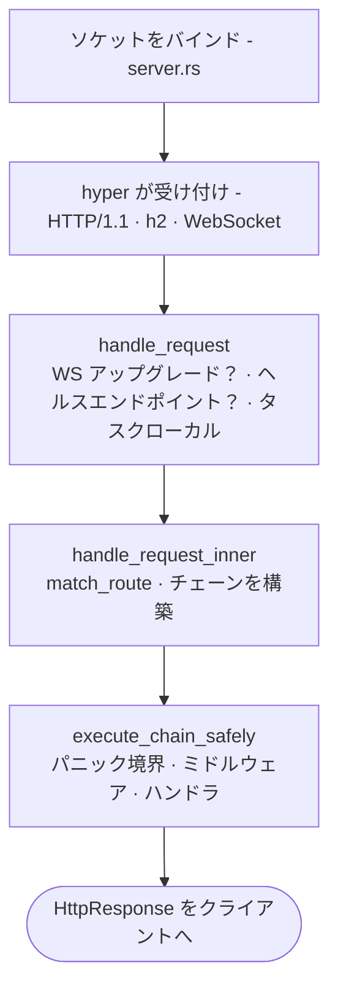

# リクエスト ライフサイクル

TCPパケットがソケットに届いてから、ハンドラが `Response` を返すまでの間に、実際には何が起きているのでしょうか。関わるファイルはわずか6つです。一度たどっておけば、フレームワークの全体像がはっきりと見えてきます。

## 経路



## 1. 起動 - `app.rs`

スキャフォルドされたアプリの `main()` は、フルーエントな記法で `Application` を構築し、それを実行します。

```rust
Application::new()
    .config(my_app::config::register)
    .bootstrap(my_app::bootstrap::bootstrap)
    .routes(my_app::routes::register)
    .migrations::<my_app::migrations::Migrator>()
    .run()
    .await
```

`Application::run()` は、バイナリのCLI（clap）を解析します。

- `serve` - HTTPサーバーを起動します
- `web:run` - serve のエイリアス
- `migrate` / `migrate:rollback` / `migrate:status` / `migrate:fresh`
- `schedule:run` / `schedule:work` / `schedule:list`
- `workflow:work`
- `queue:work`
- `down` / `up` - メンテナンスモードを切り替えます

`db:sync` と `db:seed` は、`Application::run()` の分岐ではなく、フレームワーク全体で使う `suprnova` CLIバイナリ（`suprnova-cli`）と、アプリごとの `cmd/console` バイナリに、それぞれ属しています。

この時点で `.env` はすでに読み込まれています。`#[suprnova::main]` はTokioランタイムを構築する*前に* `.env` を読み込みます。プロセス環境への書き込みは、プロセスがシングルスレッドである間しか安全ではないためです - 詳しくは[ブートストラップ](bootstrap.md#suprnovamain-not-tokiomain)を参照してください。このステップが省略された場合、`Application::run` は起動を拒否します。

`serve` の場合、続けて次の処理を行います。

1. 環境変数がシングルスレッドのコンテキストから読み込まれたことを検証します
2. `#[policy]` インベントリを認可システムに流し込みます
3. 型付き設定を登録する `config_fn` を呼び出します
4. マイグレーションを実行します
5. `bootstrap_fn` を呼び出します（サービス登録、オブザーバー、リスナー）
6. `routes_fn` から `Router` を構築します
7. ルーターを `Server::from_config(...)` に渡します
8. `server.run()` を呼び出します

同じ起動経路はワーカー（`queue:work`、`workflow:work`、`schedule:run`）でも使われるため、設定済みのサービスやコンテナにバインドされた値を、ワーカーも同様に参照できます。

## 2. サーバー起動 - `server.rs`

`Server::from_config` は、安全性の観点で重要な処理を2つ行います。

- `App::init()` と `App::boot_services()` を実行します - コンテナのタスクローカル層を初期化し、起動時の依存関係を解決します
- `APP_KEY` が必要（開発環境以外はすべて該当）なのに未設定または不正な場合、**フェイルクローズします** - `Err` を返し、`app.rs` はパニックする代わりに対処方法を示すメッセージを表示して、非ゼロの終了コードで終了します

続いて `server.run()` は次を行います。

1. テレメトリ（`tracing` サブスクライバー、ログ形式）を起動します
2. 暗号化キー（`APP_KEY` と `APP_KEY_PREVIOUS`）を読み込みます
3. ランタイムドライバーを**必ずこの順序で**起動します: Cache → Queue → RateLimit → Mail。サーバー以外のサブコマンドも `bootstrap_runtime_drivers` を呼び出すため、ワーカーも同じドライバーを参照します
4. TCPソケットをバインドします
5. `.with_upgrades()` を使ってhyper経由で処理を行います（これによりWebSocketのアップグレードが機能します）

ドライバーの起動順序は意図的なものです - QueueはユニークジョブのロックのためにCacheに依存することがあり、RateLimitもCacheを使うことがあり、MailはQueue経由でディスパッチすることがあります。

## 3. リクエストの入口 - `handle_request`

すべてのリクエストは `handle_request(router, registry, req)` に到達します。**これは、統合テストがソケットを開かずに直接操作する、プロセス内のリクエストインターフェースでもあります。** `suprnova::handle_request` として再エクスポートされています。

```rust
pub async fn handle_request(
    router: Arc<Router>,
    middleware_registry: Arc<MiddlewareRegistry>,
    req: hyper::Request<hyper::body::Incoming>,
) -> hyper::Response<ServerBody>;
```

ピア情報を認識するバリエーションである `handle_request_with_peer` は、同じ引数に加えて `Option<std::net::IpAddr>` を受け取ります - 本番のacceptループはこちらを使います。プロセス内呼び出し元は `handle_request` を使い、リクエストのプロキシヘッダー（または `None`）が `Request::ip()` を決定します。

内部では、次を行います。

1. `router.match_ws(...)` を使ってWebSocketアップグレードを確認します - `ws!()` ルートにマッチした場合、WSハンドラに処理を委ねます
2. 組み込みのヘルスエンドポイント（`GET /_suprnova/health`、`/_suprnova/health/live`、`/_suprnova/health/ready`）を特別扱いします。`SERVER_HEALTH_READINESS_TOKEN` のチェックに失敗したレディネスプローブは、意図的に特別扱い*しません* - ルーティングにフォールスルーし、ルーティングされなかったパスと同様に404になります。そのため、このエンドポイントは単に閉じているのではなく、存在しないものとして振る舞います
3. リクエストごとのタスクローカル（フラッシュバッグ、SSR無効化フラグ）をインストールします
4. `handle_request_inner` にディスパッチします

## 4. ルーティングとチェーンの組み立て - `handle_request_inner`

ここでミドルウェアチェーンが組み立てられます。ルーターは `(pattern, handler, params)` の三つ組を返し、`MiddlewareChain` は次の固定順序で組み立てられます。

```
[0] RequestIdMiddleware（常に最も外側）
[1] グローバルミドルウェア（登録順）
[2] ルートミドルウェア（(method, matched pattern) をキーとする）
[3] ハンドラ
```

注意すべき点が3つあります。

- **パスではなくパターンです。** ルートミドルウェアは、生のパス（`/posts/42`）ではなく、マッチしたパターン（`"/posts/{id}"`）をキーにします。これにより、パラメータ付きルートに対するグループミドルウェアが確実に発火します。
- **マッチしなくてもチェーンは実行されます。** ルーターがどのルートにもマッチしない場合でも、チェーン（RequestId とグローバルミドルウェア）は実行され、登録済みのフォールバックか静的な404で終わります。CORSプリフライト（OPTIONSがルートにマッチすることは稀です）、ロギング、request-idはすべて、ルーティングされなかったトラフィックにも届きます。
- **グループミドルウェアは平坦化され、積み重なりません。** グループミドルウェアは、登録時にグループ化された各ルートのミドルウェアリストにコピーされます - 別個のランタイム層ではありません。イントロスペクションでは、グループ由来のミドルウェアとルート由来のミドルウェアを区別できません。

## 5. パニック境界 - `execute_chain_safely`

チェーンは `AssertUnwindSafe(...).catch_unwind()` の中で実行されます。**ミドルウェアやハンドラで発生したパニックはすべて捕捉され**、メソッドとパスとともにログに記録され、返された5xxと同じ `FrameworkError → HttpResponse` の経路で変換されます。

- サニタイズされたボディ: `{"message": "Internal Server Error"}`
- ログと突き合わせられるよう、`request_id` が注入されます
- リスナー（Sentryやあなたのアラートパイプライン）が失敗を検知できるよう、`ErrorOccurred` イベントがディスパッチされます
- パニックのペイロードが、レスポンスボディに**漏れることは決してありません**

これは契約ではなく、安全網です。あなたのコードの公開APIは、`catch_unwind` に頼るのではなく、`Result` を返すべきです。この境界は、バグのあるハンドラがワーカースレッドを道連れにしたり、スタックトレースをクライアントに漏らしたりしないために存在するものであり、あらゆる場所で `.unwrap()` を使ってよいという許可ではありません。

## 6. チェーンの構成 - `middleware/chain.rs`

`MiddlewareChain::execute` は、ハンドラを最も内側の `Next` としてネストし、その後（`.rev()` で）各ミドルウェアを後ろから前へラップしていきます。そのため、**最初に追加したミドルウェアが最初に実行されます**（外側から内側へ）。空のチェーンは、ハンドラを直接呼び出します。

```
登録順序：        [Auth, CSRF, Throttle, handler]
実行時の順序：    Auth → CSRF → Throttle → handler →（元に戻る）
```

ミドルウェアがショートサーキットした場合（`Err(response)` を返した場合）、チェーンは直ちに巻き戻り、レスポンスはすでに実行済みのミドルウェアを逆順に通って外へ戻っていきます。

## `Response` の契約

`http::Response` は **`Result<HttpResponse, HttpResponse>`** です - どちらの分岐も `HttpResponse` を保持します。ハンドラと `Middleware::handle` は `Response` を返します。

- `Ok(resp)` は成功を表します
- `Err(resp)` はショートサーキットです - 例えば、認証ミドルウェアから直接返される401などです。ランタイムは `result.unwrap_or_else(|e| e)` で両者をまとめるため、`Err` はクラッシュではなくレスポンスになります。
- `?` は、`HttpResponse` に変換できるあらゆるエラーを伝播します。`FrameworkError`、`AppError`、`ValidationErrors`、そしてあなた自身の `HttpError` 実装はすべてこれに該当します - そのため、ハンドラの本体は上から下へと読め、失敗はコンバータへと伝わっていきます。

エラーコンバータ（`From<FrameworkError> for HttpResponse`）は5xxのボディをサニタイズし、詳細をレスポンスに漏らすことは決してありません。詳細は構造化ログの中にとどまります。

全体像については、[エラーハンドリング](errors.md)と[エラー モデル](error-model.md)を参照してください。

## リクエストごとの状態

リクエストごとの状態には2つの層があり、どちらもタスクローカルです。

- **フラッシュバッグ** - `req.flash()` はセッションのフラッシュを返します。ここに保存された値は、1回のリダイレクトを生き延びた後に消えます
- **SSR無効化フラグ** - Inertiaはこれを使って、テストのコンテキストでサーバーサイドレンダリングをショートサーキットします

どちらも、チェーンが実行される前に `handle_request` によってインストールされ、レスポンスが送出される際に解体されます。独自のリクエストごとの状態は `Context` システムを通じて扱います - 詳しくは[コンテキスト](context.md)を参照してください。

## ワーカーも同じライフサイクルを再利用します

バックグラウンドワーカー（`queue:work`、`workflow:work`、`schedule:run`）は、次を経由します。

1. 同じ起動経路（`Config::init`、`bootstrap_runtime_drivers`、あなたの `bootstrap()` 関数）
2. 作業を取り出してハンドラを実行する、それぞれ独自のループ。**同じパニック境界**を使います（各ワーカー種別に相当する `execute_chain_safely`）
3. `SIGTERM` / `SIGINT` によるグレースフルシャットダウン - 進行中の作業は完了し、新しい作業は開始されません

つまり、`bootstrap()` に登録されたオブザーバーは、キューワーカーからの挿入に対しても、HTTPハンドラからの挿入に対してと全く同じように発火します。

## 本番環境における安全性の保証

ライフサイクルが確立する不変条件を、簡潔にまとめます。

- **`APP_KEY` は開発環境以外では必須です。** 起動はフェイルクローズし、非ゼロで終了するため、暗号化データの破損は起きません。
- **ハンドラやミドルウェアのパニックがクライアントに届くことは決してありません。** パニック境界はサニタイズされた500を返し、`ErrorOccurred` をディスパッチします。
- **5xxのボディは常にサニタイズされます。** 詳細はレスポンスではなく、ログに送られます。
- **ロックのポイズニングがプロセスを中断させることは決してありません。** 承認された2つのパターンがあります。リクエストごとの経路では、ポイズニングを `"<context> lock poisoned"` というメッセージを持つ `FrameworkError::Internal` に変換します（リクエストは500になります）。稼働し続ける必要があるホットパスのレジストリは、`.unwrap_or_else(|e| e.into_inner())` でその場で復旧します。詳しくは[ロック ポリシー](lock-policy.md)を参照してください。
- **ドライバーバックエンドの失敗は、フェイルオープンかフェイルクローズかを明示的に選択します。** レートリミット、キャッシュ、セッションはそれぞれ、呼び出し箇所でポリシーを選びます - `BackendErrorPolicy::FailClosed` は503を返し、`FailOpen` はリクエストを通過させます。暗黙のデフォルトはありません。詳しくは[レート リミット](rate-limiting.md)を参照してください。
- **WebSocketのアップグレードは、同じルーターを経由します。** 同じ `match_ws` ルックアップが、HTTPルートと同じ `(method, pattern)` によるインデックスを使うため、HTTPミドルウェアと全く同じように、ルートごとのWSミドルウェアを適用できます。
- **シャットダウンシグナルが、コネクション上限によって飢餓状態になることは決してありません。** `SERVER_MAX_CONNECTIONS` が設定されている場合、空きスロットを待つ処理はacceptループをブロックするのではなく、シャットダウンシグナルと競合します。そのため、すべてのスロットが長時間生存するWebSocketセッションに占有されているサーバーでも、オーケストレーターの猶予期間の終わりにSIGKILLされることなく、`SIGTERM` で正しくドレインします。
- **すべてのドレイン処理は、見捨てるものを確実に中断させます。** HTTPコネクション、WebSocketハンドラ、スーパーバイザーは、それぞれ限られた猶予期間を与えられた後、中断されて完了を待たれます - スーパーバイザーの内部タスクも含まれるため、キャンセルは再起動ラッパーだけでなく、本体にまで届きます。ドレインを超えてまでテレメトリを書き出すために動き続けるものはありません。

## あなたのコードにとっての意味

日々のハンドラ作成における要点をいくつか挙げます。

- **`Response` を返し、`?` で伝播させましょう。** 素の `HttpResponse` が必要な場合を除いて、`match err` はしないでください。
- **あなたのドメインエラー型に `HttpError` を実装しましょう。** 自動的に変換されるようになります。詳しくは[エラーハンドリング](errors.md)を参照してください。
- **パニック境界に頼らないでください。** これは本物のバグを捕捉し、プロセスのクラッシュを防ぐものですが、ライブラリのコードはそれでも `Result` を返すべきです。
- **ミドルウェアの順序は重要であり、3つの層に固定されています** - request-idが最も外側、次にグローバルミドルウェア、そしてハンドラの直前にルートミドルウェアが最も内側に来ます。
- **ワーカーとハンドラはbootstrapを共有します。** 起動時に登録したものは、両方から見えます。

## 各ステップの実装場所

| ステップ | ファイル |
|---|---|
| 起動 | `framework/src/app.rs` |
| サーバーのライフサイクル | `framework/src/server.rs` |
| `handle_request`（入口） | `framework/src/server.rs`（`suprnova::handle_request` として再エクスポート） |
| `handle_request_inner`（ルーティングとチェーン） | `framework/src/server.rs` |
| `execute_chain_safely`（パニック境界） | `framework/src/server.rs` |
| `MiddlewareChain::execute`（構成） | `framework/src/middleware/chain.rs` |
| ルーターのマッチング | `framework/src/routing/router.rs` |

フレームワークを使うだけであれば、これらを読む必要はないはずです。ですが、思いがけないバグに遭遇したときには、たどるべき道筋は短くて済みます。

## 次のステップ

- [サービス コンテナ](container.md) - `App::*` がどのようにサービスを解決するか
- [アプリケーション ブートストラップ](bootstrap.md) - `bootstrap.rs` が何を行うか
- [ミドルウェア](middleware.md) - 独自のミドルウェアを書く方法
- [エラー モデル](error-model.md) - `FrameworkError`、`HttpError`、パニックリカバリの詳細
- [ルーティング](routing.md) - `routes!` が実際に何に展開されるか
