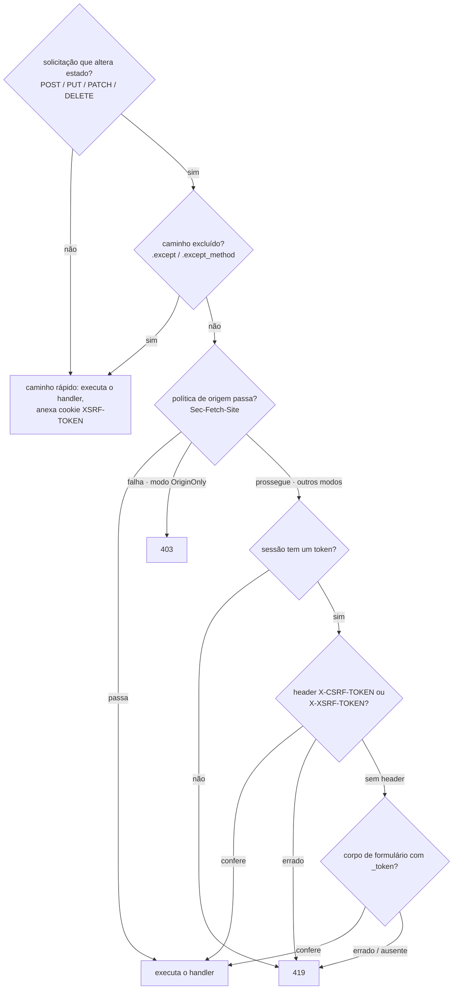

# CSRF

`CsrfMiddleware` valida um token por sessão em toda solicitação que
altera estado (POST / PUT / PATCH / DELETE). Ele espelha o
`PreventRequestForgery` do Laravel 13 - as mesmas fontes de token, a
mesma convenção de cookie `XSRF-TOKEN`, a mesma verificação de origem
via `Sec-Fetch-Site`, a mesma divisão 419 de token incompatível / 403
de origem incompatível - implementado sobre o middleware de sessão do
Suprnova.

## Instale-o globalmente

CSRF executa depois do middleware de sessão (ele precisa do token
CSRF da sessão para comparar). Em `bootstrap.rs`:

```rust
use suprnova::{global_middleware, CsrfMiddleware, SessionConfig, SessionMiddleware};

pub async fn register() {
    let session_config = SessionConfig::from_env();
    global_middleware!(SessionMiddleware::new(session_config));
    global_middleware!(CsrfMiddleware::new());
}
```

`SessionMiddleware::new(SessionConfig)` recebe a config; o construtor
padrão conecta internamente o `DatabaseSessionDriver` apoiado em banco
de dados. Use `SessionMiddleware::with_store(config, store)` para
plugar um `SessionStore` customizado.

`CsrfMiddleware` precisa vir **depois** de `SessionMiddleware` na
ordem de registro - middleware global executa de fora para dentro,
então a sessão é carregada antes de o CSRF ler seu token.

## Como uma solicitação flui



GET, HEAD, e OPTIONS nunca são verificados quanto a token, mas mesmo
assim chegam ao fundo do middleware para que o cookie `XSRF-TOKEN`
seja anexado à resposta. É assim que clientes SPA adquirem o cookie
pela primeira vez.

## Fontes de token, em ordem de prioridade

O middleware lê o token de um entre três lugares, nesta ordem (igual
ao Laravel):

1. **Header `X-CSRF-TOKEN`** - o que o Inertia e os templates SPA com
   scaffold enviam.
2. **Header `X-XSRF-TOKEN`** - convenção Laravel / Axios / Angular: o
   JavaScript lê o cookie `XSRF-TOKEN` e ecoa seu valor aqui.
3. **Campo de formulário `_token`** - para posts
   `application/x-www-form-urlencoded` de um formulário HTML
   tradicional.

Se um header está presente mas errado, o middleware rejeita
imediatamente sem fazer parse do corpo. Um cliente correto escolhe um
único local para o token; combinar fontes seria uma armadilha de
divisão de token.

Para validação de corpo de formulário, o middleware armazena em buffer
o corpo da solicitação até 64 KiB antes de ler `_token`. O handler
downstream continua vendo o form bag completo - o buffering é
transparente, então `_token` permanece no formulário parseado para
qualquer handler que queira olhá-lo.

## O lado do frontend

Os pontos de entrada Svelte, React e Vue com scaffold usam o pipeline de visitas
nativo do Inertia 3, não Axios. Cada ponto de entrada importa `router` de seu
adaptador Inertia, lê o token meta e o anexa em um hook do router:

```ts
const csrfToken = document
  .querySelector('meta[name="csrf-token"]')
  ?.getAttribute('content');
if (csrfToken) {
  router.on('before', (event) => {
    event.detail.visit.headers['X-CSRF-TOKEN'] = csrfToken;
  });
}
```

A tag `<meta name="csrf-token">` é injetada na view base do Inertia
automaticamente por `framework/src/inertia/response.rs` - você não precisa
adicioná-la em um projeto gerado. Toda resposta Inertia carrega o token da sessão
atual no page shell.

O `useForm` do Inertia usa o mesmo pipeline de visitas e, portanto, recebe o
header deste hook:

```tsx
import { useForm } from '@inertiajs/react';

const form = useForm({ title: '', content: '' });
form.post('/posts');  // X-CSRF-TOKEN vem do hook do router
```

Para uma chamada `fetch` bruta, leia o token da meta tag da mesma
forma:

```ts
const token = document
  .querySelector('meta[name="csrf-token"]')
  ?.getAttribute('content') ?? '';

await fetch('/api/data', {
  method: 'POST',
  headers: {
    'Content-Type': 'application/json',
    'X-CSRF-TOKEN': token,
  },
  body: JSON.stringify({ /* ... */ }),
});
```

## O cookie `XSRF-TOKEN`

Em toda resposta - de leitura ou escrita - `CsrfMiddleware` anexa um
cookie `XSRF-TOKEN` contendo o token da sessão atual. Esta é a
convenção Laravel-Axios: a biblioteca SPA lê o cookie via JavaScript e
o ecoa como `X-XSRF-TOKEN` na próxima solicitação que altera estado,
completando o round-trip sem nunca tocar em uma meta tag.

O cookie **não** é `HttpOnly` - ele precisa ser legível a partir do
JS. O valor é, portanto, armazenado como texto puro (sem round-trip de
criptografia), porque o valor do lado JS precisa corresponder ao que
o middleware compara no lado servidor. O Laravel criptografa o cookie
via `EncryptCookies` executando na frente de `PreventRequestForgery`;
o Suprnova o entrega em texto puro e documenta a divergência - o
mesmo comportamento de wire da perspectiva do cliente.

### Atributos do cookie

Os padrões correspondem a `SessionConfig::default()`: `Path=/`,
`Secure`, `SameSite=Lax`, `Max-Age=7200` (2 horas), sem `Domain`.
Sobrescreva por builder:

```rust
use std::time::Duration;
use suprnova::{CsrfMiddleware, http::SameSite};

CsrfMiddleware::new()
    .xsrf_cookie_path("/app")
    .xsrf_cookie_domain(".example.com")
    .xsrf_cookie_secure(false)             // para dev HTTP local
    .xsrf_cookie_same_site(SameSite::Strict)
    .xsrf_cookie_lifetime(Duration::from_secs(15 * 60));
```

### Sincronizar a partir de `SessionConfig`

Se você sobrescrever `SESSION_PATH` / `SESSION_DOMAIN` /
`SESSION_SECURE` / `SESSION_SAME_SITE` / `SESSION_LIFETIME` no `.env`,
o cookie de sessão respeita essas sobrescritas - mas os padrões do
cookie XSRF não respeitariam, o que dessincroniza os dois
silenciosamente. A correção é um alinhamento de uma chamada só:

```rust
let session_config = SessionConfig::from_env();
let csrf = CsrfMiddleware::new().with_session_config(&session_config);
global_middleware!(SessionMiddleware::new(session_config));
global_middleware!(csrf);
```

`with_session_config` copia `cookie_path`, `cookie_domain`,
`cookie_secure`, `lifetime`, e faz parse de `cookie_same_site` com a
mesma matriz case-insensitive que o middleware de sessão usa
(`"strict"` → `Strict`, `"none"` → `None`, qualquer outra coisa →
`Lax`).

`with_session_config` deliberadamente **não** copia
`SessionConfig::cookie_prefix`. Os cookies de sessão e remember-me usam
o prefixo na rede, mas Axios e clientes semelhantes normalmente procuram
o nome literal `XSRF-TOKEN` (`xsrfCookieName` no Axios). Adicioná-lo como
efeito colateral faria o navegador e o cliente discordarem sobre onde o
token está.

Se o cliente estiver configurado para um cookie XSRF com prefixo, adote
esse nome explicitamente:

```rust
let csrf = CsrfMiddleware::new().xsrf_cookie_name("__Host-XSRF-TOKEN");
```

O renderizador do cookie então fornece `Secure`, `Path=/` e nenhum
`Domain` para o nome `__Host-`. O prefixo da sessão continua sendo uma
configuração independente; configure ambos deliberadamente quando os
dois cookies precisarem de bloqueio ao host.

### Desative-o

Para um app puramente server-rendered onde você só emite o token via
`{{ csrf_meta_tag() }}` (sem round-trip de SPA), descarte o cookie:

```rust
global_middleware!(CsrfMiddleware::new().without_xsrf_cookie());
```

## Excluindo rotas

Endpoints de webhook, callbacks de OAuth, e outras integrações
externas não conseguem carregar um token CSRF. Isente-os com
`.except(...)`:

```rust
global_middleware!(
    CsrfMiddleware::new()
        .except(vec!["/webhooks/*", "/api/external/*"])
);
```

Cada entrada é um glob no estilo Laravel (semântica `Str::is`): `*`
corresponde a qualquer sequência de caracteres, incluindo `/`.

| Padrão | Corresponde a |
|---|---|
| `"/login"` | apenas `/login` |
| `"/webhooks/*"` | `/webhooks/stripe`, `/webhooks/github/events`, … |
| `"/api/*/internal"` | `/api/v1/internal`, `/api/v2/internal` |
| `"*/healthz"` | qualquer caminho com `/healthz` em algum lugar |

Barras iniciais se normalizam - `"webhooks/*"` e `"/webhooks/*"` se
comportam de forma idêntica. `/healthz` isolado (sem segmento de
prefixo) **não** corresponde a `"*/healthz"`, igual ao `Str::is` do
Laravel exatamente.

### Isenções por método

Às vezes um prefixo de webhook legitimamente trata tanto callbacks
`POST` não-autenticados (que não conseguem carregar um token) quanto
solicitações `DELETE` de admin autenticadas (que podem e devem). Use
`.except_method`:

```rust
global_middleware!(
    CsrfMiddleware::new()
        // Callbacks POST do Stripe contornam o CSRF…
        .except_method("POST", "/webhooks/stripe/*")
        // …mas DELETEs contra o mesmo prefixo ainda exigem um token.
);
```

A comparação de método não diferencia maiúsculas de minúsculas. Regras
`.except(...)` se aplicam a todo método; regras `.except_method(...)`
só disparam para o verbo que elas nomeiam.

## Verificação de origem

Navegadores modernos definem `Sec-Fetch-Site` em todo fetch sobre
HTTPS. Um valor correspondente diz a você que a solicitação veio da
mesma origem (ou do mesmo domínio registrável) sem nenhum round-trip
de token. `CsrfMiddleware` pode consultar esse header além de - ou em
vez de - a verificação de token.

`OriginPolicy` é o tipo de valor que escolhe qual modo executa:

| Variante | Comportamento |
|---|---|
| `Disabled` (padrão) | Ignora `Sec-Fetch-Site`. Só a validação de token executa. |
| `SameOriginOnly` | `same-origin` passa; qualquer outra coisa cai para a validação de token. |
| `AllowSameSite` | `same-origin` e `same-site` passam; qualquer outra coisa cai para a validação de token. |
| `OriginOnly` | `Sec-Fetch-Site` é o **único** portão. A verificação de token é pulada. Uma falha é um **403** (não 419). |

Dois builders de conveniência cobrem os casos comuns:

```rust
CsrfMiddleware::new().allow_same_site();   // OriginPolicy::AllowSameSite
CsrfMiddleware::new().origin_only();       // OriginPolicy::OriginOnly
```

Use `.with_origin_policy(OriginPolicy::SameOriginOnly)` para a opção
intermediária sem `allow-same-site`.

**Ressalva de HTTPS:** navegadores só emitem `Sec-Fetch-Site` sobre
HTTPS. Um app rodando HTTP puro não pode usar `origin_only()` - toda
solicitação que altera estado vai retornar 403 porque o header está
ausente.

`origin_only()` também desativa o cookie `XSRF-TOKEN` automaticamente -
não há round-trip de token para alimentar, então entregar o cookie é
peso morto.

### 419 vs 403

| Status | O que falhou |
|---|---|
| **419** | Verificação de token (`TokenMismatchException` do Laravel) - token de sessão ausente, token de solicitação ausente, ou token de solicitação errado |
| **403** | Verificação de origem sob o modo `OriginOnly` (`OriginMismatchException` do Laravel) |

Clientes conseguem diferenciar os dois modos de falha só pelo status.
Um 419 geralmente significa "recarregue a página e tente de novo"; um
403 de verificação de origem significa que a solicitação não veio de
uma origem confiável e tentar de novo não vai ajudar.

## Funções helper

Três funções livres leem ou renderizam o token da sessão atual. Elas
retornam vazio / `None` quando nenhuma sessão está ativa (o middleware
vai rejeitar a solicitação antes de um handler executar nesse caso,
então um token ausente fora de um escopo de solicitação é benigno).

```rust
use suprnova::csrf::{csrf_token, csrf_meta_tag, csrf_field};

let token: Option<String> = csrf_token();
let meta: String = csrf_meta_tag();
// → <meta name="csrf-token" content="...">
let field: String = csrf_field();
// → <input type="hidden" name="_token" value="...">
```

A view base do Inertia já chama `csrf_meta_tag()` para você - use
`csrf_field()` ao renderizar um formulário HTML tradicional a partir
de um template Tera / Askama / minijinja, e `csrf_token()` quando você
precisar do valor bruto para algo customizado.

## Comparação em tempo constante

A comparação de token passa por `subtle::ConstantTimeEq`, um
primitivo de igualdade em tempo constante revisado, em vez de um loop
XOR feito à mão. Tokens do Suprnova têm comprimento fixo (40
caracteres alfanuméricos minúsculos), então uma comparação de
comprimento desigual faz short-circuit como uma rejeição estrutural -
uma incompatibilidade de comprimento só pode vir de um token
malformado ou de classe errada, não de um atacante sondando por um
oráculo de timing de mesmo comprimento.

## Regeneração de token

O middleware de sessão regenera o token CSRF no login e no logout para
prevenir fixação de sessão. Se você precisar forçar um token novo fora
desses fluxos (por exemplo, depois de uma mudança de privilégio
sensível), chame `regenerate_csrf_token()`:

```rust
use suprnova::regenerate_csrf_token;

if let Some(new_token) = regenerate_csrf_token() {
    // Token rotacionado; a próxima solicitação da SPA precisa ecoar este valor.
}
```

Retorna `None` se nenhuma sessão está ativa.

## Tratando 419 no cliente

Quando uma sessão expira no meio e a próxima solicitação que altera
estado dispara, o servidor retorna 419. O padrão comum é recarregar a
página para que a SPA capte uma meta tag e um cookie novos:

```ts
axios.interceptors.response.use(
  response => response,
  error => {
    if (error.response?.status === 419) {
      window.location.reload();
    }
    return Promise.reject(error);
  },
);
```

Visitas do Inertia já seguem redirecionamentos, então um controlador
que faz `redirect` depois de um refresh de sessão (por exemplo,
através de um fluxo de login) leva o usuário de volta à página com um
token funcionando.

## Testes

Testes executam o mesmo pipeline `handle_request` que a produção usa -
veja [HTTP Tests](http-tests.md) para a configuração completa. O
padrão mais limpo para um endpoint protegido por CSRF é rodar a
solicitação através da mesma dança de dois saltos que uma SPA de
verdade faz:

1. **`GET` algo primeiro** sob o mesmo listener de loopback TCP. O
   middleware de sessão cunha um cookie de sessão; `CsrfMiddleware`
   anexa o cookie `XSRF-TOKEN` na saída.
2. **`POST` a rota de verdade**, enviando o cookie de sessão de volta
   para que a mesma sessão carregue, e ecoando o valor `XSRF-TOKEN`
   capturado em `X-XSRF-TOKEN`.

Esse é o round-trip de produção sem nenhuma superfície de teste
especial - o middleware não consegue diferenciar o cliente de teste
de um navegador. Os próprios testes do middleware CSRF do framework
exercitam isso de ponta a ponta via loopback hyper; o harness vive no
módulo `tests` de `framework/src/csrf/middleware.rs` e é a forma de
referência para testes de integração de nível mais alto.

## Garantias de segurança

- **Tokens por sessão.** Cada sessão tem seu próprio token aleatório
  de 40 caracteres; o logout o rotaciona.
- **Apoiado por CSPRNG.** Tokens vêm do mesmo gerador que os IDs de
  sessão (`rand::Rng::random_range` sobre um charset alfanumérico,
  semeado pelo CSPRNG do SO).
- **Comparação em tempo constante.** `subtle::ConstantTimeEq` para o
  corpo da comparação; atalho estrutural de incompatibilidade de
  comprimento para o caso de comprimento desigual.
- **Rotação de login / logout.** A regeneração de sessão gera um
  token novo, derrotando a fixação de sessão.
- **Cookies SameSite.** Combinado com o padrão `SameSite=Lax` do
  cookie `XSRF-TOKEN` para defesa em profundidade.
- **419 e não 500 quando a sessão está ausente.** Uma sessão ausente é
  uma condição do lado do cliente (sem cookie / sessão expirada), não
  uma configuração incorreta do servidor - o Laravel retorna 419 no
  mesmo caso, e nós também.

## Matriz de paridade do Laravel

| Laravel | Suprnova |
|---|---|
| Middleware `VerifyCsrfToken` / `PreventRequestForgery` | `CsrfMiddleware` |
| Helper `csrf_token()` | `suprnova::csrf::csrf_token()` |
| Helper Blade `csrf_field()` | `suprnova::csrf::csrf_field()` |
| `<meta name="csrf-token">` (`@csrf` do Blade para formulários) | `suprnova::csrf::csrf_meta_tag()` + auto-injetado pela view base do Inertia |
| `$except = ['stripe/*']` | `.except(["stripe/*"])` |
| Glob `*` (meio / início / fim) | O mesmo - semântica completa de `Str::is` |
| Round-trip de cookie `XSRF-TOKEN` + header `X-XSRF-TOKEN` | Mesma convenção |
| `$addHttpCookie = false` | `.without_xsrf_cookie()` |
| `PreventRequestForgery::allowSameSite(true)` | `.allow_same_site()` |
| `PreventRequestForgery::useOriginOnly(true)` | `.origin_only()` |
| `TokenMismatchException` (419) | 419 `{"message": "CSRF token mismatch."}` |
| `OriginMismatchException` (403) | 403 `{"message": "Origin mismatch."}` |
| `EncryptCookies` criptografa `XSRF-TOKEN` | **Divergiu:** texto puro (legível por JS; mesma forma de wire para clientes) |
| `config('session.*')` conduz atributos do cookie | `.with_session_config(&SessionConfig)` |

## Próximos passos

- [Sessões](session.md) - como `SessionMiddleware` popula o token
  que o middleware CSRF compara
- [CORS](cors.md) - o outro middleware global que a maioria dos apps
  instala ao lado do CSRF
- [Middleware](middleware.md) - ordem de registro, a pilha global,
  escrevendo o seu próprio
- [HTTP Tests](http-tests.md) - executando `handle_request` de ponta
  a ponta, incluindo rotas protegidas por CSRF
- [Autenticação](authentication.md) - fluxos de login / logout que
  rotacionam a sessão e seu token CSRF
