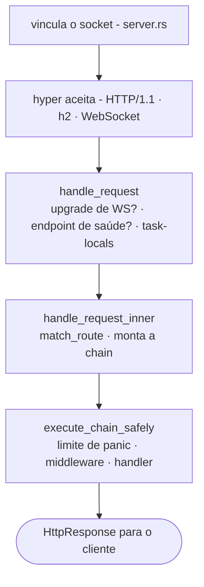

# Ciclo de vida da solicitação

O que realmente acontece entre o pacote TCP chegando ao socket e o seu handler retornar uma `Response`? Seis arquivos. Rastreie-os uma vez e a forma do framework se esclarece.

## O caminho



## 1. Inicialização - `app.rs`

O `main()` de uma app com scaffold constrói uma `Application` fluentemente e a executa:

```rust
Application::new()
    .config(my_app::config::register)
    .bootstrap(my_app::bootstrap::bootstrap)
    .http_bootstrap(|| async { my_app::bootstrap::register_http_stack() })
    .routes(my_app::routes::register)
    .migrations::<my_app::migrations::Migrator>()
    .run()
    .await
```

`Application::run()` faz parse da CLI do binário (clap):

- `serve` - inicia o servidor HTTP
- `web:run` - alias para serve
- `migrate` / `migrate:rollback` / `migrate:status` / `migrate:fresh`
- `schedule:run` / `schedule:work` / `schedule:list`
- `workflow:work`
- `queue:work`
- `down` / `up` - alterna modo de manutenção

`db:sync` e `db:seed` ficam no binário CLI `suprnova` do framework como
um todo (`suprnova-cli`) e no binário `cmd/console` (por app)
respectivamente - não no switch `Application::run()`.

`.env` já está carregado neste ponto. `#[suprnova::main]` o carrega
*antes* de construir o runtime Tokio, porque escrever no ambiente do processo
só é seguro enquanto o processo está single-threaded - veja
[Inicialização](bootstrap.md#suprnovamain-not-tokiomain). `Application::run`
se recusa a inicializar se essa etapa foi pulada.

Para `serve`, em seguida:

1. Verifica se o ambiente foi carregado de um contexto single-threaded
2. Drena o inventário `#[policy]` no sistema de autorização
3. Chama seu `config_fn` (registro de config tipado)
4. Executa migrações
5. Chama seu `bootstrap_fn` (registro de serviços, observers, listeners)
6. Chama seu `http_bootstrap_fn` (middleware global, `Inertia::install`)
7. Constrói o `Router` a partir de `routes_fn`
8. Passa o router para `Server::from_config(...)`
9. Chama `server.run()`

Workers (`queue:work`, `workflow:work`, `schedule:run`) e o binário de
console executam o mesmo caminho de inicialização *até e incluindo*
`bootstrap_fn`, portanto veem os mesmos serviços configurados e valores do
contêiner vinculados - mas nunca chamam `http_bootstrap_fn`. Somente
`serve` / `web:run` o faz. Veja
[Inicialização da aplicação](bootstrap.md) para saber por quê:
`Inertia::install` falha de forma fechada quando o manifesto de frontend
construído está ausente, e espera-se que uma imagem de worker ou console seja
enviada sem ele.

## 2. Inicialização do servidor - `server.rs`

`Server::from_config` faz duas coisas que importam para segurança:

- Executa `App::init()` + `App::boot_services()` - inicializa a camada
  task-local do contêiner e resolve dependências de inicialização
- **Falha de forma fechada** quando `APP_KEY` é obrigatório (qualquer
  ambiente não-desenvolvimento) mas está faltando/malformado - retorna `Err`, e `app.rs`
  imprime uma mensagem de remediação e sai com código não-zero em vez de fazer panic

`server.run()` então:

1. Inicializa telemetria (`tracing` subscriber, formato de log)
2. Carrega chaves de criptografia (`APP_KEY` + `APP_KEY_PREVIOUS`)
3. Inicializa os drivers de runtime **nesta ordem exata**: Cache → Queue →
   RateLimit → Mail. Subcomandos não-server também chamam
   `bootstrap_runtime_drivers` para que workers vejam os mesmos drivers
4. Vincula o socket TCP
5. Serve via hyper com `.with_upgrades()` (para que upgrades WebSocket funcionem)

A ordem de inicialização do driver é intencional - Queue pode depender de Cache
(para unique-job locks), RateLimit pode usar Cache, Mail pode despachar
via Queue.

## 3. Entrada de solicitação - `handle_request`

Toda solicitação chega em `handle_request(router, registry, req)`.
**Esta também é a superfície de solicitação in-process que testes de integração
acionam sem abrir um socket.** É re-exportada como
`suprnova::handle_request`.

```rust
pub async fn handle_request(
    router: Arc<Router>,
    middleware_registry: Arc<MiddlewareRegistry>,
    req: hyper::Request<hyper::body::Incoming>,
) -> hyper::Response<ServerBody>;
```

Uma variante ciente de peer, `handle_request_with_peer`, toma os mesmos
argumentos mais um `Option<std::net::IpAddr>` - o accept loop de produção a usa;
chamadores in-process usam `handle_request` e os headers de proxy da solicitação
(ou `None`) determinam `Request::ip()`.

Dentro, ela:

1. Verifica se há um upgrade WebSocket via `router.match_ws(...)` - se
   corresponder a uma rota `ws!()`, passa para o handler WS
2. Trata especialmente os endpoints de saúde integrados - `GET /_suprnova/health`,
   `/_suprnova/health/live`, `/_suprnova/health/ready`. Uma sonda de prontidão
   que falha na verificação `SERVER_HEALTH_READINESS_TOKEN` é deliberadamente
   *não* tratada especialmente: cai no roteamento e retorna 404 como qualquer
   caminho não-roteado, então o endpoint é invisível em vez de apenas fechado
3. Instala task-locals por solicitação (flash bag, SSR-disable flag)
4. Despacha para `handle_request_inner`

## 4. Roteamento + assembly da chain - `handle_request_inner`

É aqui que a middleware chain se compõe. O router produz uma
tripla `(pattern, handler, params)`, e a `MiddlewareChain` é
montada nesta ordem fixa:

```
[0] RequestIdMiddleware (sempre mais externo)
[1] middleware global em ordem de registro
[2] middleware de rota (chaveado por (method, matched pattern))
[3] handler
```

Três coisas a notar:

- **Padrão, não caminho.** O middleware de rota é chaveado pelo padrão
  correspondido (`"/posts/{id}"`), não pelo caminho bruto (`/posts/42`). Group
  middleware em rotas parametrizadas realmente dispara.
- **Sem correspondência ainda executa a chain.** Se o router não corresponder a nenhuma
  rota, a chain (RequestId + globals) ainda executa e termina em
  um fallback registrado ou um 404 estático. CORS preflight (OPTIONS raramente
  corresponde a uma rota), logging, e request-id todos chegam ao tráfego não-roteado.
- **Group middleware é achatado, não empilhado.** Group middleware é
  copiado para a lista de middleware de cada rota agrupada no momento do registro -
  não é uma camada de runtime separada. Introspecção não consegue diferenciar group
  de middleware de rota.

## 5. Limite de panic - `execute_chain_safely`

A chain executa dentro de `AssertUnwindSafe(...).catch_unwind()`. **Um panic
em qualquer middleware ou no handler é capturado**, registrado com method+path,
e convertido através do mesmo caminho `FrameworkError → HttpResponse`
como um 5xx retornado:

- Corpo sanitizado: `{"message": "Internal Server Error"}`
- `request_id` injetado para que você possa correlacionar com o log
- Evento `ErrorOccurred` despachado para que listeners (Sentry, seu alert
  pipeline) vejam a falha
- O payload de panic **nunca vaza para o corpo da resposta**

Esta é uma rede de segurança, não um contrato. APIs públicas em seu
código devem retornar `Result`, não confiar em `catch_unwind`. O limite
existe para evitar que um handler bugado mate a thread de worker ou
vaze um stack trace para o cliente - não é licença para `.unwrap()` em
todos os lugares.

## 6. Composição da chain - `middleware/chain.rs`

`MiddlewareChain::execute` aninha o handler como o `Next` mais interno,
depois envolve cada middleware último-para-primeiro (`.rev()`), então **o
primeiro middleware adicionado executa primeiro** (outside-in). Uma chain vazia chama
o handler diretamente:

```
ordem de registro:   [Auth, CSRF, Throttle, handler]
ordem de execução:   Auth → CSRF → Throttle → handler → (de volta para fora)
```

Se middleware faz short-circuit (retorna `Err(response)`), a chain
se desenrola imediatamente e a resposta sai através do
middleware já-executado em ordem reversa.

## O contrato `Response`

`http::Response` é **`Result<HttpResponse, HttpResponse>`** - ambos os
ramos carregam uma `HttpResponse`. Handlers e `Middleware::handle` retornam
`Response`:

- `Ok(resp)` é sucesso
- `Err(resp)` faz short-circuit - por exemplo, um 401 direto do middleware
  de autenticação. O runtime colapsa ambos com
  `result.unwrap_or_else(|e| e)`, então um `Err` é uma resposta, não um
  crash.
- `?` propaga qualquer erro que se converte em `HttpResponse`. Cada
  `FrameworkError`, `AppError`, `ValidationErrors`, e suas próprias
  impls `HttpError` fazem - então corpos de handler se leem de cima para
  baixo e propagam as falhas até o conversor.

O conversor de erro (`From<FrameworkError> for HttpResponse`)
sanitiza corpos 5xx e nunca vaza detalhe para a rede. O detalhe
fica no log estruturado.

Veja [Tratamento de erros](errors.md) e [Modelo de erros](error-model.md) para
o quadro completo.

## Estado por solicitação

Duas camadas de estado por solicitação, ambas task-local:

- **Flash bag** - `req.flash()` retorna o flash da sessão; valores armazenados
  aqui sobrevivem a um redirecionamento e depois desaparecem
- **SSR-disable flag** - Inertia a usa para fazer short-circuit
  de server-side rendering em contextos de teste

Ambas são instaladas por `handle_request` antes da chain executar e
são removidas quando a resposta sai. Estado customizado por solicitação vai
através do sistema `Context` - veja [Contexto](context.md).

## Workers reutilizam o mesmo ciclo de vida

Workers de background (`queue:work`, `workflow:work`, `schedule:run`) passam por:

1. O mesmo caminho de inicialização (`Config::init`, `bootstrap_runtime_drivers`,
   sua função `bootstrap()`) - **não** `http_bootstrap()`; esse hook é somente
   do servidor, o que permite que uma imagem de worker inicialize sem um
   manifesto de frontend construído
2. Seu próprio loop que puxa trabalho e executa handlers com o **mesmo
   limite de panic** (equivalente `execute_chain_safely` para cada tipo
   de worker)
3. Shutdown gracioso em `SIGTERM` / `SIGINT` - trabalho em voo termina,
   nenhum novo trabalho inicia

Isto significa que um observer registrado em `bootstrap()` dispara para inserts
de um queue worker exatamente como faria para inserts de um
handler HTTP.

## Garantias de segurança de produção

Uma lista curta de invariantes que o ciclo de vida estabelece:

- **`APP_KEY` é obrigatório em ambientes não-desenvolvimento.** Inicialização falha
  de forma fechada, sai com código não-zero, sem corrupção de dados criptografados.
- **Panics em handler ou middleware nunca chegam ao cliente.** O
  limite de panic retorna um 500 sanitizado e despacha `ErrorOccurred`.
- **Corpos 5xx são sempre sanitizados.** Detalhe vai para o log, não para a
  rede.
- **Locks envenenados nunca abortam o processo.** Dois padrões autorizados:
  caminhos por solicitação encaminham o envenenamento para um
  `FrameworkError::Internal` carregando uma mensagem
  `"<context> lock poisoned"` (e a solicitação recebe um 500);
  registries de hot-path que precisam continuar de pé se recuperam no
  lugar com `.unwrap_or_else(|e| e.into_inner())`. Veja
  [Política de bloqueio](lock-policy.md).
- **Falhas de backend de driver são uma escolha explícita fail-open ou fail-closed.**
  Rate-limit, cache, session cada um escolhe uma política no local da chamada -
  `BackendErrorPolicy::FailClosed` retorna 503; `FailOpen`
  deixa a solicitação passar. Não há padrão implícito. Veja
  [Limitação de taxa](rate-limiting.md).
- **Upgrades WebSocket passam pelo mesmo router.** O mesmo
  lookup `match_ws` usa a mesma indexação `(method, pattern)` que
  rotas HTTP; você pode aplicar middleware WS por rota exatamente como
  middleware HTTP.
- **O sinal de shutdown nunca sofre inanição pelo cap de conexão.**
  Com `SERVER_MAX_CONNECTIONS` definido, esperar por um slot livre corre
  uma corrida contra o sinal de shutdown em vez de bloquear o accept loop, então
  um servidor cujos slots são todos ocupados por sessões WebSocket de
  longa duração ainda drena em `SIGTERM` em vez de ser SIGKILLed no
  final do período de graça do orquestrador.
- **Cada drenagem aborta o que abandona.** Conexões HTTP, WebSocket
  handlers, e supervisors cada um recebem uma janela de graça limitada e
  então são abortados e aguardados - incluindo a tarefa interna de um supervisor, então
  cancelamento chega ao corpo e não apenas ao wrapper de restart.
  Nada continua executando após sua drenagem para emitir telemetria após o
  flush.

## O que isto significa para seu código

Alguns aprendizados para escrita de handlers dia a dia:

- **Retorne `Response`, propague com `?`.** Não faça `match err` a menos que
  você precise da `HttpResponse` pura.
- **Implemente `HttpError` em seus tipos de erro de domínio.** Eles se
  converterão automaticamente. Veja [Tratamento de erros](errors.md).
- **Não confie no limite de panic.** Ele captura bugs genuínos e
  previne crashes de processo; código de biblioteca ainda deve retornar `Result`.
- **A ordem de middleware importa e é fixa em três camadas** -
  request-id mais externa, globals próxima, middleware de rota mais interna
  antes do handler.
- **Workers e handlers compartilham `bootstrap`, não `http_bootstrap`.**
  Qualquer coisa que você registrar em `bootstrap` é visível para ambos;
  middleware global e `Inertia::install` pertencem a `http_bootstrap` e
  só são executados para o servidor.

## Onde cada etapa vive

| Etapa | Arquivo |
|---|---|
| Inicialização | `framework/src/app.rs` |
| Ciclo de vida do servidor | `framework/src/server.rs` |
| `handle_request` (entrada) | `framework/src/server.rs` (re-exportado como `suprnova::handle_request`) |
| `handle_request_inner` (roteamento + chain) | `framework/src/server.rs` |
| `execute_chain_safely` (limite de panic) | `framework/src/server.rs` |
| `MiddlewareChain::execute` (composição) | `framework/src/middleware/chain.rs` |
| Correspondência do router | `framework/src/routing/router.rs` |

Você não precisa ler estes para usar o framework, mas se um bug
o surpreender, o rastro é curto.

## Próximos passos

- [Contêiner de serviços](container.md) - como `App::*` resolve serviços
- [Inicialização da aplicação](bootstrap.md) - o que `bootstrap.rs` faz
- [Middleware](middleware.md) - escrevendo seu próprio middleware
- [Modelo de erros](error-model.md) - `FrameworkError`, `HttpError`,
  recuperação de panic em detalhe
- [Roteamento](routing.md) - o que `routes!` realmente se expande para
