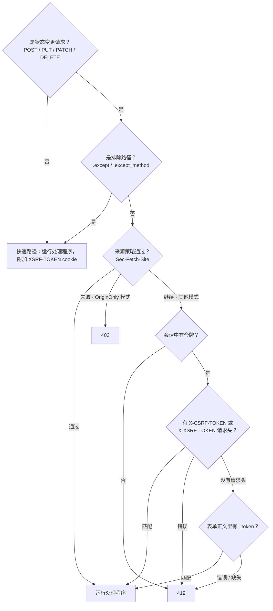

# CSRF

`CsrfMiddleware` 会在每一个状态变更请求（POST / PUT / PATCH / DELETE）上验证一个逐会话的令牌。它镜照 Laravel 13 的 `PreventRequestForgery` - 相同的令牌来源、相同的 `XSRF-TOKEN` cookie 约定、相同的 `Sec-Fetch-Site` 来源验证、相同的 419 令牌不匹配 / 403 来源不匹配拆分 - 构建在 Suprnova 的会话中间件之上。

## 全局安装它

CSRF 运行在会话中间件之后（它需要会话的 CSRF 令牌来做比较）。在 `bootstrap.rs` 里：

```rust
use suprnova::{global_middleware, CsrfMiddleware, SessionConfig, SessionMiddleware};

pub async fn register() {
    let session_config = SessionConfig::from_env();
    global_middleware!(SessionMiddleware::new(session_config));
    global_middleware!(CsrfMiddleware::new());
}
```

`SessionMiddleware::new(SessionConfig)` 接受配置；默认构造函数在内部接好了基于数据库的 `DatabaseSessionDriver`。使用 `SessionMiddleware::with_store(config, store)` 来接入一个自定义的 `SessionStore`。

在注册顺序里，`CsrfMiddleware` 必须排在 `SessionMiddleware` **之后** - 全局中间件是由外而内运行的，所以会话会在 CSRF 读取它的令牌之前被加载。

## 请求如何流动



GET、HEAD 和 OPTIONS 永远不会被做令牌检查，但它们仍然会走到中间件的末端，好让 `XSRF-TOKEN` cookie 附加到响应上。这就是 SPA 客户端第一次获取这个 cookie 的方式。

## 令牌来源，按优先级顺序

中间件会按下面的顺序，从三个位置之一读取令牌（和 Laravel 一致）：

1. **`X-CSRF-TOKEN` 请求头** - Inertia 和脚手架生成的 SPA 模板发送的就是这个。
2. **`X-XSRF-TOKEN` 请求头** - Laravel / Axios / Angular 的约定：JavaScript 读取 `XSRF-TOKEN` cookie，并在这里把它的值回显出来。
3. **`_token` 表单字段** - 用于来自传统 HTML 表单的 `application/x-www-form-urlencoded` 提交。

如果一个请求头存在但错误，中间件会立即拒绝，不会解析请求体。一个正确的客户端只会为令牌选定一个位置；混用多个来源本身就是一个陷阱，会把令牌拆得支离破碎。

对于表单正文的验证，中间件在读取 `_token` 之前会先缓冲最多 64 KiB 的请求体。下游的处理程序仍然会看到完整的表单包 - 这次缓冲是透明的，所以任何想查看 `_token` 的处理程序，都能在解析后的表单里找到它。

## 前端那一侧

脚手架生成的 `main.ts` / `main.tsx`（Svelte / React / Vue）已经配置好了 Axios：

```ts
import axios from 'axios';

axios.defaults.headers.common['X-Requested-With'] = 'XMLHttpRequest';

const csrfToken = document
  .querySelector('meta[name="csrf-token"]')
  ?.getAttribute('content');
if (csrfToken) {
  axios.defaults.headers.common['X-CSRF-TOKEN'] = csrfToken;
}
```

`<meta name="csrf-token">` 标签会由 `framework/src/inertia/response.rs` 自动注入到 Inertia 的基础视图里 - 在一个生成的项目里，您不需要自己添加它。每一个 Inertia 响应都会在页面外壳里携带当前会话的令牌。

Inertia 的 `useForm` 提交是经由 Axios 发出的，所以它们不需要任何额外的接线就能继承这个请求头：

```tsx
import { useForm } from '@inertiajs/react';

const form = useForm({ title: '', content: '' });
form.post('/posts');  // X-CSRF-TOKEN 来自 Axios 的默认设置
```

对于一次原始的 `fetch` 调用，用同样的方式从 meta 标签里读取令牌：

```ts
const token = document
  .querySelector('meta[name="csrf-token"]')
  ?.getAttribute('content') ?? '';

await fetch('/api/data', {
  method: 'POST',
  headers: {
    'Content-Type': 'application/json',
    'X-CSRF-TOKEN': token,
  },
  body: JSON.stringify({ /* ... */ }),
});
```

## `XSRF-TOKEN` cookie

在每一个响应上 - 无论是读还是写 - `CsrfMiddleware` 都会附加一个包含当前会话令牌的 `XSRF-TOKEN` cookie。这是 Laravel-Axios 的约定：SPA 库通过 JavaScript 读取这个 cookie，并在下一个状态变更请求里把它回显为 `X-XSRF-TOKEN`，完成这次往返，全程都不需要碰 meta 标签。

这个 cookie **不是** `HttpOnly` 的 - 它必须能被 JS 读取。因此它的值是以明文存储的（没有加密往返），因为 JS 那一侧的值必须和中间件在服务器端做比较时用的值一致。Laravel 通过运行在 `PreventRequestForgery` 之前的 `EncryptCookies` 来加密这个 cookie；Suprnova 把它做成明文并记录下这个分歧 - 从客户端的角度看，网络层面的行为是一样的。

### Cookie 属性

默认值和 `SessionConfig::default()` 一致：`Path=/`、`Secure`、`SameSite=Lax`、`Max-Age=7200`（2 小时）、没有 `Domain`。用构建器逐项覆盖：

```rust
use std::time::Duration;
use suprnova::{CsrfMiddleware, http::SameSite};

CsrfMiddleware::new()
    .xsrf_cookie_path("/app")
    .xsrf_cookie_domain(".example.com")
    .xsrf_cookie_secure(false)             // 用于本地 HTTP 开发
    .xsrf_cookie_same_site(SameSite::Strict)
    .xsrf_cookie_lifetime(Duration::from_secs(15 * 60));
```

### 从 `SessionConfig` 同步

如果您在 `.env` 里覆盖了 `SESSION_PATH` / `SESSION_DOMAIN` / `SESSION_SECURE` / `SESSION_SAME_SITE` / `SESSION_LIFETIME`，会话 cookie 会遵从这些覆盖值 - 但 XSRF cookie 的默认值不会，这会让两者悄悄地失去同步。修复方法是一次调用就能完成的对齐：

```rust
let session_config = SessionConfig::from_env();
let csrf = CsrfMiddleware::new().with_session_config(&session_config);
global_middleware!(SessionMiddleware::new(session_config));
global_middleware!(csrf);
```

`with_session_config` 会复制 `cookie_path`、`cookie_domain`、`cookie_secure`、`lifetime`，并用和会话中间件相同的大小写不敏感矩阵来解析 `cookie_same_site`（`"strict"` → `Strict`，`"none"` → `None`，其他任何值 → `Lax`）。

### 禁用它

对于一个纯服务器端渲染的应用，如果您只通过 `{{ csrf_meta_tag() }}` 签发令牌（没有 SPA 往返），可以去掉这个 cookie：

```rust
global_middleware!(CsrfMiddleware::new().without_xsrf_cookie());
```

## 排除路由

Webhook 端点、OAuth 回调，以及其他外部集成都无法携带 CSRF 令牌。用 `.except(...)` 来豁免它们：

```rust
global_middleware!(
    CsrfMiddleware::new()
        .except(vec!["/webhooks/*", "/api/external/*"])
);
```

每一项都是 Laravel 风格的 glob（`Str::is` 语义）：`*` 匹配任意一段连续字符，包括 `/`。

| 模式 | 匹配 |
|---|---|
| `"/login"` | 只匹配 `/login` |
| `"/webhooks/*"` | `/webhooks/stripe`、`/webhooks/github/events`、… |
| `"/api/*/internal"` | `/api/v1/internal`、`/api/v2/internal` |
| `"*/healthz"` | 任何某处包含 `/healthz` 的路径 |

开头的斜杠会被规范化 - `"webhooks/*"` 和 `"/webhooks/*"` 的行为完全一样。裸的 `/healthz`（没有前缀段）**不会**匹配 `"*/healthz"`，这和 Laravel 的 `Str::is` 完全一致。

### 逐方法豁免

有时候，一个 webhook 前缀会合理地同时处理未认证的 `POST` 回调（无法携带令牌）和已认证的 `DELETE` 管理请求（可以而且应该携带令牌）。这时候用 `.except_method`：

```rust
global_middleware!(
    CsrfMiddleware::new()
        // Stripe 的 POST 回调绕过 CSRF……
        .except_method("POST", "/webhooks/stripe/*")
        // ……但是针对同一前缀的 DELETE 请求仍然需要令牌。
);
```

方法的比较是大小写不敏感的。`.except(...)` 规则适用于每一个方法；`.except_method(...)` 规则只会为它指名的那个动词触发。

## 来源验证

现代浏览器会在每一次通过 HTTPS 发出的 fetch 上设置 `Sec-Fetch-Site`。一个匹配的值可以在不需要任何令牌往返的情况下，告诉您这个请求来自同一个来源（或者同一个可注册域名）。`CsrfMiddleware` 可以在令牌检查之外 - 或者取代令牌检查 - 参考这个请求头。

`OriginPolicy` 是决定运行哪种模式的值类型：

| 变体 | 行为 |
|---|---|
| `Disabled`（默认） | 忽略 `Sec-Fetch-Site`。只运行令牌验证。 |
| `SameOriginOnly` | `same-origin` 通过；其他任何值都会继续走到令牌验证。 |
| `AllowSameSite` | `same-origin` 和 `same-site` 都通过；其他任何值都会继续下探。 |
| `OriginOnly` | `Sec-Fetch-Site` 是**唯一**的门。令牌检查会被跳过。未通过是一个 **403**（不是 419）。 |

两个便捷的构建器方法覆盖了常见情形：

```rust
CsrfMiddleware::new().allow_same_site();   // OriginPolicy::AllowSameSite
CsrfMiddleware::new().origin_only();       // OriginPolicy::OriginOnly
```

对于那个没有 `allow-same-site` 的中间选项，使用 `.with_origin_policy(OriginPolicy::SameOriginOnly)`。

**HTTPS 附加条件：** 浏览器只会在 HTTPS 上发出 `Sec-Fetch-Site`。一个跑在纯 HTTP 上的应用不能使用 `origin_only()` - 每一个状态变更请求都会因为这个请求头缺失而返回 403。

`origin_only()` 还会自动禁用 `XSRF-TOKEN` cookie - 既然没有令牌往返需要喂养，发出这个 cookie 就是死重。

### 419 对比 403

| 状态码 | 什么失败了 |
|---|---|
| **419** | 令牌检查（Laravel 的 `TokenMismatchException`） - 缺少会话令牌、缺少请求令牌，或者请求令牌错误 |
| **403** | `OriginOnly` 模式下的来源检查（Laravel 的 `OriginMismatchException`） |

客户端仅凭状态码就能区分这两种失败模式。419 通常意味着重新加载页面并重试；来自来源验证的 403 意味着这个请求不是来自一个受信任的来源，重试也无济于事。

## 辅助函数

三个自由函数用于读取或渲染当前会话的令牌。当没有活动会话时，它们会返回空值 / `None`（在那种情况下，中间件会在处理程序运行之前就拒绝这个请求，所以在请求作用域之外缺失令牌是无害的）。

```rust
use suprnova::csrf::{csrf_token, csrf_meta_tag, csrf_field};

let token: Option<String> = csrf_token();
let meta: String = csrf_meta_tag();
// → <meta name="csrf-token" content="...">
let field: String = csrf_field();
// → <input type="hidden" name="_token" value="...">
```

Inertia 的基础视图已经替您调用了 `csrf_meta_tag()` - 当您从一个 Tera / Askama / minijinja 模板渲染一个传统 HTML 表单时，用 `csrf_field()`；当您需要为某个自定义场景取原始值时，用 `csrf_token()`。

## 常量时间比较

令牌的比较是经过 `subtle::ConstantTimeEq` 的 - 一个经过审查的常量时间相等性原语，而不是一个手写的 XOR 循环。Suprnova 的令牌是定长的（40 个小写字母数字字符），所以一次长度不相等的比较会以结构性拒绝的方式短路 - 长度不匹配只可能来自一个格式错误或类别错误的令牌，而不会来自一个正在试探同长度计时预言机的攻击者。

## 令牌重新生成

会话中间件会在登录和登出时重新生成 CSRF 令牌，以防止会话固定攻击。如果您需要在这些流程之外强制生成一个新令牌（例如在一次敏感的权限变更之后），调用 `regenerate_csrf_token()`：

```rust
use suprnova::regenerate_csrf_token;

if let Some(new_token) = regenerate_csrf_token() {
    // 令牌已轮换；SPA 的下一个请求必须回显这个值。
}
```

如果没有活动会话，返回 `None`。

## 在客户端处理 419

当一个会话在会话期间过期，并且下一个状态变更请求被触发时，服务器会返回 419。标准的处理方式是重新加载页面，让 SPA 获取一个全新的 meta 标签和 cookie：

```ts
axios.interceptors.response.use(
  response => response,
  error => {
    if (error.response?.status === 419) {
      window.location.reload();
    }
    return Promise.reject(error);
  },
);
```

Inertia 的访问本来就会跟随重定向，所以一个在会话刷新之后（例如经过一次登录流程）执行 `redirect` 的控制器，会把用户带回到一个带有可用令牌的页面上。

## 测试

测试驱动的是和生产环境相同的 `handle_request` 管道 - 完整的设置请参见 [HTTP 测试](http-tests.md)。对于一个受 CSRF 保护的端点，最干净的模式是让请求走一遍真实 SPA 会执行的同一套两跳舞步：

1. 在同一个 TCP 环回监听器下，**先 `GET` 一些东西**。会话中间件会铸造一个会话 cookie；`CsrfMiddleware` 会在返回的路上附加 `XSRF-TOKEN` cookie。
2. **`POST` 实际的路由**，把会话 cookie 带回去，让同一个会话被加载，并把捕获到的 `XSRF-TOKEN` 值用 `X-XSRF-TOKEN` 回显出来。

这就是生产环境的往返过程，没有任何特殊的测试接口 - 中间件无法把测试客户端和浏览器区分开。框架自己的 CSRF 中间件测试就是通过 hyper 环回端到端地演练这一套；这套测试装置位于 `framework/src/csrf/middleware.rs` 的 `tests` 模块里，是更高层集成测试的参考形态。

## 安全保证

- **逐会话令牌。** 每个会话都有自己的 40 字符随机令牌；登出会轮换它。
- **由 CSPRNG 提供支持。** 令牌来自和会话 ID 相同的生成器（在一个字母数字字符集上使用 `rand::Rng::random_range`，由操作系统的 CSPRNG 播种）。
- **常量时间比较。** 比较的主体使用 `subtle::ConstantTimeEq`；长度不相等的情况有一个结构性的长度不匹配捷径。
- **登录 / 登出轮换。** 会话重新生成会产生一个新令牌，粉碎会话固定攻击。
- **SameSite cookie。** 与 `XSRF-TOKEN` cookie 默认的 `SameSite=Lax` 结合，实现纵深防御。
- **缺失会话时是 419 而不是 500。** 一个缺失的会话是一个客户端状况（没有 cookie / 会话已过期），而不是一个服务器配置错误 - Laravel 在同样的情况下返回 419，我们也是。

## Laravel 对等映射

| Laravel | Suprnova |
|---|---|
| `VerifyCsrfToken` / `PreventRequestForgery` 中间件 | `CsrfMiddleware` |
| `csrf_token()` 辅助函数 | `suprnova::csrf::csrf_token()` |
| `csrf_field()` Blade 辅助函数 | `suprnova::csrf::csrf_field()` |
| `<meta name="csrf-token">`（表单用的 Blade `@csrf`） | `suprnova::csrf::csrf_meta_tag()` + 由 Inertia 基础视图自动注入 |
| `$except = ['stripe/*']` | `.except(["stripe/*"])` |
| Glob `*`（中间 / 开头 / 结尾） | 相同 - 完整的 `Str::is` 语义 |
| `XSRF-TOKEN` cookie + `X-XSRF-TOKEN` 请求头往返 | 相同的约定 |
| `$addHttpCookie = false` | `.without_xsrf_cookie()` |
| `PreventRequestForgery::allowSameSite(true)` | `.allow_same_site()` |
| `PreventRequestForgery::useOriginOnly(true)` | `.origin_only()` |
| `TokenMismatchException`（419） | 419 `{"message": "CSRF token mismatch."}` |
| `OriginMismatchException`（403） | 403 `{"message": "Origin mismatch."}` |
| `EncryptCookies` 加密 `XSRF-TOKEN` | **分歧之处：** 明文（JS 可读；对客户端而言网络层面的形态相同） |
| `config('session.*')` 驱动 cookie 属性 | `.with_session_config(&SessionConfig)` |

## 下一步

- [会话](session.md) - `SessionMiddleware` 如何填充 CSRF 中间件用来比较的令牌
- [CORS](cors.md) - 大多数应用会和 CSRF 一起安装的另一个全局中间件
- [中间件](middleware.md) - 注册顺序、全局栈、编写您自己的中间件
- [HTTP 测试](http-tests.md) - 端到端地驱动 `handle_request`，包括受 CSRF 保护的路由
- [认证](authentication.md) - 会轮换会话及其 CSRF 令牌的登录 / 登出流程
