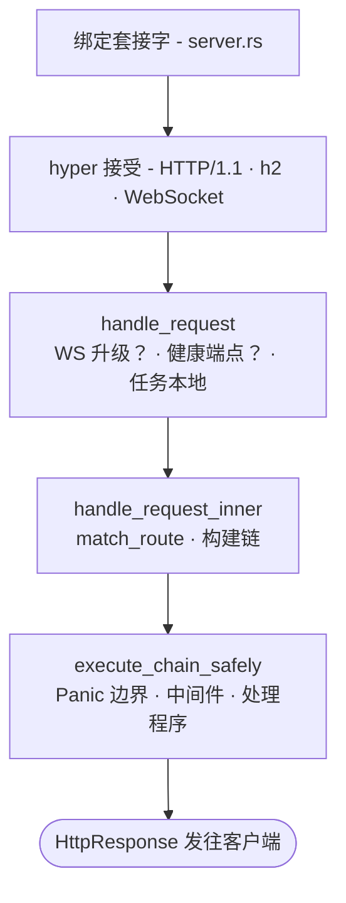

# 请求生命周期

在 TCP 数据包到达套接字，到您的处理程序返回一个 `Response` 之间，究竟发生了什么？六个文件。跟踪一遍，框架的结构就会豁然开朗。

## 路径



## 1. 启动 - `app.rs`

脚手架应用的 `main()` 以链式方式构建一个 `Application` 并运行它：

```rust
Application::new()
    .config(my_app::config::register)
    .bootstrap(my_app::bootstrap::bootstrap)
    .routes(my_app::routes::register)
    .migrations::<my_app::migrations::Migrator>()
    .run()
    .await
```

`Application::run()` 解析二进制文件的 CLI（clap）：

- `serve` - 启动 HTTP 服务器
- `web:run` - serve 的别名
- `migrate` / `migrate:rollback` / `migrate:status` / `migrate:fresh`
- `schedule:run` / `schedule:work` / `schedule:list`
- `workflow:work`
- `queue:work`
- `down` / `up` - 切换维护模式

`db:sync` 和 `db:seed` 分别位于框架级的 `suprnova` CLI 二进制文件（`suprnova-cli`）和每个应用自带的 `cmd/console` 二进制文件上 - 不在 `Application::run()` 的分支里。

`.env` 在此时已经加载完毕。`#[suprnova::main]` 会在构建 Tokio 运行时*之前*加载它，因为写入进程环境只有在进程是单线程时才是安全的 - 参见[启动](bootstrap.md#suprnovamain-not-tokiomain)。如果跳过了这一步，`Application::run` 会拒绝启动。

对于 `serve`，接下来它会：

1. 验证环境变量是否从单线程上下文中加载
2. 将 `#[policy]` 的 inventory 清空到授权系统中
3. 调用您的 `config_fn`（类型化配置注册）
4. 运行迁移
5. 调用您的 `bootstrap_fn`（服务注册、观察者、监听器）
6. 从 `routes_fn` 构建 `Router`
7. 将路由器交给 `Server::from_config(...)`
8. 调用 `server.run()`

工作进程（`queue:work`、`workflow:work`、`schedule:run`）使用相同的启动路径，因此它们能看到相同的已配置服务和已绑定的容器值。

## 2. 服务器启动 - `server.rs`

`Server::from_config` 做了两件对安全性很重要的事：

- 运行 `App::init()` + `App::boot_services()` - 初始化容器的任务本地层并解析启动期依赖
- 当需要 `APP_KEY`（任何非开发环境）但缺失或格式错误时，**失败关闭** - 返回 `Err`，`app.rs` 打印一条修复提示并以非零状态退出，而不是 panic

`server.run()` 接下来会：

1. 启动遥测（`tracing` 订阅者、日志格式）
2. 加载加密密钥（`APP_KEY` + `APP_KEY_PREVIOUS`）
3. 按**这个确切顺序**启动运行时驱动程序：Cache → Queue → RateLimit → Mail。非 server 子命令也会调用 `bootstrap_runtime_drivers`，因此工作进程能看到相同的驱动程序
4. 绑定 TCP 套接字
5. 使用 `.with_upgrades()` 通过 hyper 提供服务（这样 WebSocket 升级才能工作）

驱动程序的启动顺序是刻意安排的 - Queue 可能依赖 Cache（用于唯一作业锁），RateLimit 可能使用 Cache，Mail 可能通过 Queue 分发。

## 3. 请求进入 - `handle_request`

每个请求都会进入 `handle_request(router, registry, req)`。**这也是集成测试无需打开套接字即可驱动的进程内请求入口。** 它以 `suprnova::handle_request` 的形式重新导出。

```rust
pub async fn handle_request(
    router: Arc<Router>,
    middleware_registry: Arc<MiddlewareRegistry>,
    req: hyper::Request<hyper::body::Incoming>,
) -> hyper::Response<ServerBody>;
```

一个感知对端的变体 `handle_request_with_peer` 接受相同的参数，外加一个 `Option<std::net::IpAddr>` - 生产环境的接受循环使用它；进程内调用者使用 `handle_request`，由请求的代理请求头（或 `None`）决定 `Request::ip()`。

在内部，它会：

1. 通过 `router.match_ws(...)` 检查是否是 WebSocket 升级 - 如果匹配一个 `ws!()` 路由，就转交给 WS 处理程序
2. 特殊处理内置的健康端点 - `GET /_suprnova/health`、`/_suprnova/health/live`、`/_suprnova/health/ready`。一个未通过 `SERVER_HEALTH_READINESS_TOKEN` 检查的就绪性探针是故意*不*被特殊处理的：它会落入路由并像任何未路由的路径一样返回 404，因此该端点是不可见的，而不仅仅是关闭的
3. 安装逐请求的任务本地状态（flash bag、SSR 禁用标志）
4. 分派到 `handle_request_inner`

## 4. 路由与链组装 - `handle_request_inner`

中间件链在这里组装。路由器产出一个 `(pattern, handler, params)` 三元组，`MiddlewareChain` 按这个固定顺序组装：

```
[0] RequestIdMiddleware（始终位于最外层）
[1] 全局中间件，按注册顺序
[2] 路由中间件（以 (method, matched pattern) 为键）
[3] handler
```

有三点需要注意：

- **是模式，不是路径。** 路由中间件是按匹配到的模式（`"/posts/{id}"`）建立索引的，而不是原始路径（`/posts/42`）。带参数路由上的组中间件确实会触发。
- **未匹配仍会运行链。** 如果路由器没有匹配任何路由，链（RequestId + 全局中间件）仍然会运行，并在一个已注册的兜底处理程序或静态 404 中终止。CORS 预检（OPTIONS 请求很少匹配到路由）、日志记录和 request-id 都会到达未路由的流量。
- **组中间件是被展平的，而不是分层堆叠的。** 组中间件在注册时被复制进每个分组路由的中间件列表中 - 它不是一个单独的运行时层。内省无法区分组中间件和路由中间件。

## 5. Panic 边界 - `execute_chain_safely`

链在 `AssertUnwindSafe(...).catch_unwind()` 内部运行。**任何中间件或处理程序中的 panic 都会被捕获**，记录方法+路径，并通过与返回的 5xx 相同的 `FrameworkError → HttpResponse` 路径转换：

- 清理后的响应体：`{"message": "Internal Server Error"}`
- 注入 `request_id`，以便您与日志相关联
- 分派 `ErrorOccurred` 事件，以便监听器（Sentry、您的告警管道）能看到这次失败
- panic 载荷**永远不会泄漏到响应体中**

这是一个安全网，不是一份契约。您代码中的公共 API 应该返回 `Result`，而不是依赖 `catch_unwind`。这个边界的存在是为了防止有问题的处理程序杀死工作线程或向客户端泄漏堆栈跟踪 - 它不是随处 `.unwrap()` 的许可证。

## 6. 链组合 - `middleware/chain.rs`

`MiddlewareChain::execute` 将处理程序嵌套为最内层的 `Next`，然后从后向前（`.rev()`）包裹每个中间件，所以**最先添加的中间件最先运行**（由外而内）。空链会直接调用处理程序：

```
注册顺序：    [Auth, CSRF, Throttle, handler]
运行时顺序：  Auth → CSRF → Throttle → handler →（向外返回）
```

如果某个中间件短路（返回 `Err(response)`），链会立即展开，响应会以相反顺序经过已执行的中间件返回。

## `Response` 契约

`http::Response` 是 **`Result<HttpResponse, HttpResponse>`** - 两个分支都携带一个 `HttpResponse`。处理程序和 `Middleware::handle` 返回 `Response`：

- `Ok(resp)` 表示成功
- `Err(resp)` 表示短路 - 例如，直接来自认证中间件的一个 401。运行时用 `result.unwrap_or_else(|e| e)` 把两者收拢为一个值，所以 `Err` 是一个响应，不是一次崩溃。
- `?` 会传播任何能转换为 `HttpResponse` 的错误。每一个 `FrameworkError`、`AppError`、`ValidationErrors`，以及您自己实现的 `HttpError`，都可以 - 所以处理程序的函数体可以从上到下顺读，并将失败一路冒泡到转换器。

错误转换器（`From<FrameworkError> for HttpResponse`）会清理 5xx 响应体，绝不向发给客户端的响应泄漏细节。细节留在结构化日志里。

参见[错误处理](errors.md)和[错误模型](error-model.md)以了解全貌。

## 逐请求状态

两层逐请求状态，都是任务本地的：

- **Flash bag** - `req.flash()` 返回会话 flash；存储在这里的值会在一次重定向后存活，然后消失
- **SSR 禁用标志** - Inertia 用它在测试上下文中短路服务器端渲染

这两者都由 `handle_request` 在链运行之前安装，并在响应离开时被拆除。自定义的逐请求状态通过 `Context` 系统实现 - 参见[上下文](context.md)。

## 工作进程复用相同的生命周期

后台工作进程（`queue:work`、`workflow:work`、`schedule:run`）会经过：

1. 相同的启动路径（`Config::init`、`bootstrap_runtime_drivers`、您的 `bootstrap()` 函数）
2. 它们自己的循环，拉取工作并使用**相同的 panic 边界**（每种工作进程类型对应的 `execute_chain_safely` 等价物）运行处理程序
3. 在 `SIGTERM` / `SIGINT` 上优雅关闭 - 进行中的工作会完成，不会开始新的工作

这意味着在 `bootstrap()` 中注册的观察者，对来自队列工作进程的插入操作触发的方式，与对来自 HTTP 处理程序的插入操作完全一样。

## 生产安全保证

生命周期建立的一小组不变量：

- **`APP_KEY` 在非开发环境中是必需的。** 启动失败关闭，以非零状态退出，不会造成加密数据损坏。
- **处理程序或中间件中的 panic 永远不会到达客户端。** panic 边界返回一个清理后的 500，并分派 `ErrorOccurred`。
- **5xx 响应体始终会被清理。** 细节进日志，不进发给客户端的响应。
- **被污染的锁永远不会中止进程。** 有两种被认可的模式：逐请求路径将污染路由为携带 `"<context> lock poisoned"` 消息的 `FrameworkError::Internal`（请求得到一个 500）；必须保持存活的热路径注册表用 `.unwrap_or_else(|e| e.into_inner())` 就地恢复。参见[锁策略](lock-policy.md)。
- **驱动程序后端故障是一个明确的失败开放或失败关闭的选择。** 速率限制、缓存、会话各自在调用点选择一种策略 - `BackendErrorPolicy::FailClosed` 返回 503；`FailOpen` 放行请求。没有隐含的默认值。参见[速率限制](rate-limiting.md)。
- **WebSocket 升级走相同的路由器。** 相同的 `match_ws` 查找使用与 HTTP 路由相同的 `(method, pattern)` 索引；您可以像对 HTTP 中间件一样，为每个路由应用 WS 中间件。
- **关闭信号永远不会被连接数上限饿死。** 设置了 `SERVER_MAX_CONNECTIONS` 时，等待一个空闲名额会与关闭信号竞态，而不是阻塞接受循环，所以即使服务器的所有名额都被长期存活的 WebSocket 会话占满，它仍会在 `SIGTERM` 时排空，而不是在编排器的宽限期结束时收到 SIGKILL。
- **每一次排空都会中止它所放弃的东西。** HTTP 连接、WebSocket 处理程序和监督程序都各自获得一个有限的宽限窗口，然后被中止并被等待 - 包括监督程序的内部任务，因此取消操作能到达任务主体，而不只是重启包装器。没有任何东西会在其排空之后继续运行以在刷新之后发出遥测。

## 这对您的代码意味着什么

日常编写处理程序时的几点收获：

- **返回 `Response`，用 `?` 传播。** 除非您需要裸的 `HttpResponse`，否则不要 `match err`。
- **在您的领域错误类型上实现 `HttpError`。** 它们会自动转换。参见[错误处理](errors.md)。
- **不要依赖 panic 边界。** 它能捕获真正的 bug 并防止进程崩溃；库代码仍然应该返回 `Result`。
- **中间件顺序很重要，并且固定为三层** - request-id 最外层，全局中间件次之，路由中间件在处理程序之前最内层。
- **工作进程和处理程序共享启动过程。** 您在启动时注册的任何东西，两者都能看到。

## 每一步位于何处

| 步骤 | 文件 |
|---|---|
| 启动 | `framework/src/app.rs` |
| 服务器生命周期 | `framework/src/server.rs` |
| `handle_request`（入口） | `framework/src/server.rs`（以 `suprnova::handle_request` 的形式重新导出） |
| `handle_request_inner`（路由 + 链组装） | `framework/src/server.rs` |
| `execute_chain_safely`（panic 边界） | `framework/src/server.rs` |
| `MiddlewareChain::execute`（组合） | `framework/src/middleware/chain.rs` |
| 路由器匹配 | `framework/src/routing/router.rs` |

要使用这个框架，您不需要阅读这些内容，但如果出现意外的 bug，排查路径很短。

## 下一步

- [服务容器](container.md) - `App::*` 如何解析服务
- [应用启动](bootstrap.md) - `bootstrap.rs` 做了什么
- [中间件](middleware.md) - 编写您自己的中间件
- [错误模型](error-model.md) - `FrameworkError`、`HttpError`，panic 恢复的细节
- [路由](routing.md) - `routes!` 实际展开成什么
